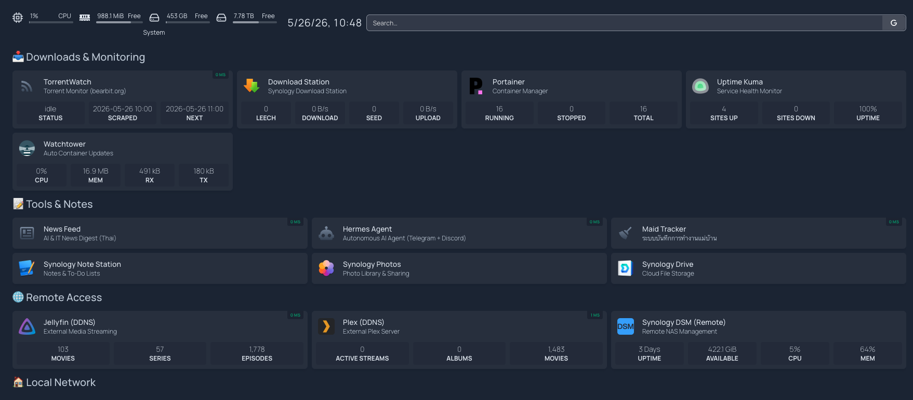

# centralized-nas-container-management

Docker stacks for Synology DS925+ NAS, managed via Synology Container Manager.



## Stacks

| Directory | Purpose | Local Port | External (Synology Reverse Proxy) |
|---|---|---|---|
| `homepage/` | Dashboard UI (gethomepage/homepage) | `3000` (Nginx + HTTPS inside) | `https://…:443` |
| `jellyfin/` | Media server with NVIDIA GPU transcoding | `8096` | `https://…:18096` |
| `maid-tracker/` | Household worker attendance & salary tracker | `5055` | `https://…:15055` |
| `portainer/` | Docker management UI | `9000` | `https://…:19000` |
| `uptime-kuma/` | Service health monitor | `3001` | `https://…:13001` |
| `watchtower/` | Auto-update containers + LINE notification sidecar | — | — |
| `secretary/` | Personal knowledge base — Notion→Qdrant RAG + n8n Telegram bot | `5065` (query) / `5678` (n8n) | `https://…:15065` / `https://…:15678` |
| `hermes-agent/` | Autonomous AI agent — Telegram + Discord (NousResearch/hermes-agent) | `5063` (Nginx basic-auth dashboard) | `https://…:15063` |
| `torrentwatch/` | Daily torrent monitor for bearbit.org — scrapes, filters, LINE alerts | `5059` | `https://…:15059` |
| `news-feed/` | AI & IT news feed bot — Thai summaries via Claude/DeepSeek, digest to LINE + Telegram, dashboard | `5064` | `https://…:15064` |
| `wallpaper-scout/` | Wallpaper research/curation — Wallhaven API + LLM alias expansion, writes into Synology Photos folders by purpose/topic | `5067` | — (LAN-only, no public HTTPS proxy) |

### Reverse Proxy Summary

All stacks except `watchtower` are exposed externally via **Synology Reverse Proxy** (DSM → Control Panel → Login Portal → Advanced). Synology handles TLS termination; containers run plain HTTP internally.

| Stack | Synology RP Source | → Destination |
|---|---|---|
| homepage | `https://…:443` | `http://localhost:3000` → internal Nginx → Homepage |
| jellyfin | `https://…:18096` | `http://localhost:8096` |
| maid-tracker | `https://…:15055` | `http://localhost:5055` → internal Nginx → Maid Tracker |
| portainer | `https://…:19000` | `http://localhost:9000` |
| uptime-kuma | `https://…:13001` | `http://localhost:3001` |
| secretary-query | `https://…:15065` | `http://localhost:5065` |
| secretary-n8n | `https://…:15678` | `http://localhost:5678` |
| torrentwatch | `https://…:15059` | `http://localhost:5059` |
| Hermes | `https://…:15063` | `http://localhost:5063` |
| news-feed | `https://…:15064` | `http://localhost:5064` |

> Your router must forward each **external port → NAS** so traffic reaches Synology Reverse Proxy. Homepage is the only exception — it has its own Nginx inside the container that handles TLS, so Synology RP simply forwards `:443` to port `3000` unencrypted and lets Nginx take over from there.

## Environment Variables

**Secrets live in `secrets/vault.sops.yaml`** — one encrypted YAML (sops+age) committed to git as the single source of truth. Each stack has a `secrets.manifest.yaml` declaring which vault paths it consumes and the ENV name to project them as. A generator (`make secrets`) decrypts the vault, applies each manifest, and writes per-stack `.env` files (gitignored). The NAS never sees sops or age.

> **Full docs:** [secrets/README.md](secrets/README.md) — architecture diagrams, step-by-step guides for adding/removing/rotating secrets, new machine setup, and troubleshooting.

### Setup

```bash
# 1. Install tooling
brew install sops age

# 2. Import your age private key (one-time per machine)
mkdir -p ~/.config/sops/age
# Generate new and ask vault maintainer to add public key + sops updatekeys:
age-keygen -o ~/.config/sops/age/keys.txt
# OR paste an existing key (e.g. from Bitwarden / 1Password):
$EDITOR ~/.config/sops/age/keys.txt
chmod 600 ~/.config/sops/age/keys.txt

# 3. Generate .env files
make secrets       # decrypts vault, writes <stack>/.env and .env.deploy

# 4. Deploy
./scripts/deploy.sh
```

### Daily workflow

```bash
make edit-vault       # open vault in $EDITOR (sops decrypts on read, re-encrypts on save)
make secrets          # regenerate all <stack>/.env + .env.deploy
./scripts/deploy.sh   # tar + ssh + restart
```

### File map

```text
.sops.yaml                            # public age recipients (commit)
secrets/vault.sops.yaml               # encrypted vault (commit)
secrets/test-vault.sops.yaml          # CI dummy vault (commit)
secrets/manifest.schema.json          # manifest JSON schema
deploy.manifest.yaml                  # produces .env.deploy for deploy.sh
<stack>/secrets.manifest.yaml         # per-stack vault → ENV mapping
.env.deploy                           # generated, gitignored
<stack>/.env                          # generated, gitignored
```

All `.env` files and `secrets/vault.yaml` (transient plaintext during edits) are gitignored. Only `vault.sops.yaml` and manifests are tracked.

## Uploading to NAS

`scripts/deploy.sh` syncs the project from your local machine to `$NAS_TARGET_PATH` (default `/volume2/docker`) over SSH (key-based auth). Per-stack `.env` files are uploaded inside the project tarball; the **root `.env` is intentionally excluded** (it holds local-only deploy/script secrets that containers never need).

**Prerequisites (one-time setup)**

1. Generate an SSH key and copy it to the NAS:
   ```bash
   ssh-keygen -t ed25519 -C "nas-key"
   ssh-copy-id -i ~/.ssh/id_ed25519.pub -p 2222 <NAS_USER>@<NAS_HOST>
   ```
2. In DSM → Control Panel → Terminal & SNMP, set SSH port to **2222** and disable password auth in `/etc/ssh/sshd_config` (`PasswordAuthentication no`).

**Deploy**

```bash
# 1. Make sure all .env files are filled in (root + each stack)
# 2. Run
scripts/deploy.sh
```

> `NAS_SUDO_PASSWORD` in the root `.env` is only used to run `sudo docker compose` during stack restarts. SSH itself uses key auth exclusively. Compose finds each stack's `.env` automatically via `--project-directory`.

## Adding a Stack to Container Manager (DSM 7.4)

After uploading files to the NAS via `deploy.sh`, register each stack in Synology Container Manager:

1. Open **DSM** → **Container Manager** → **Project** tab
2. Click **Create**
3. Fill in:
   - **Project Name** — e.g. `homepage`
   - **Path** — point to the stack directory on NAS, e.g. `/volume2/docker/homepage`
     Container Manager will automatically detect `docker-compose.yml` in that path
4. Click **Next** → review the compose config → click **Build**
5. Container Manager pulls images and starts the containers

> For stacks with a local build (e.g. `watchtower`, `maid-tracker`), Container Manager will build the image on first run. On subsequent updates, use `deploy.sh` with the restart option instead of re-registering the project.

## Architecture Notes

- **Homepage** — sits behind an Nginx reverse proxy that handles HTTPS (port 3000 on host → 443 inside container) with Authelia SSO forward-auth. TLS uses the Synology system certificate mounted from `/usr/syno/etc/certificate/system/default/`. Config files in `homepage/config/` are hot-reloaded. Secrets are injected via `HOMEPAGE_VAR_*` env vars from `homepage/.env` and referenced in `services.yaml` as `{{HOMEPAGE_VAR_*}}`. DSM / Download Station widgets authenticate with `HOMEPAGE_VAR_NAS_USERNAME` / `HOMEPAGE_VAR_NAS_PASSWORD` — use a dedicated DSM user (no 2FA) and whitelist private subnets in DSM → Security → Protection to avoid auto-blocking the Docker container IP.
- **External HTTPS** — all stacks except homepage use **Synology Reverse Proxy** (DSM → Control Panel → Login Portal → Advanced) for HTTPS termination. Synology handles the SSL cert and auto-renewal; containers run plain HTTP internally.
- **DSM / Download Station widgets** — Homepage connects to the Synology API over HTTP (`HOMEPAGE_VAR_NAS_URL=http://192.168.x.x:5000`) to avoid SSL certificate mismatch when using an IP address.
- **Maid Tracker** — FastAPI + SQLite single-container app. Database persisted in a named volume `maid_tracker_data`. Local build. The container runs on port 5055 internally; external access is via **Synology Reverse Proxy** on port 15055 (`https://<NAS_HOST>:15055`), which handles TLS termination — the container itself serves plain HTTP.
- **Watchtower** — runs two services: the updater and a Python sidecar that tails Watchtower logs via raw Docker socket HTTP and pushes LINE notifications. The sidecar is excluded from auto-updates via `com.centurylinklabs.watchtower.enable=false`.
- **Portainer** — standard CE deployment on port 9000. HTTPS is handled upstream by Synology Reverse Proxy. Data persisted in `portainer_data` named volume.
- **TorrentWatch** — FastAPI + Python 3.12 daily torrent monitor that scrapes bearbit.org on a schedule, filters today's uploads by seed/leech threshold and per-source keywords, and surfaces results via a mobile-first dark web UI. Supports multiple listing URLs (each with its own keyword list), cover images, file size/count display, and two download modes: proxy .torrent to browser or save directly to a NAS watch folder. LINE push notifications on keyword matches. Auto scrape schedule configurable (30 min / 1 hour, night window or all day). Data older than 7 days is cleaned up weekly. Port 5059 internally; external HTTPS via Synology Reverse Proxy on port 15059.
- **secretary** — Personal knowledge base stack: Notion pages ingested into Qdrant via BGE-M3 hybrid embeddings (dense 1024d + sparse), served as a RAG API (FastAPI :5065), orchestrated by n8n Telegram bot workflows (:5678). Ingest is a one-shot container (`restart: "no"`) run manually or triggered via `POST /ingest-trigger`. Hybrid search uses RRF fusion; optional Cohere `rerank-multilingual-v3.0` improves cross-lingual (Thai query / English content) accuracy. LLM provider switchable via `LLM_PROVIDER`: `anthropic` (default), `openrouter`, or `nous` (OAuth Device Code). BGE-M3 model (~2GB) cached in `hf_cache` volume shared between ingest and query containers.
- **news-feed** — Single-container FastAPI + APScheduler + SQLite stack. Fetches RSS from 7 sources (TechCrunch AI, VentureBeat, The Verge, Ars Technica, GSMArena, 9to5Mac, Android Authority), summarises articles in Thai via Anthropic Claude (default) or OpenRouter/DeepSeek (switchable at runtime via dashboard). Sends digest to LINE + Telegram at configurable times (default 07:00/12:00/18:00 Bangkok). Dashboard at port 5064 provides Source Health, News Timeline, AI Price Tracker, Leaderboard, Digest History, and Schedule Config. Data persisted in `news_feed_data` named volume. No external reverse proxy — LAN access only.

