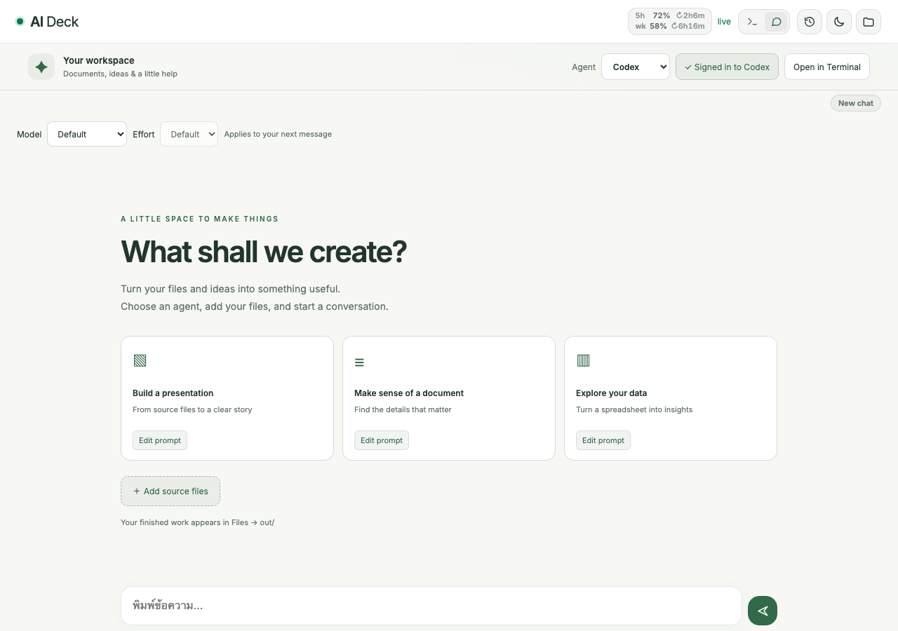
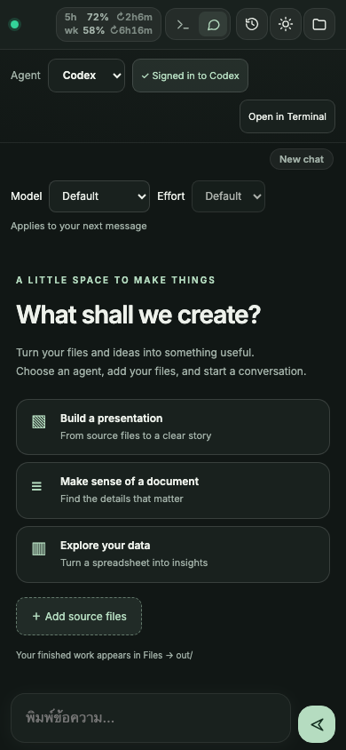
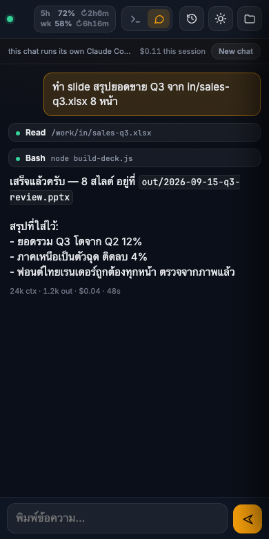

# AI Deck

Claude and Codex in a browser workspace for documents and source code. Document mode uses `in/` and `out/`; the optional coding worker clones GitHub repositories into persistent task workspaces and sends deployments to a separate trusted runner.





## Claude or Codex in three steps

1. Choose **Claude** or **Codex** in the Agent menu. Chat is the default view; **Open in Terminal** starts the selected CLI in your own terminal.
2. For Codex, click **Sign in to Codex** once. The terminal runs `codex login --device-auth`; open the displayed verification page and enter its code using your ChatGPT account. Enable device-code login in your ChatGPT security settings if the CLI asks. After login, return to Chat with the speech-bubble tab. No API key is needed. Authentication persists in `~/.codex` inside the existing home volume.
3. Click **Add source files**, upload inputs, then choose a starter or describe your task. Finished files appear under **Files → out/**. The history sheet lists the selected agent's conversations.
   Each starter has **Edit prompt**: save its template for future visits in this browser, shared by Claude and Codex. **Cancel** discards edits; **Restore default** fills the original template (click **Save prompt** to apply). Selecting a card fills the composer for review; it does not send automatically. Templates are stored locally, not synced across browsers or devices.

Switching agents preserves their separate conversations and composer drafts. It does not cancel a running turn. Claude streams text deltas; Codex displays completed message items as its CLI emits them, with live tool activity. Codex token counts are shown without fabricating dollar costs or Claude quota numbers.

The directory, Compose project, and main service/container are **`ai-deck`**; the visible name is **AI Deck**. Port 5072, the DSM proxy, `CLAUDE_WORK_DIR`, encrypted vault keys, and the existing home volume remain compatible. **Before the first deployment after renaming, follow [MIGRATION.md](MIGRATION.md)** to verify the home volume and stop the old project without deleting data. MiMo remains available in Terminal as `m`; `ask` remains the one-shot MiMo helper.

Chat offers **Model** and **Effort** selectors, remembering choices separately for Claude and Codex in this browser. Changes apply to the next message; Claude resumes the same conversation when its child needs restarting. Default leaves CLI configuration in control. Codex choices come from the installed CLI's model catalog (falling back to its local cache), with effort levels filtered per model. Claude uses stable CLI aliases; account access still depends on the subscription. Haiku has no effort override.

The Codex button checks `codex login status` and shows **✓ Signed in to Codex** when authenticated. It refreshes every 30 seconds while visible and when returning to the tab. Failed checks show **Check Codex sign-in**, rather than claiming the account is logged out. No CLI diagnostics, credentials or tokens are returned to the page.

CLI references: [Codex commands](https://learn.chatgpt.com/docs/developer-commands?surface=cli), [Codex configuration](https://learn.chatgpt.com/docs/config-file/config-reference), and [Claude model configuration](https://code.claude.com/docs/en/model-config).

Chat now keeps an independent agent and SSE replay stream per authenticated user **and** provider. Files, provider accounts and saved-session lists remain shared; this is a trusted shared workspace, not tenant isolation. Multiple agents can edit the same files, so coordinate work on a shared output.

Codex discovers the same document/workstation skills through `~/.agents/skills`. On startup, `/work/AGENTS.md` is generated from the maintained `work/CLAUDE.md`, so both CLIs receive the same document rules. Edit the source in this repository, not the generated file.

Local preview: serve `ui/` and open `?demo=1&chat=1&welcome=1&provider=codex&theme=light`; add `mobile=1` for mobile controls. Run `.venv/bin/pytest ai-deck/tests` from the repository root. `make desk-latest` also updates the Codex version pin.

Container startup smoke check (fresh disposable image; no provider credentials):

```bash
docker run --rm -i --network none --entrypoint /bin/bash IMAGE -s < ai-deck/tests/container_smoke.sh
```

Implementation review and remaining improvements: [.notes/ai-desk-review.md](.notes/ai-desk-review.md).


## Coding projects

Enable the optional service with `docker compose --profile coding up -d --build` in this stack (or persist `COMPOSE_PROFILES=coding` in the deployment environment). The supplied NAS runner adapter enables it when deploying this stack. Preserve `code-home` and `code-workspaces` volumes across updates.

1. Open **Projects & deploy → Open coding Terminal / GitHub sign-in**. For private repositories run `gh auth login --web --git-protocol https`. Configure `git config --global user.name` and `user.email` once. Git credentials remain in the coding home volume. Public clone does not require login.
2. Open **Projects & deploy**, enter a GitHub HTTPS URL and optional base branch, then **Clone & start task**. Each task gets a `desk/<id>` branch/worktree; creating another task for the same repository reuses its cached Git objects. The project menu reopens previous work without uploading files.
3. Chat works in the selected repository and reads its own instructions. Composer drafts, history, resume and agent processes are scoped to user/provider/workspace. Coding Terminal also uses a distinct tmux session per user/workspace, including when two project tabs are open.
4. **Refresh Git status** shows branch, SHA, changes and tracked staged/unstaged diff. **Test changes** and **Commit & push…** fill the composer for review; they never send automatically. Agents run ordinary Git/test commands inside the worker. New untracked files appear in status; their contents appear in diff after staging. Ask the agent to inspect them too.
5. **Deploy this commit** sends a selected profile plus full pushed SHA to the trusted runner. The NAS profile accepts only the current `main` tip; merge a task branch first. Push alone does not deploy. The panel polls durable job status and sanitized logs; success requires deployment and the profile's health command to pass.

The coding worker has a separate home/workspace volume and Docker network; it receives the Claude subscription token explicitly, never the document `.env`, document share, SSH/age keys, runner token or Docker socket. Codex must be signed in separately in coding mode. It runs as uid 1000, with a 1536 MiB cap. Node/Python/Git/gh and native build tools are available; project-specific dependencies still need installation. Docker-based tests need a separate build service; no Docker daemon is exposed to the agent.

This initial worker is for trusted household accounts: metadata/API ownership is enforced, but accounts share a Unix UID and provider/Git credentials inside the coding container. It is not an OS boundary between users or hostile repositories. Deploy commands execute trusted merged code on the runner host and carry that host's production privileges.

The first runner is the Mac, supervised by `local.ai-deck.deploy-runner` after login. It must be awake and reachable. Its private configuration, credential files and logs live under `~/.config/ai-deck-runner/`, outside the repository. NAS-to-Mac communication uses HTTPS with a pinned local CA and a bearer credential. [Runner setup, profiles and recovery](docs/CODING_DEPLOY.md).

New stack environment mappings: `AI_DECK_DEPLOY_URL`, `AI_DECK_DEPLOY_TOKEN`, `AI_DECK_DEPLOY_CA_B64` come from `stacks.ai_desk.deploy_runner.*`. The worker's explicit environment list excludes them. `AI_DECK_BUILD_SHA` identifies the deployed revision at the read-only `/health` endpoint. The NAS adapter writes it from the job checkout; its health command verifies equality with that SHA. Ordinary deployments that do not provide it return `unknown`.

Git/workspace API: `/code/projects` GET/POST, `/code/projects/status?workspace=<id>`, `/code/chat/*?workspace=<id>`. Deploy API is `/deploy/profiles`, `/deploy/jobs`, `/deploy/jobs/<id>` via the document backend bridge. Coding routes resolve lazily so document mode starts when the coding profile is off; unavailable services return an error rather than falling back to document files.

## What runs

```
phone ──HTTPS :15072 (DSM RP)──▶ ai-deck-nginx :5072
                                   ├─ /            static UI  (ui/)
                                   ├─ /ws, /token  ──▶ ai-deck :7681 (ttyd → tmux `fixhardez` → bash → claude)
                                   │                └▶ ai-deck :7684 (ttyd → tmux `pookzii`, routed by basic auth user)
                                   ├─ /files/in/, /files/out/   autoindex JSON + the files (read-only)
                                   ├─ /upload/<dir>/[name]      ──▶ ai-deck :7682 (upload.py → /work/<dir>)
                                   ├─ /api/…                    ──▶ ai-deck :7682 (upload.py → ~/.claude, tmux)
                                   └─ /chat/…                   ──▶ ai-deck :7683 (chat.py → a second claude)
```

- **`upload.py`** — stdlib HTTP server in the desk container (port 7682, only nginx can reach it). Files, for the drawer:
  - `PUT /upload/in/<name>` streams the body into `/work/in/<name>` via a unique hidden temporary file + atomic rename after the entire body arrives, so Claude never reads a half-written source. `out/` refuses uploads (403).
  - `DELETE /upload/<dir>/<name>` removes one file from `in/` or `out/`.
  - `DELETE /upload/<dir>/` clears the folder — top-level plain files only, so subdirectories and Synology's `@eaDir` survive.

  Only `in` and `out` are routable, names are one flat segment (no `..`, slashes, or dot-files), and the raw path is split before unquoting so an encoded separator is rejected here rather than becoming a directory step. Size cap is nginx's `client_max_body_size 300m` on `/upload/` (DSM's reverse proxy has its own too).

  Desk, for the header and the sessions sheet — see [Rate-limit chip](#rate-limit-chip) and [Sessions](#sessions):
  - `GET /api/status?provider=claude|codex` — provider-specific quota snapshots with per-window age.
  - `GET /api/sessions` — past transcripts in `/work`, newest first, with the pane's current command.
  - `POST /api/resume {"id": "<uuid>"}` / `POST /api/new` — type the command into the tmux pane.
  - `POST /api/quit` — Escape + `/exit` into the pane, then wait for a shell.
- **`ai-deck`** — Debian + Node 22 + `@anthropic-ai/claude-code` (pinned `ARG CLAUDE_VERSION`), LibreOffice `*-nogui`, poppler, qpdf, Thai fonts, the Python and npm packages the official office skills need. PID 1 is `ttyd -W -m 2 -P 30 tmux new -A -s <desk>`, one ttyd per person — see [Two people, two desks](#two-people-two-desks). Runs as uid 1000 (Claude Code refuses `--dangerously-skip-permissions` as root). Never published on the host.
- **`ai-deck-nginx`** — `nginx:alpine` with `ui/` baked in (`nginx/Dockerfile`): basic auth on every path (`nginx/.htpasswd` from the vault), proxies only the websocket and token endpoints to ttyd, and lists `out/` as JSON. `ui/` cannot be bind-mounted: directories under `/volume2/docker` carry the DSM share ACL, which the nginx worker (uid 101) cannot traverse → 403 on every file. Single-file binds (`nginx.conf`, `.htpasswd`) are read by the root master process and work.
- **`ui/`** — our own page instead of ttyd's: xterm.js 5.3 (vendored, no CDN), Inter + JetBrains Mono self-hosted, a key bar with `Esc ⇧Tab Tab Ctrl ↑↓←→ ↵NL` and `Paste / ^C A− A+ ⌨`, a rate-limit chip in the header, two right-hand sheets — files (`in/` Add files → PUT, 🗑 delete; `out/` tap to open, ⬇ to save) and sessions — a dark/light theme toggle, PWA manifest for Add-to-Home-Screen. Speaks ttyd's websocket protocol directly (touch scrolling and the iOS keyboard handling adapted from `pawprint0706/ttyd-wrapper`, MIT). `ui/stream.js` holds how an answer fills in — paragraph-tail writes, one commit per frame, an `IntersectionObserver` for "is the reader at the bottom" — kept apart from `app.js` so `tests/stream_harness.html` can drive it in a browser with no agent behind it.

## Chat



The header switches between two views over the same desk. The terminal is the
whole desk — a shell, `mimo`, `ask`, anything. Chat is bubbles, and it exists
for one reason: **a terminal wraps hard at `COLUMNS`**, which on a phone is
about 40 columns of Thai, and a long answer is painful to read there. Bubbles
reflow, and the text is ordinary selectable HTML rather than something that has
to come back through OSC 52.

It is **not** a wrapper around the terminal. `chat.py` drives a *second* Claude
Code over `--input-format stream-json --output-format stream-json` — a
documented protocol, not a screen. Building bubbles by parsing ANSI out of
xterm.js would break every time Claude Code changed how it draws, and would put
the working half of the desk at the mercy of a cosmetic upstream change. See
[ADR 0013](../docs/adr/0013-claude-desk-chat-is-a-second-view-not-a-wrapper.md).

What the page gets, over server-sent events:

- text token by token, from `content_block_delta`, so a bubble fills in;
- one pill per tool call — name and the one useful argument (a command, a path,
  a search pattern) — going green or red when its result lands;
- the end of a turn, told apart from a failure by its reason.
- what the turn cost, under the answer: `24k ctx · 1.2k out · $0.04 · 48s`,
  with the session's running total in the bar above.

`total_cost_usd` is the **session** total, not the turn's — measured across
three turns as 0.0607 → 0.0701 → 0.1049, never decreasing — so a turn is
charged the difference. `usage`, by contrast, is per turn. Billing each answer
the raw total would have charged the whole session again every time.

The send button becomes a stop button while a turn is running. Stop is a control
request rather than a signal: the child ends the turn in about half a second and
**stays up for the next message**. An interrupt comes back as an *error* result
and the only thing distinguishing it from a real failure is `terminal_reason` —
`aborted_tools` when a tool was running, `aborted_streaming` when text was — so
the prefix is what is tested. Calling a stop the user asked for a failure would
be a lie.

`New chat` throws the session away and starts another, and the history button
works here too: tapping a past conversation reopens it **in this view**, with
its earlier messages painted back. Before that the sheet only ever typed into
the tmux pane, so from chat it brought the conversation back in the *other*
view, which reads as the list being broken. Nothing is kept in memory on this
side — the messages come from the transcript Claude Code writes
(`~/.claude/projects/-work/<id>.jsonl`), because `--resume` gives the agent
the context but replays nothing. The same read repaints the view after a plain
reload.

The sheet acts on whichever view it was opened over: in chat it never touches
the terminal, so the "terminal is busy" rule does not apply there — gating on
it would have greyed out every row for the ordinary case of Claude Code
sitting open in the other view.

The desk opens on this view unless the terminal was the last one used — from a
phone, chat is what it is for, and the terminal is one tap away.

**Two agents in `/work` at once.** The chat runs its own Claude Code, so it can
be working while the terminal's is too. That is a change from "one agent at a
time", and it is not prevented: the only signal available is the pane's current
command, and that reads `claude` whenever a session is merely *open*, so
refusing on it would block the normal case and the feature would look broken.
The line above the chat says when the terminal also has an agent up.

**No transcript is kept.** A reload starts a fresh view of the same live session
instead of replaying it; only "is a turn in flight" survives, so a page that
comes back mid-turn shows the stop button rather than an idle one.

**Coming back after a drop.** iOS suspends a backgrounded PWA, so the phone
loses this stream constantly and usually mid-answer — reconnecting is the
ordinary case here, not an edge one. Every event is numbered and written with an
`id:`, which the browser hands back as `Last-Event-ID` on its own reconnect;
`chat.py` keeps the last 4000 and replays what was missed. The page ignores
anything it has already applied, because the replay and the live stream overlap
by design (the connection subscribes before it replays).

When the ring has rolled past — or the page has applied *nothing*, which is what
a reload looks like — it is sent a **snapshot** instead: the half-said answer and
the tools still running, and nothing else. Claude Code writes a message when it
completes, so everything finished comes from the transcript the page already
reads, and nothing is drawn twice. Replaying from the first event instead would
redraw every past turn of the process on top of it. Events that land while that
transcript read is in flight are held and applied after it, in order.

**An answer is not rebuilt while it arrives.** Deltas land in the last
paragraph's text node; the markdown pass runs once, when the turn's text ends;
and a burst of deltas costs one commit per frame. The first version appended to
a string and re-parsed the whole answer per token, which recreates every node of
the reply — quadratic over a turn, worst exactly where this view is used. Whether
the reader is at the bottom comes from an `IntersectionObserver` on a sentinel
rather than from measuring `scrollHeight` per delta, and the log never chases the
bottom unless that is where the reader already was — a floating
"ข้อความล่าสุด" button is the way back down. The rules live in `ui/stream.js`
apart from the rest of the page so a browser test can hold them: against the old
shape the harness reports 311 commits and 622 layout reads for 311 deltas,
against this one 32 and 32.

A half-typed message survives a reload, kept per conversation in `localStorage`
and saved again on `visibilitychange` — the one that fires when a phone is put
away. A failed turn shows the agent's own `terminal_reason` under it and offers
the message back as "ลองใหม่".

Streaming needs `proxy_buffering off` on `/chat/` — otherwise nginx holds the
whole turn and the page shows nothing until it ends, which is indistinguishable
from a hung agent — plus a long `proxy_read_timeout` and a heartbeat comment
every 20s, because a stream carrying nothing else looks idle to both nginx and
DSM's reverse proxy. Verified from outside: a stream held open past 100s through
`:15072` with five heartbeats and no disconnect.

The chat covers `claude` only. `mimo` and `ask` do not speak this protocol — the
terminal stays the only way to reach them.

## Sessions

The history button opens a list of past Claude Code sessions in `/work`, newest first; tapping one resumes it. Before this the only way back was the `r` alias (`claude --continue`), which reaches exactly one session — yesterday's work was unfindable from a phone.

The list is built from `~/.claude/projects/-work/*.jsonl`. A row's name is the transcript's `summary` record if it has one, otherwise the first thing someone actually typed — user-role records also carry replayed slash commands (`<local-command-caveat>…`) and tool results, and those are skipped, which leaves a real opener or nothing. The date and the short id are shown regardless, because plenty of sessions honestly open with `hi`.

Reading is bounded twice: the newest 30 files by mtime, and 256 KB per file with each `readline` capped at 64 KB. A single `file-history-snapshot` record can be megabytes on its own (one transcript here is 4.6 MB), so a line budget would not have been a budget.

**Tapping a row types `claude --resume <id>` into the tmux pane** (`tmux send-keys`), rather than sending keys down the page's websocket. Keys on the socket land wherever the pane's focus is, and the pane usually has Claude Code in it — the command would arrive in Claude's prompt box as a message to read, not a command to run. So the endpoint asks `tmux display-message -p '#{pane_current_command}'` first and refuses with `409 busy:<program>` unless a shell is at the prompt (`claude` is what a running session reports); the sheet greys the rows out and says which program to quit. The id is matched against a uuid pattern before it goes anywhere near a shell.

`+ New session` is the same path with a bare `claude`, and **`Quit "claude"`
is the way back out** — without it the sheet is a trap, because New session
leaves Claude Code sitting in the pane and every later visit is refused until
someone quits it by typing in the terminal, which is the thing the sheet
exists to avoid. Quitting sends Escape (so the next line lands in an empty
prompt box rather than being appended to a half-typed message or a running
turn) then `/exit`, and waits for the pane to report a shell — about a second
in practice. Ctrl-C twice is the documented way out of Claude Code and was
measured **not** to work through `send-keys`; Escape + `/exit` returns the
pane to `bash` both at an idle prompt and mid-turn. Both pick up the `--dangerously-skip-permissions` alias from `profile.sh`, because an interactive login shell is what is typing.

## Volumes

| Mount | What | Why |
|---|---|---|
| external `claude-desk_claude_desk_home` → `/home/claude` | named volume | `claude --resume` across restarts; `~/.claude.json` lives outside `~/.claude`, hence the whole home |
| `/volume2/claude-work` → `/work` | DSM shared folder | `in/` for source files (drop via DS File / Synology Drive), `out/` for deliverables. `work/CLAUDE.md` is baked into the image and copied to `/work` on every start (same ACL reason — a `./work` bind is unreadable to uid 1000) |
| `/volume2/claude-work` → nginx `/files` (ro) | same share | download side; nginx only exposes `/files/out/` (binding `out/` directly races the entrypoint that creates it) |

**rtk** (the same Bash-output trimmer the workstation runs) is in the image, pinned like ttyd, and `entrypoint.sh` merges `claude-settings.json` (the `PreToolUse Bash → rtk hook claude` hook) into the home volume's `~/.claude/settings.json` on every start — additive, keyed by command string, so settings changed from inside the desk survive. `rtk gain` in the shell shows what it saved.

## Status line

`statusline.sh` is the workstation's status line vendored into the stack — model, effort, cwd, git branch, the context bar, and the 5h / 7d rate-limit rows with a pace projection. The Jira segment did not come along (it needs credentials and a fetch script that never ship here, and its `stat -f` is macOS-only), nor did an unused helper that was the only caller of perl. Everything it does need — `bash jq awk git` — is already in the image.

It sits in the image at `/opt/ai-deck/statusline.sh`, **not** in `~/.claude`: a named volume is only seeded from the image while it is empty, so anything written under `/home/claude` in the Dockerfile never reaches a desk that already exists. `claude-settings.json` points at the image path, and the same merge that installs the rtk hook installs the `statusLine` key.

The rows size themselves on every render. Claude Code captures the script's output rather than connecting it to the terminal — `tput cols` and `stty` see nothing from in there — but it exports the current `COLUMNS` before each run, which is what the script reads. A limit row costs its bar plus ~43 cells of label and tail, so the bar takes what is left, capped at 36. Under ~51 columns (a phone) nothing useful is left and the rows drop the bar and the `(bud 61%, -19% → 69%)` breakdown, keeping the percentage, where the pace lands, and the reset — 24 columns, nothing wraps:

```
Opus 5 | high | work | main*
  ctx 65% (131K)
  5h  42% → 69% ✓ ↻1h56m
  wk  61% → 91% ✓ ↻2d
```

A row that is about to blow its budget appends ` ⚠ wall -17m`, ~12 cells the other rows never pay for — enough to wrap a bar sized for the normal tail. That suffix is dropped when it does not fit (the ⚠ and the projection still say it), so the bars keep their width instead of shrinking for a case most renders never hit.

`STATUSLINE_BAR_W` overrides the arithmetic (`0` forces the narrow layout), but compose deliberately does not set it: the same desk is opened from a phone and from a laptop, and pinning the variable would give both the same layout. That was the first cut of this and it showed up as missing bars on a wide screen.

At 36 the output is byte-identical to the workstation copy, which keeps re-vendoring a clean diff.

### Rate-limit chip

The header shows **used** percentages for the selected provider, with reset countdowns (amber at 80%, red at 95%). It refreshes every 20 seconds while visible, after a chat turn, when returning to the tab, or on click. Account limits are shared by this workspace's users; they are not token-cost estimates.

- **Claude:** Chat consumes the CLI's `rate_limit_event`, including `unifiedWindows` in the pinned CLI, and pushes a `quota` SSE event immediately. Per-window snapshots are atomically saved in `~/.claude/desk-chat-status.json`. `GET /api/status?provider=claude` merges the newest observation for each window with Terminal's `~/.claude/desk-status.json`, preserving each window's own age. Starting Chat no longer depends on a Terminal status-line render.
- **Codex:** `GET /api/status?provider=codex` reads `account/rateLimits/read` through the installed CLI app-server. This metadata request does not start a model turn or return credentials. Results are cached for 30 seconds; explicit/turn-completion refresh has a 3-second cooldown. The header uses actual window durations and never shows Claude percentages or completion notifications for Codex.
- A missing observation shows **Quota pending**. A failed Codex refresh shows **Quota unavailable**. After 20 minutes without an observation, or once the observed window has expired, its percentage becomes **— stale**, with the old reading available in the tooltip. The client never invents 0% at reset and never makes a stale weekly reading fresh because only the 5-hour window updated.

References: [Claude SDK rate-limit events](https://raw.githubusercontent.com/anthropics/claude-agent-sdk-python/main/src/claude_agent_sdk/types.py), [Codex account metadata](https://learn.chatgpt.com/docs/app-server).

### "Claude finished"

A toggle at the bottom of the sessions sheet raises a browser notification when a turn ends. It is a button rather than something applied on load because Safari only grants notification permission inside a tap; the choice is kept in `localStorage`.

The end of a turn is not readable from the websocket — that carries terminal bytes, and "Claude stopped talking" is a shape in Claude Code's drawing, not an event. So a `Stop` hook (`done-hook.sh`, merged into `~/.claude/settings.json` by the entrypoint like the rtk hook) writes `~/.claude/desk-done.json`, and the same `/api/status` poll that feeds the chip carries it. The hook always exits 0: a non-zero Stop hook is reported back into the session, and a notification is not worth interrupting anyone over.

The first answer after a reload only establishes where the clock is — the turn it reports finished before the page existed — and nothing fires while the page is visible, since the terminal is already showing it.

**Limit, accepted deliberately:** this only works while the page is still running. A backgrounded PWA on iOS is suspended, so with the phone locked nothing arrives. The version that survives a locked phone is real Web Push — VAPID keys and a push service — which is a project rather than a toggle.

Skills live in the image at `/opt/skills` (clone of `anthropics/skills`, pinned `ARG SKILLS_REF`); `entrypoint.sh` re-links `pptx docx xlsx pdf` into `~/.claude/skills` on every start so a ref bump reaches the volume.

## Skills

Two sets, from two places:

- **The official office set** — `pptx`, `docx`, `xlsx`, `pdf` cloned from `anthropics/skills` at build time (`ARG SKILLS_REF`) into `/opt/skills`, linked into `~/.claude/skills` on every start. Bumped by `make desk-latest` with everything else.
- **The workstation's own skills** — listed in `skills.list`, copied into `ai-deck/skills/` by `make desk-skills`, baked into the image at `/opt/user-skills` (last `COPY` in the Dockerfile), and linked by the same loop in `entrypoint.sh`.

```bash
make desk-skills ARGS=-n     # what would change
make desk-skills             # copy them into ai-deck/skills/
./scripts/deploy.sh -s ai-deck -y
```

Baked, not bind-mounted: a `./skills` bind from `/volume2/docker` is `0700` to uid 1000 through the DSM share ACL — the same reason `work/CLAUDE.md` and `ui/` are baked — and `chmod -R a+rX` on the NAS does not stick. Measured on the deployed desk before this was changed: the mount was there, `/opt/user-skills` was unreadable, and the skills simply did not exist as far as the agent was concerned.

So changing a skill is a rebuild. It is a cheap one: the `COPY` is the last layer before the build-time sanity check, so apt, npm, pip and the `anthropics/skills` clone all stay cached — about a minute, and the deploy recreates the container anyway, which is what the link loop needs in order to notice a *new* name.

It is an allowlist, not a mirror of `~/.claude/skills`, for three reasons that are each worth a rule:

- **Credentials travel with skills.** `notebooklm/` is 196 MB and holds `data/auth_info.json` plus a logged-in Chrome profile; copying the tree would put a live Google session in a public repo. `scripts/desk_skills.py` refuses a whole skill when it finds a credential-shaped file rather than filtering it out — "we stripped the secret for you" is a worse habit than "this one does not travel" — and `tests/test_skills.py` re-checks the copy.
- **Half of them cannot work here.** Anything that drives a browser has no display server and no Chrome; anything that touches the vault or the NAS needs the age key and the SSH key, which this container deliberately does not have.
- **This is not where code gets edited.** The coding-flow skills would only be noise in the desk's skill list.

Skills that come from *plugins* (`~/.claude/plugins`) are a separate mechanism and are not covered by this — they would have to be installed inside the container.

Known gap: `archify`'s `validate` and `deliver` work here, but `visual-check` looks for a system Chrome binary the image does not carry, so it reports an environmental failure instead of browser evidence.

## Staying current

Every piece of software here is pinned (`CLAUDE_VERSION` and `SKILLS_REF` in `docker-compose.yml`, `MIMO_CODE_VERSION` / `TTYD_VERSION` / `RTK_VERSION` in the `Dockerfile`), and **nothing in the container can update itself**: both agents are npm globals owned by root while the container runs as uid 1000, so `claude`'s own updater cannot write to its own install — and a self-update would be discarded by the next deploy anyway, since that recreates the container. Watchtower is no help either; this image is built here rather than pulled from a registry, which is why it is labelled off.

So updating is: bump the pin, rebuild. From the repo root:

```bash
make desk-latest ARGS=-n     # what is behind, changes nothing
make desk-latest             # rewrite the pins (Claude Code, Codex, MiMoCode, skills)
git diff                     # one line per bump
./scripts/deploy.sh -s ai-deck -y
```

`scripts/desk_latest.py` reads the npm registry's own `latest` dist-tag and `anthropics/skills@main`, then edits exactly one pin per file and refuses to write if a file's shape has changed. ttyd and rtk are left out: they are pinned by sha256 as well as version, so bumping them means downloading the artefact to hash it, and they move about once a year.

A version rather than `@latest` on purpose. `@latest` in the Dockerfile would also need a cache-bust argument — the `npm install -g` layer is keyed by the command string, so without one a rebuild quietly reinstalls the same old version — and more importantly this desk is a working tool reached from a phone. A release that breaks the TUI (the copy path, the status line) leaves you with no way to roll back from a phone; a pin in git is one `git revert` away.

A rebuild takes a few minutes and drops the open tmux session.

## Secrets

`secrets.manifest.yaml` → `.env`:

- `stacks.claude_desk.oauth_token` → `CLAUDE_CODE_OAUTH_TOKEN` — from `claude setup-token` on a machine with a browser (subscription token, ~1 year). No API key: a deck burns tokens.
- `stacks.claude_desk.dashboard.basic_auth_user` / `basic_auth_password` → `nginx/.htpasswd` (gitignored; regenerate on a fresh clone):

```bash
cd ai-deck
U=$(awk -F= '/^DASHBOARD_BASIC_AUTH_USER=/{print $2}' .env)
P=$(awk -F= '{if(/^DASHBOARD_BASIC_AUTH_PASSWORD=/){sub(/^[^=]*=/,"");print}}' .env)
printf '%s:%s\n' "$U" "$(openssl passwd -apr1 "$P")" > nginx/.htpasswd
chmod 644 nginx/.htpasswd
```

- `shared.llm.mimo_api_key` → `MIMO_API_KEY` — the same key the bots use, for `mimo` and `ask` below. Already in the vault, so nothing to add there. `entrypoint.sh` substitutes it into `~/.config/mimocode/mimocode.jsonc` on every start, so the config in git holds a placeholder.

Literals: `CLAUDE_WORK_DIR=/volume2/claude-work`, `MIMO_BASE_URL`, `MIMO_MODEL=mimo-v2.5-pro`.

## First-time setup (in this order)

1. DSM → Control Panel → Shared Folder → create **`claude-work`** on volume2, then in Permissions give the **`users` group Read/Write** — a fresh share's ACL only lists `administrators`, and mode bits (777) are ignored; without it the container gets `Permission denied` on `/work` even as the share owner (SSD — keep the pptx/soffice churn off the big HDD) (`synoshare --add` refuses; and if compose runs first, docker creates a plain root-owned dir with that name and the share can never be created).
2. On the Mac: `claude setup-token` → `sops set secrets/vault.sops.yaml '["stacks"]["claude_desk"]["oauth_token"]' '"<token>"'` → `make sync-test-vault && make secrets`.
3. DSM → Login Portal → Reverse Proxy: `https://<domain>:15072` → `http://localhost:5072`, WebSocket enabled (the RP must pass `Upgrade`; DSM's "Enable WebSocket" checkbox on the rule).
4. Follow [MIGRATION.md](MIGRATION.md) for the external home volume first. Then `./scripts/deploy.sh -y -s ai-deck` — first build pulls LibreOffice, takes several minutes.
5. Open `https://<domain>:15072` on the phone, sign in, tap ⋯ → Add to Home Screen.

## Theme

The sun/moon button in the header switches dark ↔ light and remembers the
choice in `localStorage`. Until it is tapped once the page follows the phone's
appearance setting and keeps following it, so a nightly auto-switch works
without doing anything. Both palettes live in `style.css` (`[data-theme]`
blocks) and `app.js` (`THEMES`, the terminal's own ANSI set — xterm paints
from its palette, not from CSS, so the two must be kept in step). `?theme=light`
forces one for a screenshot.

Colours emitted as 256-palette codes (the shell banner and prompt from
`profile.sh`, and some Claude Code output) are not part of either palette and
look the same in both themes.

## Using it

- Tap the folder icon → **in/** → **Add files** to upload sources from the phone (or drop them into `claude-work/in/` from DS File — same folder). Type `claude` (alias for `claude --dangerously-skip-permissions`), describe the document. `r` resumes the last session.
- Tap the history icon for **past sessions** — the list is every session that ran in `/work`, newest first; tapping one resumes it, `+ New session` starts a fresh one. Both need the terminal to be at a shell prompt: quit whatever is running there first — the sheet's own `Quit` button does it.
- The chip beside the connection dot is the **5h / 7d rate limit and how long until each resets**. It dims when nothing has run for a while, because that is when the percentage stops being current — the countdown keeps running regardless. Tap it to refetch.
- **Notify when Claude finishes** at the bottom of the sessions sheet raises a notification at the end of a turn — while this page is still running. Lock the phone and it is not: iOS suspends a backgrounded PWA.
- Finished files appear under **out/** in the same drawer: tap to open (iOS previews pptx/xlsx inline), ⬇ to save to Files.
- **Clear in/** and **Clear out/** at the bottom of the drawer empty the folder. The first tap arms the button and shows the count, the second one does it, and it disarms itself after four seconds. **This is permanent** — DSM's recycle bin is a file-service feature and a delete from inside the container goes straight past it.
- **`mimo` (alias `m`) is the second agent: MiMoCode ([XiaomiMiMo/MiMo-Code](https://github.com/XiaomiMiMo/MiMo-Code), a fork of opencode) with our mimo endpoint behind it** — `ARG MIMO_CODE_VERSION`, installed from npm (`@mimo-ai/cli`) rather than the `curl | bash` installer upstream also offers, because npm takes a version pin. A real tool loop: it reads, writes and runs things in `/work` by itself. `mimo` opens the TUI, `mimo run "<task>"` does one task. Slow and free where `claude` is fast and spends subscription quota — a tool-using turn costs tens of seconds and mimo's wall time tracks the tokens it thinks (~30 tok/s), so pick per job. It reads the same `/work/CLAUDE.md` house rules `claude` does (MiMoCode's own convention is `AGENTS.md`; the `instructions` key points it at ours).
- `ask <question>` is a **one-shot question**, not an agent: it prints one answer and touches nothing. It is called `ask` and not `mimo` because MiMoCode's own binary is `mimo`. `cat out/notes.md | ask "สรุปสั้นๆ"` pipes the material in; the answer goes to stdout so it redirects into a file, and the seconds counter goes to stderr. For the small asks (translate, rewrite, explain an error) that need neither an agent nor subscription quota.
- **Copy / Paste** are both buttons on the key bar, and Copy has two sources because the screen has two kinds of selection. At a shell prompt a drag is an ordinary xterm selection and the button reads it. Inside Claude Code it is not: Claude Code turns on mouse tracking, keeps the selection itself, and copies with `tmux load-buffer -w` — the terminal never sees a selection at all (this is the `copied N chars to tmux buffer` line it prints). `set-clipboard on` in `tmux.conf` makes tmux forward that buffer to us as an OSC 52 sequence, `ui/app.js` catches it (xterm.js has no handler of its own) and writes it to the clipboard. On iOS the write needs a tap, so the text is held and the button says `tap to copy` — tap it and the copy lands. `mimo` copies a third way again: MiMoCode writes OSC 52 itself and, seeing `$TMUX`, wraps it in a DCS passthrough — which tmux drops unless `allow-passthrough on` is set, so the copy went nowhere at all. With that on, all three paths end at the same handler. MiMoCode also copies **on mouse-up**, with no key to press: finish the selection and it is sent.
- **Pasting an image does not work and cannot be made to.** Claude Code reads images from the clipboard of the machine it runs on; here that machine is a container with no display server and no clipboard, and the websocket carries keystrokes rather than clipboard objects. Send pictures the same way as any other source file: drawer → **Add files** → it lands in `/work/in/` → name the path in the prompt.
- Close the tab any time — tmux keeps the session; reopening attaches to the same screen.
- `?demo=1&mobile=1` on the URL shows the UI with a canned session and no server, for design work; add `&drawer=in|out` or `&sessions` to open a sheet.

## Two people, two desks

Two of us use this desk with separate basic auth accounts. With a single
`ttyd -m 1` that did not work at all: `--max-clients` is per ttyd instance, so
whoever opened the page second was refused the websocket, and `ui/app.js` did
the only thing it can with a closed socket — reconnect, back off, reconnect,
forever. The container logged the reason and nothing else did:

```
W: refuse to serve WS client due to the --max-clients option.
```

"Ask them to close the tab" is not a workaround either: a backgrounded iOS tab
keeps its slot, because the browser answers the websocket ping from the network
stack without ever waking the page.

So there is now one ttyd per person, each on its own port with its own tmux
session, and nginx picks by `$remote_user`:

| basic auth user | ttyd | tmux session |
| :-- | :-- | :-- |
| `fixhardez` (and anyone unlisted) | `:7681`, PID 1 | `fixhardez` |
| `Pookzii` | `:7684` | `pookzii` |

The roster lives in `DESK_USERS` in `docker-compose.yml` (`<user>:<port>`), and
`nginx.conf` keeps a `map $remote_user $desk_port` copy of it because nginx
cannot read the environment. `tests/test_desks.py` fails if the two drift —
the failure mode otherwise is a 502 for one person only. Adding a person is:
roster entry in `docker-compose.yml`, the matching line in `nginx.conf`, an
`htpasswd` entry, deploy. **Roster first:** `.htpasswd` is gitignored so no test
can compare against it, and an account with no roster line does not fail — it
quietly shares desk 1 with whoever is there.

`/api/` is routed too. nginx sets `X-Desk-User` from `$remote_user` (overwriting
whatever the browser sent) and `upload.py` maps it to a tmux target, because
every one of those endpoints types into a pane — without it, **one person's
Quit button would send Escape + `/exit` into the other person's running turn**.

`-m 2` per desk, not `-m 1`: one person on a phone and a laptop is normal, and
one stale suspended tab should not lock them out of their own desk. It defers
that problem rather than solving it — the *second* stale tab locks you out just
the same — but two is the number of devices one person actually uses at once.

With two clients on one session, `window-size latest` in `tmux.conf` decides the
width: **the device that last interacted sets it**. tmux's default is the
*smallest* attached client, which would peg the laptop at the phone's ~40 columns
permanently (and flip `statusline.sh` into its mobile layout on a wide screen);
`latest` at least means the screen you are typing on is the one being sized for.
Touching the phone while the laptop is open resizes the laptop.

**What is still shared, on purpose:**

- **Accounts, files and history lists.** Chat processes and live streams are separate per user/provider; existing files and saved conversation lists remain shared. `POST /chat/new` refuses 409 only while that user's selected provider is working.
- **The quota chip and the finish notification.** `~/.claude/desk-status.json`
  and `desk-done.json` are single files in one home volume; the numbers are the
  account's anyway.
- **The sessions sheet.** Transcripts all live in `~/.claude/projects/-work/`,
  so the list shows both people's sessions. Resuming one is fine — it opens in
  your own pane.
- **`/work` and the drawer.** The share is the point; two agents in it at once
  is normal now.

## Limits accepted

- `mimo` runs with `MIMOCODE_DANGEROUSLY_SKIP_PERMISSIONS=1` (the alias in `profile.sh`; the flag form cannot be used from an alias — it lands before the subcommand and MiMoCode just prints help), the same bargain as `claude`: a tap per tool call makes the desk unusable from a phone, and the container is the cage. The alias also clears `CLAUDE_CODE_OAUTH_TOKEN`, because MiMoCode's first-run auth offers to *import Claude Code credentials* and it has its own key — hygiene rather than a boundary, since bash is allowed and ttyd runs as the same uid.
- **A UI change needs a reload on the phone.** `ui/` is COPYed into the nginx image, so editing it means a rebuild — and `app.js`/`css`/icons are served `no-cache` (revalidate every load) precisely because a week-long cache once hid a deployed fix behind the home-screen PWA. `vendor/` and `fonts/` keep the long cache; they only change with a new image anyway.
- `set-clipboard on` plus `allow-passthrough on` lets anything in the container push text to the phone's system clipboard through OSC 52, and write escape sequences straight to the browser's terminal — including `mimo` with permissions skipped. The handler in `ui/app.js` refuses OSC 52 *read* requests (`?`), which is the direction that would leak the clipboard back out. Bash in that container is trusted anyway; this is the shape of the trust, written down.
- Basic auth is the only gate in front of a shell with permission prompts off. The container is the sandbox: no docker socket, no other mounts, `mem_limit: 3g`. Keep the passwords long.
- **Two desks, not two accounts.** Each person gets their own terminal and their own tmux session, but the home volume, `/work`, the chat view, the quota chip and the transcript list are shared — see [Two people, two desks](#two-people-two-desks) for what isolation does and does not buy.
- **Resume and New session need a free prompt.** They type into *your* pane (`X-Desk-User` decides which), so a running agent there has to be quit first.
- **Quota requires provider observations.** Claude updates after response headers arrive; a new empty chat alone does not consume quota. Codex account reads can fail or lack subscription windows. Missing/old data is visibly marked, never estimated from tokens.
- **The finish notification does not survive a locked phone.** It needs this page's JavaScript to be running, and iOS suspends a backgrounded PWA. Chosen over the alternative on purpose: a Telegram ping from the same `Stop` hook would work with the screen off, but it means a new bot token in the vault, and the desk deliberately holds one credential.
- `cpus:` does nothing on DSM; a heavy soffice render can pin a few cores for a minute.
- **Two brains, one desk, no second stack.** `claude` and `mimo` share the image, `/work`, the port and the basic auth. Splitting a `mimo-desk` stack would duplicate the nginx sidecar, the `.htpasswd`, a second DSM reverse-proxy entry and the share. Running both at once is already possible — a second desk, or a second window in your own tmux session — so the split would buy a directory of duplicated config and nothing else.
- **`reasoningEffort`, not `reasoning_effort`, in `mimocode.jsonc`.** The snake_case spelling is accepted by the config and silently dropped; the camelCase one is what the AI SDK maps onto the wire. Verified by pointing the harness at a local echo server and reading the body it actually sent — the symptom of getting this wrong is every turn running at mimo's default effort (measured elsewhere at 10,457 tokens/161s against 3,796/79s), which is indistinguishable from "mimo is just slow". Re-checked against MiMoCode itself rather than inherited from opencode — the same capture shows it ignoring `limit.output` and sending `max_tokens: 128000` of its own, which is fine: the rule is that nothing *small* goes out.
- **The model switcher only offers our two models**, because `disabled_providers: ["xiaomi"]` turns off MiMoCode's built-in catalog — there are no credentials for it here, and `only_configured_models` alone does not hide it.
- **Comments in `mimocode.jsonc` must be `//`.** MiMoCode validates its config and rejects unknown keys, so the `"_comment"` array opencode ignored takes down `mimo models` and every session with it. It is a `.jsonc` file and real comments parse fine.
- **mimo is the slow brain, not a router.** Claude Code was *not* rewired to speak to mimo through a translating proxy: that would put a Node router inside a 2 GB container that already holds Claude Code and LibreOffice, to gain skills a coding agent does not use. MiMoCode speaks the OpenAI wire natively, so the harness talks to mimo directly. Probed on the live endpoint (2026-09-15): `tool_calls` come back correctly and the loop writes files and runs commands; `max_tokens` returned real content on a trivial prompt but was not tested under reasoning load, so nothing here sends a small one.

### GitHub coding walkthrough

ดูขั้นตอน clone → edit/test → commit/push → merge → deploy สำหรับ repo นี้ที่ [CODING_WALKTHROUGH.md](docs/CODING_WALKTHROUGH.md).
