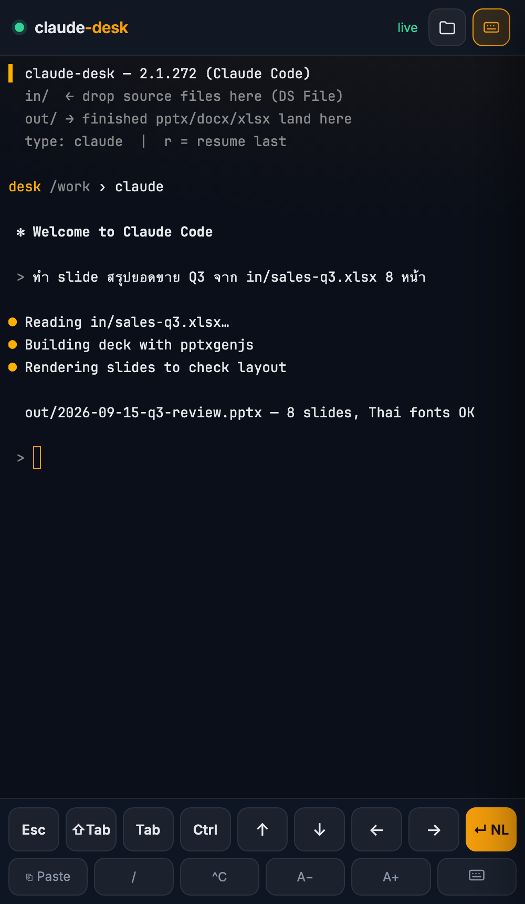
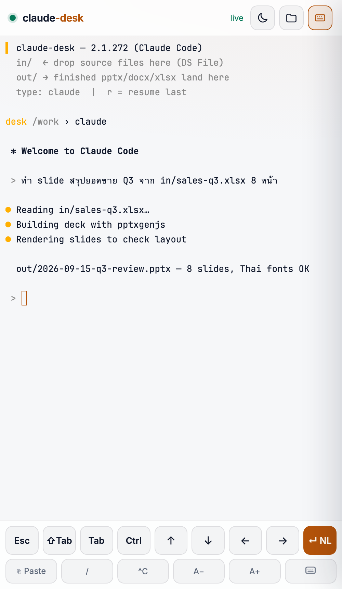
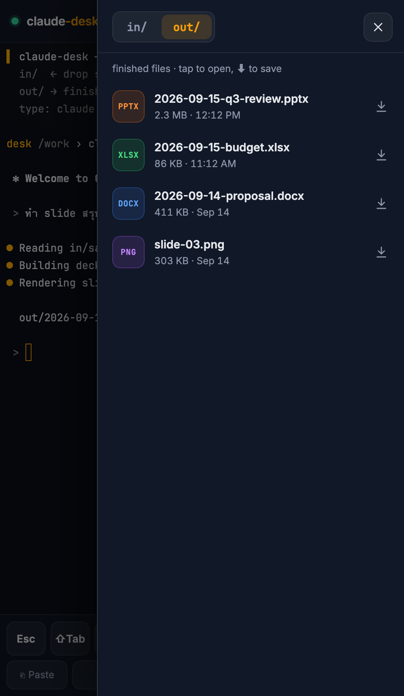
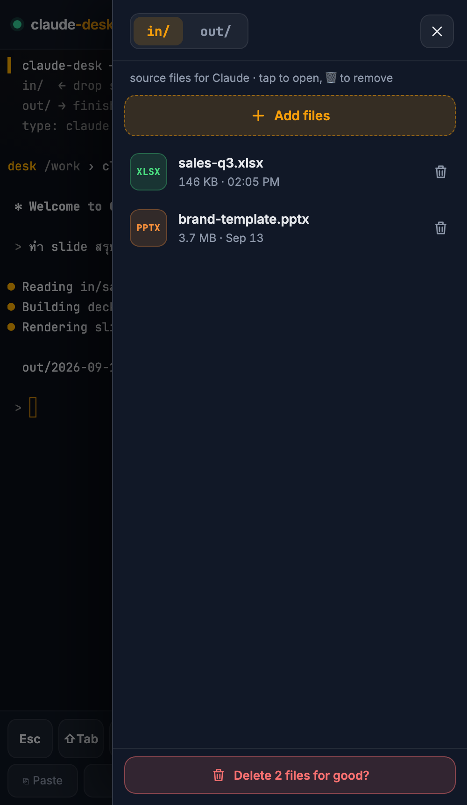
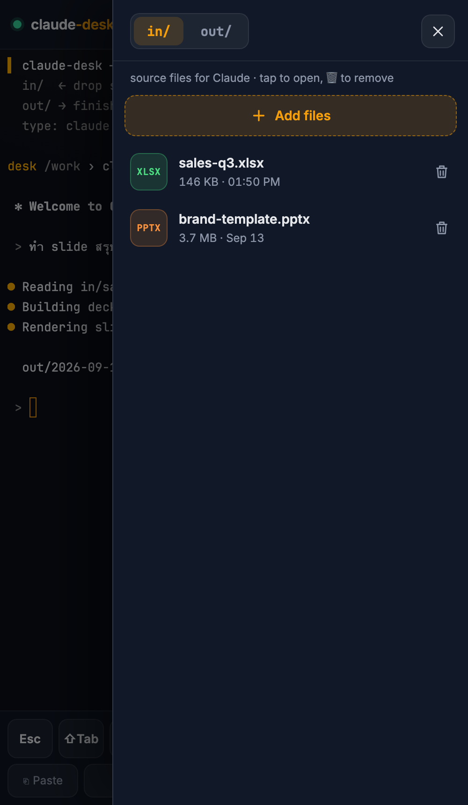

# claude-desk

Claude Code as a document desk, driven from a phone browser. Not a place to
write code — a place to say "make me an 8-slide deck from `in/sales.xlsx`"
and download the `.pptx` a few minutes later.







## What runs

```
phone ──HTTPS :15072 (DSM RP)──▶ claude-desk-nginx :5072
                                   ├─ /            static UI  (ui/)
                                   ├─ /ws, /token  ──▶ claude-desk :7681 (ttyd → tmux → bash → claude)
                                   ├─ /files/in/, /files/out/   autoindex JSON + the files (read-only)
                                   └─ /upload/<dir>/[name]      ──▶ claude-desk :7682 (upload.py → /work/<dir>)
```

- **`upload.py`** — stdlib HTTP server in the desk container (port 7682, only nginx can reach it):
  - `PUT /upload/in/<name>` streams the body into `/work/in/<name>` via a `.part` temp file + atomic rename, so Claude never reads a half-written source. `out/` refuses uploads (403).
  - `DELETE /upload/<dir>/<name>` removes one file from `in/` or `out/`.
  - `DELETE /upload/<dir>/` clears the folder — top-level plain files only, so subdirectories and Synology's `@eaDir` survive.

  Only `in` and `out` are routable, names are one flat segment (no `..`, slashes, or dot-files), and the raw path is split before unquoting so an encoded separator is rejected here rather than becoming a directory step. Size cap is nginx's `client_max_body_size 300m` on `/upload/` (DSM's reverse proxy has its own too).
- **`claude-desk`** — Debian + Node 22 + `@anthropic-ai/claude-code` (pinned `ARG CLAUDE_VERSION`), LibreOffice `*-nogui`, poppler, qpdf, Thai fonts, the Python and npm packages the official office skills need. PID 1 is `ttyd -W -m 1 -P 30 tmux new -A -s main`. Runs as uid 1000 (Claude Code refuses `--dangerously-skip-permissions` as root). Never published on the host.
- **`claude-desk-nginx`** — `nginx:alpine` with `ui/` baked in (`nginx/Dockerfile`): basic auth on every path (`nginx/.htpasswd` from the vault), proxies only the websocket and token endpoints to ttyd, and lists `out/` as JSON. `ui/` cannot be bind-mounted: directories under `/volume2/docker` carry the DSM share ACL, which the nginx worker (uid 101) cannot traverse → 403 on every file. Single-file binds (`nginx.conf`, `.htpasswd`) are read by the root master process and work.
- **`ui/`** — our own page instead of ttyd's: xterm.js 5.3 (vendored, no CDN), Inter + JetBrains Mono self-hosted, a key bar with `Esc ⇧Tab Tab Ctrl ↑↓←→ ↵NL` and `Paste / ^C A− A+ ⌨`, a right-hand drawer with `in/` (Add files → PUT, 🗑 delete) and `out/` (tap to open, ⬇ to save) tabs, a dark/light theme toggle, PWA manifest for Add-to-Home-Screen. Speaks ttyd's websocket protocol directly (touch scrolling and the iOS keyboard handling adapted from `pawprint0706/ttyd-wrapper`, MIT).

## Volumes

| Mount | What | Why |
|---|---|---|
| `claude_desk_home` → `/home/claude` | named volume | `claude --resume` across restarts; `~/.claude.json` lives outside `~/.claude`, hence the whole home |
| `/volume2/claude-work` → `/work` | DSM shared folder | `in/` for source files (drop via DS File / Synology Drive), `out/` for deliverables. `work/CLAUDE.md` is baked into the image and copied to `/work` on every start (same ACL reason — a `./work` bind is unreadable to uid 1000) |
| `/volume2/claude-work` → nginx `/files` (ro) | same share | download side; nginx only exposes `/files/out/` (binding `out/` directly races the entrypoint that creates it) |

**rtk** (the same Bash-output trimmer the workstation runs) is in the image, pinned like ttyd, and `entrypoint.sh` merges `claude-settings.json` (the `PreToolUse Bash → rtk hook claude` hook) into the home volume's `~/.claude/settings.json` on every start — additive, keyed by command string, so settings changed from inside the desk survive. `rtk gain` in the shell shows what it saved.

## Status line

`statusline.sh` is the workstation's status line vendored into the stack — model, effort, cwd, git branch, the context bar, and the 5h / 7d rate-limit rows with a pace projection. The Jira segment did not come along (it needs credentials and a fetch script that never ship here, and its `stat -f` is macOS-only), nor did an unused helper that was the only caller of perl. Everything it does need — `bash jq awk git` — is already in the image.

It sits in the image at `/opt/claude-desk/statusline.sh`, **not** in `~/.claude`: a named volume is only seeded from the image while it is empty, so anything written under `/home/claude` in the Dockerfile never reaches a desk that already exists. `claude-settings.json` points at the image path, and the same merge that installs the rtk hook installs the `statusLine` key.

The rows size themselves on every render. Claude Code captures the script's output rather than connecting it to the terminal — `tput cols` and `stty` see nothing from in there — but it exports the current `COLUMNS` before each run, which is what the script reads. A limit row costs its bar plus ~43 cells of label and tail, so the bar takes what is left, capped at 36. Under ~51 columns (a phone) nothing useful is left and the rows drop the bar and the `(bud 61%, -19% → 69%)` breakdown, keeping the percentage, where the pace lands, and the reset — 24 columns, nothing wraps:

```
Opus 5 | high | work | main*
  ctx 65% (131K)
  5h  42% → 69% ✓ ↻1h56m
  wk  61% → 91% ✓ ↻2d
```

A row that is about to blow its budget appends ` ⚠ wall -17m`, ~12 cells the other rows never pay for — enough to wrap a bar sized for the normal tail. That suffix is dropped when it does not fit (the ⚠ and the projection still say it), so the bars keep their width instead of shrinking for a case most renders never hit.

`STATUSLINE_BAR_W` overrides the arithmetic (`0` forces the narrow layout), but compose deliberately does not set it: the same desk is opened from a phone and from a laptop, and pinning the variable would give both the same layout. That was the first cut of this and it showed up as missing bars on a wide screen.

At 36 the output is byte-identical to the workstation copy, which keeps re-vendoring a clean diff.

Skills live in the image at `/opt/skills` (clone of `anthropics/skills`, pinned `ARG SKILLS_REF`); `entrypoint.sh` re-links `pptx docx xlsx pdf` into `~/.claude/skills` on every start so a ref bump reaches the volume.

## Secrets

`secrets.manifest.yaml` → `.env`:

- `stacks.claude_desk.oauth_token` → `CLAUDE_CODE_OAUTH_TOKEN` — from `claude setup-token` on a machine with a browser (subscription token, ~1 year). No API key: a deck burns tokens.
- `stacks.claude_desk.dashboard.basic_auth_user` / `basic_auth_password` → `nginx/.htpasswd` (gitignored; regenerate on a fresh clone):

```bash
cd claude-desk
U=$(awk -F= '/^DASHBOARD_BASIC_AUTH_USER=/{print $2}' .env)
P=$(awk -F= '{if(/^DASHBOARD_BASIC_AUTH_PASSWORD=/){sub(/^[^=]*=/,"");print}}' .env)
printf '%s:%s\n' "$U" "$(openssl passwd -apr1 "$P")" > nginx/.htpasswd
chmod 644 nginx/.htpasswd
```

- `shared.llm.mimo_api_key` → `MIMO_API_KEY` — the same key the bots use, for `mimo` and `ask` below. Already in the vault, so nothing to add there. `entrypoint.sh` substitutes it into `~/.config/mimocode/mimocode.jsonc` on every start, so the config in git holds a placeholder.

Literals: `CLAUDE_WORK_DIR=/volume2/claude-work`, `MIMO_BASE_URL`, `MIMO_MODEL=mimo-v2.5-pro`.

## First-time setup (in this order)

1. DSM → Control Panel → Shared Folder → create **`claude-work`** on volume2, then in Permissions give the **`users` group Read/Write** — a fresh share's ACL only lists `administrators`, and mode bits (777) are ignored; without it the container gets `Permission denied` on `/work` even as the share owner (SSD — keep the pptx/soffice churn off the big HDD) (`synoshare --add` refuses; and if compose runs first, docker creates a plain root-owned dir with that name and the share can never be created).
2. On the Mac: `claude setup-token` → `sops set secrets/vault.sops.yaml '["stacks"]["claude_desk"]["oauth_token"]' '"<token>"'` → `make sync-test-vault && make secrets`.
3. DSM → Login Portal → Reverse Proxy: `https://<domain>:15072` → `http://localhost:5072`, WebSocket enabled (the RP must pass `Upgrade`; DSM's "Enable WebSocket" checkbox on the rule).
4. `./scripts/deploy.sh -y -s claude-desk` — first build pulls LibreOffice, takes several minutes.
5. Open `https://<domain>:15072` on the phone, sign in, tap ⋯ → Add to Home Screen.

## Theme

The sun/moon button in the header switches dark ↔ light and remembers the
choice in `localStorage`. Until it is tapped once the page follows the phone's
appearance setting and keeps following it, so a nightly auto-switch works
without doing anything. Both palettes live in `style.css` (`[data-theme]`
blocks) and `app.js` (`THEMES`, the terminal's own ANSI set — xterm paints
from its palette, not from CSS, so the two must be kept in step). `?theme=light`
forces one for a screenshot.

Colours emitted as 256-palette codes (the shell banner and prompt from
`profile.sh`, and some Claude Code output) are not part of either palette and
look the same in both themes.

## Using it

- Tap the folder icon → **in/** → **Add files** to upload sources from the phone (or drop them into `claude-work/in/` from DS File — same folder). Type `claude` (alias for `claude --dangerously-skip-permissions`), describe the document. `r` resumes the last session.
- Finished files appear under **out/** in the same drawer: tap to open (iOS previews pptx/xlsx inline), ⬇ to save to Files.
- **Clear in/** and **Clear out/** at the bottom of the drawer empty the folder. The first tap arms the button and shows the count, the second one does it, and it disarms itself after four seconds. **This is permanent** — DSM's recycle bin is a file-service feature and a delete from inside the container goes straight past it.
- **`mimo` (alias `m`) is the second agent: MiMoCode ([XiaomiMiMo/MiMo-Code](https://github.com/XiaomiMiMo/MiMo-Code), a fork of opencode) with our mimo endpoint behind it** — `ARG MIMO_CODE_VERSION`, installed from npm (`@mimo-ai/cli`) rather than the `curl | bash` installer upstream also offers, because npm takes a version pin. A real tool loop: it reads, writes and runs things in `/work` by itself. `mimo` opens the TUI, `mimo run "<task>"` does one task. Slow and free where `claude` is fast and spends subscription quota — a tool-using turn costs tens of seconds and mimo's wall time tracks the tokens it thinks (~30 tok/s), so pick per job. It reads the same `/work/CLAUDE.md` house rules `claude` does (MiMoCode's own convention is `AGENTS.md`; the `instructions` key points it at ours).
- `ask <question>` is a **one-shot question**, not an agent: it prints one answer and touches nothing. It is called `ask` and not `mimo` because MiMoCode's own binary is `mimo`. `cat out/notes.md | ask "สรุปสั้นๆ"` pipes the material in; the answer goes to stdout so it redirects into a file, and the seconds counter goes to stderr. For the small asks (translate, rewrite, explain an error) that need neither an agent nor subscription quota.
- **Copy / Paste** are both buttons on the key bar, and Copy has two sources because the screen has two kinds of selection. At a shell prompt a drag is an ordinary xterm selection and the button reads it. Inside Claude Code it is not: Claude Code turns on mouse tracking, keeps the selection itself, and copies with `tmux load-buffer -w` — the terminal never sees a selection at all (this is the `copied N chars to tmux buffer` line it prints). `set-clipboard on` in `tmux.conf` makes tmux forward that buffer to us as an OSC 52 sequence, `ui/app.js` catches it (xterm.js has no handler of its own) and writes it to the clipboard. On iOS the write needs a tap, so the text is held and the button says `tap to copy` — tap it and the copy lands.
- **Pasting an image does not work and cannot be made to.** Claude Code reads images from the clipboard of the machine it runs on; here that machine is a container with no display server and no clipboard, and the websocket carries keystrokes rather than clipboard objects. Send pictures the same way as any other source file: drawer → **Add files** → it lands in `/work/in/` → name the path in the prompt.
- Close the tab any time — tmux keeps the session; reopening attaches to the same screen.
- `?demo=1&mobile=1` on the URL shows the UI with a canned session and no server, for design work.

## Limits accepted

- `mimo` runs with `MIMOCODE_DANGEROUSLY_SKIP_PERMISSIONS=1` (the alias in `profile.sh`; the flag form cannot be used from an alias — it lands before the subcommand and MiMoCode just prints help), the same bargain as `claude`: a tap per tool call makes the desk unusable from a phone, and the container is the cage. The alias also clears `CLAUDE_CODE_OAUTH_TOKEN`, because MiMoCode's first-run auth offers to *import Claude Code credentials* and it has its own key — hygiene rather than a boundary, since bash is allowed and ttyd runs as the same uid.
- Basic auth is the only gate in front of a shell with permission prompts off. The container is the sandbox: no docker socket, no other mounts, `mem_limit: 2g`. Keep the password long; `-m 1` refuses a second concurrent browser.
- One session, one person. Not multi-user.
- `cpus:` does nothing on DSM; a heavy soffice render can pin a few cores for a minute.
- **Two brains, one desk, no second stack.** `claude` and `mimo` share the image, `/work`, the port and the basic auth. Splitting a `mimo-desk` stack would duplicate the nginx sidecar, the `.htpasswd`, a second DSM reverse-proxy entry and the share, and buy isolation that cannot be used: `ttyd -m 1` + `tmux new -A -s main` means one browser and one screen, so the two agents can never run side by side anyway. If concurrent sessions ever become the point, that is when the split earns itself.
- **`reasoningEffort`, not `reasoning_effort`, in `mimocode.jsonc`.** The snake_case spelling is accepted by the config and silently dropped; the camelCase one is what the AI SDK maps onto the wire. Verified by pointing the harness at a local echo server and reading the body it actually sent — the symptom of getting this wrong is every turn running at mimo's default effort (measured elsewhere at 10,457 tokens/161s against 3,796/79s), which is indistinguishable from "mimo is just slow". Re-checked against MiMoCode itself rather than inherited from opencode — the same capture shows it ignoring `limit.output` and sending `max_tokens: 128000` of its own, which is fine: the rule is that nothing *small* goes out.
- **The model switcher only offers our two models**, because `disabled_providers: ["xiaomi"]` turns off MiMoCode's built-in catalog — there are no credentials for it here, and `only_configured_models` alone does not hide it.
- **Comments in `mimocode.jsonc` must be `//`.** MiMoCode validates its config and rejects unknown keys, so the `"_comment"` array opencode ignored takes down `mimo models` and every session with it. It is a `.jsonc` file and real comments parse fine.
- **mimo is the slow brain, not a router.** Claude Code was *not* rewired to speak to mimo through a translating proxy: that would put a Node router inside a 2 GB container that already holds Claude Code and LibreOffice, to gain skills a coding agent does not use. MiMoCode speaks the OpenAI wire natively, so the harness talks to mimo directly. Probed on the live endpoint (2026-09-15): `tool_calls` come back correctly and the loop writes files and runs commands; `max_tokens` returned real content on a trivial prompt but was not tested under reasoning load, so nothing here sends a small one.
