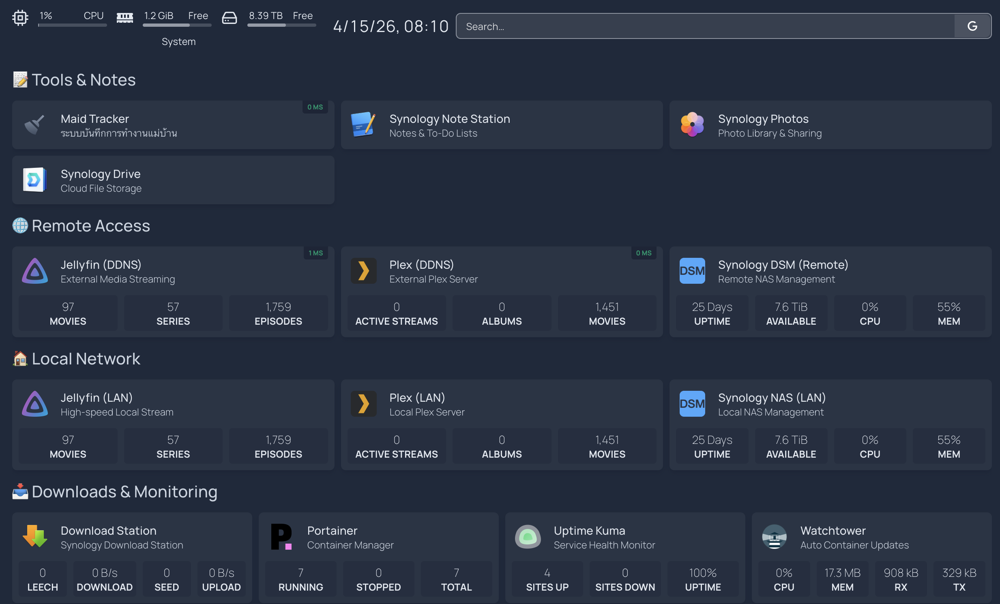

# Homepage



Dashboard UI for the home lab, powered by [gethomepage/homepage](https://gethomepage.dev).

**Local URL:** `https://<NAS_IP>:3000` (HTTPS + HTTP Basic Auth via Nginx)
**External URL:** `https://<NAS_HOST>` (port 443, via Synology Reverse Proxy → Nginx → Homepage)

## File Structure

```
homepage/
├── docker-compose.yml
├── nginx/
│   └── nginx.conf        ← Nginx reverse proxy + Basic Auth config
└── config/
    ├── settings.yaml     ← theme, layout
    ├── widgets.yaml      ← top bar: datetime, search, resources
    ├── services.yaml     ← service cards
    ├── bookmarks.yaml    ← bookmark links
    └── docker.yaml       ← docker socket config
```

## Setup

ตั้งค่า environment variables ที่ **root `.env`** (ไฟล์เดียวสำหรับทุก stack):

```bash
# จาก root ของโปรเจกต์
cp .env.example .env
# แก้ไขค่าในส่วน Homepage และ LINE ใน .env
```

จากนั้น upload ขึ้น NAS ด้วย `deploy.sh` จาก root ของโปรเจกต์

## HTTPS + HTTP Basic Auth

Access to the homepage is protected by Nginx with TLS and HTTP Basic Auth.

| Item | Detail |
|------|--------|
| Credentials | Set `BASIC_AUTH_USER` and `BASIC_AUTH_PASS` in root `.env` |
| Hash generation | `htpasswd` runs automatically on container startup — no manual hashing needed |
| Port layout | Nginx listens on **443 SSL**, exposed on host port **3000**; homepage is internal-only |
| TLS certificate | Synology default cert mounted from `/usr/syno/etc/certificate/system/default/` — uses `RSA-cert.pem` / `RSA-privkey.pem` |

To change the password: update root `.env` and restart the stack (`docker compose down && docker compose up -d`).

### Host Validation

`HOMEPAGE_ALLOWED_HOSTS` must include every hostname:port combination that clients use to reach the container. The current value covers:

| Entry | When used |
|---|---|
| `<NAS_HOST>` | Browser on HTTPS default port (no port suffix in Host header) |
| `<NAS_HOST>:443` | Clients that include the explicit port |
| `<NAS_HOST>:3000` | Direct LAN HTTPS access |
| `192.168.50.200:3000` | Local IP access |

### SSL Certificate Auto-Renewal

The Nginx container reads the cert at startup and caches it in memory. When Synology renews the cert (every 90 days), Nginx must be reloaded to pick it up. Set up a **Synology Task Scheduler** monthly task:

```bash
# DSM → Control Panel → Task Scheduler → Scheduled Task → User-defined script
# Schedule: Monthly, day 1, 03:00 | User: root
docker exec homepage-nginx nginx -s reload
```

## Secrets Injection

Credentials are never hardcoded in config files. They flow through two layers:

1. Docker Compose reads variables from root `.env` via `env_file: ../.env` and injects `HOMEPAGE_VAR_*` container env vars directly.
2. `services.yaml` references them as `{{HOMEPAGE_VAR_*}}` — Homepage interpolates these at runtime.

### Key `.env` Variables (ใน root `.env`)

| Variable | Purpose |
|---|---|
| `HOMEPAGE_VAR_NAS_URL` | DSM API base URL — use **HTTP port 5000** (`http://192.168.x.x:5000`), not HTTPS, to avoid SSL cert mismatch on IP address |
| `HOMEPAGE_VAR_DDNS_BASE_HTTP` | External base for services that don't support HTTPS (e.g. ping checks) |
| `HOMEPAGE_VAR_DDNS_BASE_HTTPS` | External base for clickable service links (HTTPS via Synology Reverse Proxy) |
| `HOMEPAGE_ALLOWED_HOSTS` | Comma-separated list of allowed hostnames — must include bare `<NAS_HOST>` (no port) for standard HTTPS access |

## Configuration

All config files in `config/` are hot-reloaded — no container restart needed after edits.

| File | Purpose |
|---|---|
| `settings.yaml` | Theme, layout, title |
| `widgets.yaml` | Top bar widgets (clock, search, system resources) |
| `services.yaml` | Service cards with API widgets |
| `bookmarks.yaml` | Quick-access links |
| `docker.yaml` | Docker socket connection for container status widgets |
