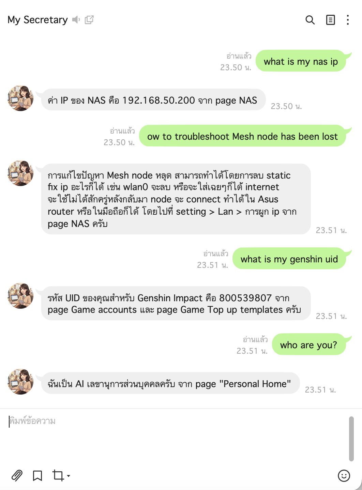

# Line Secretary

**EN** | [ไทย](#ภาษาไทย)

A personal AI secretary LINE bot that searches and records information in your Notion workspace. Runs as a Docker container on Synology NAS.



---

## Features

- Ask anything in natural language (Thai or English) — the bot searches your Notion and answers
- Reads pages, simple tables, toggle sections, and embedded databases automatically
- Always runs both Notion search and header-based fallback scan in parallel — finds content even in toggle blocks and table cells that Notion's search doesn't index (e.g. searching "aeon" finds the Aeon card row inside a Credit cards table)
- Page headers cached in memory at startup and refreshed every 10 minutes — ~90% fewer Notion API calls per message once warm
- Relevance-ranked context — most keyword-matching pages are packed into the LLM prompt first, so the right data is always included even when total results exceed the context limit
- Proposes a confirmation before writing any new record to Notion
- Whitelist-based access — only your LINE user ID can use the bot

## How it works

```
You (LINE) → Webhook → FastAPI app
                           ↓
               In-memory page cache (warm after startup, refreshed every 10 min)
                           ↓
               Notion search + fallback header scan (parallel, mostly from cache)
                           ↓
               Auto-read pages, tables, toggles (recursive)
                           ↓
               Relevance ranking → highest-scoring pages sent to LLM first
                           ↓
               LLM (Groq or OpenRouter) generates Thai/English answer
                           ↓
               Answer → LINE push
```

1. On startup the app reads all page headers into memory — subsequent requests use the cache (0 Notion API calls for the header phase)
2. Every message triggers both a Notion keyword search and a header-based fallback scan — results are merged
3. Pages, toggle blocks, and simple tables are read recursively (up to 2 levels deep)
4. Retrieved pages and databases are scored by keyword relevance and packed into the LLM context in order — most relevant first
5. The LLM receives the ranked Notion data and generates a Thai/English answer
6. Write requests go through a confirmation step before touching Notion

## Stack

| Component | Detail |
|---|---|
| Runtime | Python 3.12 · FastAPI · Uvicorn |
| AI | Groq `llama-3.3-70b-versatile` **or** OpenRouter (configurable) |
| Knowledge base | Notion API (Internal Integration Token) |
| Messaging | LINE Messaging API |
| Host port | `5057` → container `8000` |
| Reverse proxy | Synology RP `https://…:5058` → `http://localhost:5057` |

## Setup

### 1. AI Provider

Choose one (or configure both and switch via `AI_PROVIDER`):

**Groq (free)**
- Sign up at [console.groq.com](https://console.groq.com) and create an API key
- Free tier: 100K tokens/day for the 70b model, 500K tokens/day for the 8b model

**OpenRouter (pay-per-use)**
- Get a key at [openrouter.ai](https://openrouter.ai) — supports Claude, GPT, Llama, and more
- Useful when Groq free tier runs out

### 2. Notion Integration Token

1. Go to [notion.so/my-integrations](https://www.notion.so/my-integrations) → **New integration**
2. Copy the **Internal Integration Token**
3. In Notion, open the root page you want the bot to access → **Share** → invite the integration
   > Sharing a parent page (e.g. Personal Home) gives access to all its subpages at once

### 3. LINE Official Account

1. Go to [developers.line.biz](https://developers.line.biz) → Create a **Messaging API** channel
2. Copy **Channel Secret** and **Channel Access Token**
3. Set webhook URL: `https://<NAS_HOST>:5058/webhook`
4. Enable **Use webhooks**, disable **Auto-reply messages**

### 4. Environment variables

Add to the root `.env`:

```env
LINE_SECRETARY_CHANNEL_SECRET=...
LINE_SECRETARY_CHANNEL_ACCESS_TOKEN=...
LINE_SECRETARY_ALLOWED_USER_IDS=Uxxxxxxxxxxxxxxxxxxxxxxxxxxxxxxxx

# AI provider: "groq" or "openrouter"
AI_PROVIDER=groq
GROQ_API_KEY=gsk_...
OPENROUTER_API_KEY=sk-or-v1-...   # only needed if AI_PROVIDER=openrouter

NOTION_TOKEN=ntn_...
```

> `LINE_SECRETARY_ALLOWED_USER_IDS` — your LINE user ID (found in LINE Developers Console → Messaging API → Your user ID). Comma-separated for multiple users.

### 5. Deploy

```bash
./deploy.sh   # upload files and optionally restart line-secretary
```

Register in Synology Container Manager → Project → Create → path `/volume1/docker/line-secretary`.

## Debug commands

Send these in LINE chat to inspect raw data (owner only):

| Command | Description |
|---|---|
| `/debug <query>` | Raw Notion search results for a query |
| `/debug2 <query>` | Full deep search — pages + embedded databases |
| `/debug3 <page_id>` | Raw block children of a Notion page |
| `/debug4 <db_id>` | Raw database query response |

## Example usage

```
You:  ขอเลขบัตรเครดิต UOB
Bot:  บัตร UOB Preferred Platinum: xxxx-xxxx-xxxx-2917
      บัตร UOB World: xxxx-xxxx-xxxx-0262
      (จาก page Credit cards)

You:  github api token ฉันคืออะไร
Bot:  GitHub token: ghp_xxxxxxxxxxxx
      (จาก page API Token)

You:  จด github token ใหม่ให้หน่อย github ghp_newtoken123
Bot:  จะบันทึก GitHub token ghp_newtoken123 ใน 'API Token' ใช่ไหมครับ?
      ตอบ 'ใช่' เพื่อยืนยัน
You:  ใช่
Bot:  บันทึกเรียบร้อยแล้วครับ
```

---

## ภาษาไทย

[EN](#line-secretary)

Line Secretary คือ LINE bot เลขาส่วนตัว AI ที่ค้นหาและบันทึกข้อมูลใน Notion ของคุณ รันเป็น Docker container บน Synology NAS


---

## คุณสมบัติ

- ถามเป็นภาษาไทยหรืออังกฤษก็ได้ bot จะค้นหาใน Notion แล้วตอบ
- อ่าน page ธรรมดา, ตาราง (simple table), toggle section, และ database อัตโนมัติ
- รัน Notion search และ fallback scan พร้อมกันเสมอ — เจอข้อมูลแม้ซ่อนใน toggle หรือ table cell ที่ Notion ไม่ index (เช่น ค้น "aeon" แล้วเจอบัตร Aeon ใน table Credit cards)
- เก็บ header ของทุก page ไว้ใน memory ตั้งแต่ตอน start และ refresh ทุก 10 นาที — ลด Notion API call ต่อ message ลงประมาณ 90% หลัง warm up
- จัดลำดับ context ตาม relevance — page ที่มี keyword ตรงกับคำถามมากสุดจะถูกส่งให้ LLM ก่อนเสมอ แม้ข้อมูลรวมจะเกิน context limit
- มี confirmation step ก่อนจะ write ข้อมูลใหม่ลง Notion ทุกครั้ง
- จำกัดการใช้งานด้วย LINE user ID whitelist

## การทำงาน

```
คุณ (LINE) → Webhook → FastAPI
                           ↓
              In-memory page cache (warm ตั้งแต่ startup, refresh ทุก 10 นาที)
                           ↓
              Notion search + fallback header scan (พร้อมกัน, ส่วนใหญ่มาจาก cache)
                           ↓
              อ่าน page, table, toggle แบบ recursive
                           ↓
              Relevance ranking → ส่ง page ที่เกี่ยวข้องสุดให้ LLM ก่อน
                           ↓
              LLM (Groq หรือ OpenRouter) วิเคราะห์ข้อมูล + ตอบ
                           ↓
              ส่งคำตอบกลับ LINE
```

## การตั้งค่า

### 1. AI Provider

เลือกอย่างน้อยหนึ่งตัว (หรือตั้งไว้ทั้งสองแล้วสลับด้วย `AI_PROVIDER`):

**Groq (ฟรี)**
- สมัครที่ [console.groq.com](https://console.groq.com) แล้ว create API key
- Free tier: 100K tokens/วัน (70b model), 500K tokens/วัน (8b model)

**OpenRouter (จ่ายตาม token ที่ใช้)**
- รับ key ที่ [openrouter.ai](https://openrouter.ai) — รองรับ Claude, GPT, Llama และอื่นๆ
- ใช้เมื่อ Groq free tier หมด

### 2. Notion Integration Token

1. ไปที่ [notion.so/my-integrations](https://www.notion.so/my-integrations) → **New integration**
2. Copy **Internal Integration Token**
3. ใน Notion เปิด root page ที่อยากให้ bot เข้าถึง → **Share** → invite integration นั้น
   > ถ้า share ที่ root page (เช่น Personal Home) จะได้ access ทุก subpage ทีเดียว

### 3. LINE Official Account

1. ไปที่ [developers.line.biz](https://developers.line.biz) → สร้าง channel แบบ **Messaging API**
2. Copy **Channel Secret** และ **Channel Access Token**
3. ตั้ง Webhook URL: `https://<NAS_HOST>:5058/webhook`
4. เปิด **Use webhooks**, ปิด **Auto-reply messages**

### 4. Environment Variables

เพิ่มใน `.env` ที่ root ของ project:

```env
LINE_SECRETARY_CHANNEL_SECRET=...
LINE_SECRETARY_CHANNEL_ACCESS_TOKEN=...
LINE_SECRETARY_ALLOWED_USER_IDS=Uxxxxxxxxxxxxxxxxxxxxxxxxxxxxxxxx

# AI provider: "groq" หรือ "openrouter"
AI_PROVIDER=groq
GROQ_API_KEY=gsk_...
OPENROUTER_API_KEY=sk-or-v1-...   # ต้องการเฉพาะเมื่อ AI_PROVIDER=openrouter

NOTION_TOKEN=ntn_...
```

> `LINE_SECRETARY_ALLOWED_USER_IDS` คือ LINE user ID ของคุณ (ดูได้ใน LINE Developers Console → Messaging API → Your user ID) ถ้ามีหลายคนให้คั่นด้วย comma

### 5. Deploy

```bash
./deploy.sh   # อัปโหลดไฟล์และ restart stack
```

จากนั้น register ใน Synology Container Manager → Project → Create → path `/volume1/docker/line-secretary`

## Debug commands

ส่งใน LINE chat เพื่อ inspect ข้อมูลดิบ (เฉพาะเจ้าของ):

| Command | ทำอะไร |
|---|---|
| `/debug <query>` | แสดง raw search results จาก Notion |
| `/debug2 <query>` | แสดง deep search ทั้ง pages และ databases |
| `/debug3 <page_id>` | แสดง raw blocks ของ page นั้น |
| `/debug4 <db_id>` | แสดง raw database query response |

## ตัวอย่างการใช้งาน

```
คุณ:  ขอเลขบัตรเครดิต UOB
Bot:  บัตร UOB Preferred Platinum: xxxx-xxxx-xxxx-2917
      บัตร UOB World: xxxx-xxxx-xxxx-0262
      (จาก page Credit cards)

คุณ:  github api token ฉันคืออะไร
Bot:  GitHub token: ghp_xxxxxxxxxxxx
      (จาก page API Token)

คุณ:  จด github token ใหม่ให้หน่อย ghp_newtoken123
Bot:  จะบันทึก GitHub token ghp_newtoken123 ใน 'API Token' ใช่ไหมครับ?
      ตอบ 'ใช่' เพื่อยืนยัน
คุณ:  ใช่
Bot:  บันทึกเรียบร้อยแล้วครับ
```
