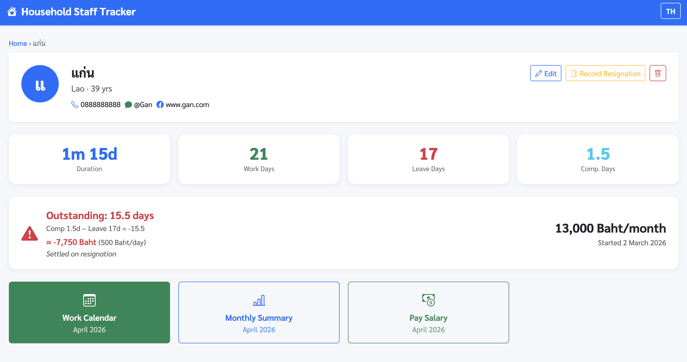

# Maid Tracker

Household staff attendance & salary tracking system — Single-Page Application running on Docker.



## Stack

| Component | Technology |
|-----------|-----------|
| Backend | FastAPI (Python 3.12) |
| Database | SQLite (persisted in named volume) |
| Frontend | Vanilla JS + Bootstrap 5 (SPA, hash-based routing) |
| Port | 5055 → container 8000 |

## Features

### 👤 Staff Management
- Add / edit / delete staff records (name, age, nationality, phone, LINE, Facebook)
- Monthly salary + start date + employment duration display (shows years/months/days once tenure reaches 1 year)

### 📅 Work Calendar
- Click a day to change status — **full-day / half-day dialog** before saving leave/comp
- Statuses: **Work**, **Leave** (full/half), **Day Off** (Sunday), **Compensatory** (full/half)
- Half-day counts as 0.5 in all calculations — shown as "Leave ½" / "Comp ½" on calendar
- Record a leave reason per day
- Navigate forward/backward by month

### 📋 Leave Log
- Leave entries for the month listed below the calendar, with "½" badge for half-day leave
- Click a leave day on the calendar → instantly revert to Work/Day Off
- Edit leave reason for each day

### 📊 Monthly Summary
- Count Work / Leave / Day Off / Compensatory days
- Calculate daily rate (salary ÷ Mon–Sat working days in the month)
- Base salary (pro-rated for the first partial month)
- Show cumulative leave/comp balance + carry-over from previous month
- **Leave cap deduction row** appears when max leave carry is configured and exceeded

### 💰 Salary Payment
- Split into **2 periods/month**: Period 1 (15th) and Period 2 (last day of month)
- Period 1 = salary ÷ 2; Period 2 = remaining half (± leave cap deduction if configured)
- **Period 2 shows a deduction breakdown** when leave exceeds the max carry limit
- Mark paid / unmark with timestamp
- Alert showing pending unpaid periods

### 🚦 Max Leave Carry Cap *(optional per employee)*
- Set a **max leave carry** (days) on each employee — leave the field blank for unlimited accumulation (default behaviour)
- At the end of each month (Period 2), the system checks the employee's cumulative leave debt after accounting for all previous months' caps
- If leave debt exceeds the cap, the **excess × daily rate is deducted from Period 2**
- The carry-forward balance is reset to `-max_leave_carry` (excess days are considered settled)
- Example: `max_leave_carry = 3`, balance = −5 days → deduct 2 days × daily rate from Period 2; carry-forward = −3 days
- LINE payment notification includes the deduction when applicable

### 🚪 Resignation
- Record resignation date + reason
- Resignation summary: last month salary (pro-rated) ± total accumulated leave/comp balance
- Shows net amount to pay or deduct on resignation day
- Cancel resignation supported
- **Balance preview before resignation** — staff detail page shows days + approximate amount (at current daily rate) without needing to file resignation first

### 🔔 Scheduled Task Reminders
- Manage a list of recurring LINE reminders for household chores (bell icon in the top-right of the nav bar → `#/reminders`)
- Two schedule types:
  - **Monthly by last digit of date** — e.g. digit `0` fires on the 10th, 20th, 30th of every month
  - **Weekly by day of week** — checkbox selection (Mon–Sun); e.g. Monday + Thursday
- Each reminder has: name, LINE message text, send time (HH:MM), enabled/disabled toggle
- **Test Send** button fires the reminder immediately without waiting for the schedule
- Two default reminders are pre-loaded on first run:
  - **เปลี่ยนผ้าปูที่นอน** — every day ending in 0 at 07:00
  - **ล้างห้องน้ำ** — every Monday and Thursday at 07:00
- Reminders are silently skipped if `LINE_CHANNEL_ACCESS_TOKEN` / `LINE_GROUP_ID` are not set

### 🌐 Language Toggle
- Switch **Thai ↔ English** at any time (TH/EN button top-right)
- Language preference saved in `localStorage`

### 🔔 LINE Notifications
Sends a LINE message via LINE Messaging API on the following events:

| Event | Message includes |
|-------|-----------------|
| Leave recorded | Staff name · date · full/half day · current cumulative balance (days + ฿) |
| Compensatory recorded | Staff name · date · full/half day · current cumulative balance |
| Leave cancelled | Staff name · date · "cancelled" label · updated balance |
| Compensatory cancelled | Staff name · date · "cancelled" label · updated balance |
| Salary paid (period 1 or 2) | Staff name · month/period · amount · current balance |
| Resignation recorded | Staff name · resign date · reason (if any) · resignation summary (last-month pay ± balance settlement = final amount) |
| Resignation cancelled | Staff name · cancellation confirmation |

Notifications are **opt-in** — if `LINE_CHANNEL_ACCESS_TOKEN` or `LINE_GROUP_ID` are not set in the environment, all notifications are silently skipped and the app functions normally. Messages are pushed to a LINE **group** so every member sees them with a single API call. See [LINE Group Setup](#line-group-setup) below.

### 📲 LINE Webhook — Auto Attendance & Salary Payment from Chat

**Anyone** in the LINE group can trigger attendance recording **or mark a salary payment as paid** by typing a keyword — the employee, the owner, or any group member.

**Leave keywords** (any of the following):

| Keyword | Result |
|---------|--------|
| `ขอลา` / `วันนี้ขอลา` / `ลาวันนี้` / `วันนี้ลา` | Full-day leave |
| `ขอหยุด` / `หยุดวันนี้` / `วันนี้หยุด` | Full-day leave |
| `take leave` / `taking leave` / `leave today` / `on leave` | Full-day leave |
| `day off` / `off today` / `half day leave` / `half day off` | Full-day leave |
| + `ครึ่งวัน` / `half day` / `half-day` anywhere in the message | Half-day leave |

**Compensatory keywords** (Sunday worked / extra day):

| Keyword | Result |
|---------|--------|
| `ทำชดเชย` / `ชดเชยวันนี้` / `วันนี้ชดเชย` / `วันนี้ทำชดเชย` | Full-day compensatory |
| `ทำงานวันหยุด` / `ทำงานวันอาทิตย์` | Full-day compensatory |
| `comp day` / `compensatory` / `working on holiday` | Full-day compensatory |
| `working today` / `work today` / `worked today` | Full-day compensatory |
| + `ครึ่งวัน` / `half day` / `half-day` anywhere in the message | Half-day compensatory |

**Example messages:**
- `วันนี้ขอลานะคะ` → full-day leave today
- `ขอลาครึ่งวันนะคะ` → half-day leave today
- `taking leave today` → full-day leave today
- `day off half day` → half-day leave today
- `วันนี้ทำชดเชยนะครับ` → full-day compensatory today
- `comp day half day` → half-day compensatory today

**Behaviour:**
- **No LINE User ID needed** — anyone in the group can type the message
- If only **1 active employee** → automatically records for that employee
- If **multiple active employees** → tries to find a name mention in the text; if ambiguous, sends a clarification message asking to include the name
- If today is Sunday and status is leave → notifies and skips (Sunday is already a holiday, no leave needed)
- If today is a workday (Mon–Sat) and status is compensatory → notifies and skips (compensatory only applies on Sundays worked)
- If the same status is already recorded for today → notifies and skips (no duplicate)
- Before recording → bot sends an acknowledgment first (e.g. "กำลังบันทึกลาเต็มวันในระบบให้นะคะ...") so the group knows action is in progress
- On success → sends the full attendance notification with cumulative balance

**Salary payment keywords:**

| Keyword | Result |
|---------|--------|
| `จ่ายแล้ว` / `จ่ายเงินแล้ว` / `โอนแล้ว` | Auto-detect period from current date |
| + `กลางเดือน` / `รอบแรก` / `รอบ 1` | Force Period 1 (15th) |
| + `ปลายเดือน` / `รอบสอง` / `รอบ 2` | Force Period 2 (end of month) |
| + `ทั้งเดือน` / `ทั้งคู่` / `ทั้งสองรอบ` | Mark both periods |
| `paid` / `salary paid` / `transferred` | Same as Thai, English variant |

**Period auto-detection logic (when no period keyword specified):**
- Days **13–18**: bot assumes Period 1 (around the 15th pay date)
- Days **24–end of month**: bot assumes Period 2 (near the month-end pay date)
- **Other days**: bot asks for clarification in the group chat

**Payment behaviour:**
- Bot sends an acknowledgment message first ("กำลังบันทึกจ่ายเงินเดือน...")
- If a period is already marked as paid → bot notifies and skips (no duplicate)
- Confirmation message with the paid amount and current balance is sent on success

**Balance query keywords:**

| Keyword | Result |
|---------|--------|
| `ยอดสะสม` / `เช็คยอด` / `ยอดลา` | Reply with current comp/leave balance |
| `balance` / `check balance` / `my balance` | Same, English variant |

**Adding / removing keywords:**

All trigger phrases live in [`keywords.py`](keywords.py) — edit that file and redeploy. No changes to `main.py` needed.

**Requirements:**
- `LINE_CHANNEL_SECRET` env var (for signature verification)
- Maid-tracker must be accessible from the internet via a **public HTTPS URL** — LINE's platform requires it to deliver webhooks (see [Webhook Setup](#webhook-setup) below)

---

## Salary Calculation Policy

| Event | Monthly salary effect | Resignation effect |
|-------|----------------------|-------------------|
| Leave (full day) | **No deduction** (unless max leave carry exceeded) | Deducted on resignation (−1 day) |
| Leave (half day) | **No deduction** (unless max leave carry exceeded) | Deducted on resignation (−0.5 day) |
| Compensatory (full day) | **No addition** | Paid out on resignation (+1 day) |
| Compensatory (half day) | **No addition** | Paid out on resignation (+0.5 day) |
| Cumulative balance | Carried forward (capped at −max_leave_carry if configured) | Settled in full |

**Monthly salary formula (no cap):** `Full monthly salary` (regardless of leave taken)

**Monthly salary formula (with cap):** `Full monthly salary − excess leave days × daily rate` (Period 2 only)
- Excess = days by which leave debt exceeds `max_leave_carry`
- Excess is deducted from Period 2; carry-forward is reset to `−max_leave_carry`

**Resignation formula:** `Last month salary (pro-rated) + (accumulated comp − accumulated leave) × daily rate`
- The resignation settlement uses the raw cumulative balance — previous monthly deductions were already collected in salary

---

## Deployment

Use `deploy.sh` from the repo root, or restart manually in Container Manager.

```bash
# From repo root
./deploy.sh
# Choose to restart maid-tracker when prompted
```

## Configuration

No `.env` needed for basic use. Create one to enable LINE notifications.

| Variable | Default | Notes |
|----------|---------|-------|
| `TZ` | `Asia/Bangkok` | Set in docker-compose.yml |
| `DATA_DIR` | `/data` | SQLite DB storage path |
| `LINE_CHANNEL_ACCESS_TOKEN` | _(empty)_ | LINE Messaging API channel token — leave blank to disable |
| `LINE_GROUP_ID` | _(empty)_ | LINE group ID (starts with `C`) — see [LINE Group Setup](#line-group-setup) |
| `LINE_CHANNEL_SECRET` | _(empty)_ | LINE channel secret for webhook signature verification — see [Webhook Setup](#webhook-setup) |

## LINE Group Setup

One-time steps to get the group ID and wire up notifications.

### 1 — Allow bot to join group chats (LINE Developers Console)

1. Open [LINE Developers Console](https://developers.line.biz/) → your **Messaging API Channel**
2. Tab **Messaging API settings** → find **"Allow bot to join group chats"** → **Edit** → **Enabled**
3. _(Recommended)_ Set **Auto-reply messages** → **Disabled** to prevent the bot from auto-replying in the group

### 2 — Create group and invite the bot

1. Open the LINE app → create a new group with all family members
2. Add your LINE OA (bot) to the group as you would add a friend

### 3 — Get the Group ID via webhook

The Group ID (starts with `C`) is only available through a Webhook event.

**Option A — use a temporary webhook inspector** (easiest):

1. Go to [webhook.site](https://webhook.site/) and copy your unique URL
2. In LINE Developers Console → **Messaging API settings** → set **Webhook URL** to that URL → **Verify**
3. Send **any message** in the group
4. In webhook.site, look for the `groupId` field inside `events[0].source`:
   ```json
   "source": {
     "type": "group",
     "groupId": "C1a2b3c4d5..."
   }
   ```
5. Copy the `groupId` value

**Option B — check container logs** (if your stack already has a webhook endpoint):

Send a message in the group, then run:
```bash
docker logs maid-tracker 2>&1 | grep groupId
```

### 4 — Set the env var

Add to your `.env` file (next to `docker-compose.yml`):
```env
LINE_CHANNEL_ACCESS_TOKEN=<your token>
LINE_GROUP_ID=C1a2b3c4d5...
```

Then redeploy (`./deploy.sh` from repo root).

## Webhook Setup

To enable auto attendance recording from LINE chat, the app must receive webhook events from LINE's platform.

### 1 — Make maid-tracker accessible over HTTPS

LINE only delivers webhooks to public HTTPS URLs.

**Current setup:** Synology Reverse Proxy handles HTTPS termination at `https://<NAS_HOST>:5056` → `http://localhost:5055`. No extra containers or tunnels needed. Router forwards external port **5056 → NAS port 5056**.

Other options if you don't use Synology Reverse Proxy:

| Method | Notes |
|--------|-------|
| **Port forwarding + nginx/Caddy** | Expose port 5055 externally; handle TLS in a separate proxy |
| **Cloudflare Tunnel** (`cloudflared`) | Free, no port forwarding needed; add as a separate Docker service |
| **ngrok** | Easy for testing; free tier has a changing URL |

### 2 — Set Webhook URL in LINE Developers Console

1. Open [LINE Developers Console](https://developers.line.biz/) → your Messaging API Channel
2. Tab **Messaging API settings** → **Webhook URL** → set to:
   ```
   https://<your-public-domain>/webhook/line
   ```
3. Click **Verify** — should return `200 OK`
4. Enable **Use webhook** toggle

### 3 — Add LINE_CHANNEL_SECRET to .env

Find the **Channel secret** in LINE Developers Console → **Basic settings** tab.

```env
LINE_CHANNEL_SECRET=abc123...
```

Then redeploy.

## Data Persistence

SQLite database is stored in named volume `maid_tracker_data` at `/data/maid_tracker.db`.

The volume is not removed on stack restart — data is safe.

## DB Schema

```sql
employees (
  id, name, age, nationality, phone, line_id, facebook,
  start_date, monthly_salary, end_date, resign_note, created_at
)

attendance (
  id, employee_id, work_date,
  status CHECK(IN 'work','leave','holiday','compensatory'),
  note,
  half_day INTEGER DEFAULT 0  -- 1 = half day (counts as 0.5 in all calculations)
)

salary_payments (
  id, employee_id, year, month,
  period CHECK(IN 1, 2),
  paid_at  -- NULL = not yet paid
)

reminders (
  id, name, message,
  enabled INTEGER DEFAULT 1,
  schedule_type CHECK(IN 'month_day_digit','weekday'),
  schedule_value,  -- digit: "0" or "0,5" | weekday: "0,3" (0=Mon…6=Sun)
  send_time,       -- "HH:MM"
  last_sent_date,  -- guards against double-fire on the same day
  created_at
)
```

## Routes (Hash-based SPA)

| Hash | View |
|------|------|
| `#/` | Staff list |
| `#/employee/new` | Add new staff |
| `#/employee/:id` | Staff profile & overview |
| `#/employee/:id/edit` | Edit staff info |
| `#/employee/:id/leaves?y=&m=` | Calendar + leave log |
| `#/employee/:id/summary?y=&m=` | Monthly summary |
| `#/employee/:id/payments?y=&m=` | Salary payments |
| `#/employee/:id/attendance?y=&m=` | Work calendar (standalone) |
| `#/reminders` | Scheduled task reminders |

---

---

# ระบบบันทึกการทำงานแม่บ้าน

ระบบบันทึกการทำงานและเงินเดือนแม่บ้าน — Single-Page Application ที่รันบน Docker

## Stack

| Component | Technology |
|-----------|-----------|
| Backend | FastAPI (Python 3.12) |
| Database | SQLite (persisted ใน named volume) |
| Frontend | Vanilla JS + Bootstrap 5 (SPA, hash-based routing) |
| Port | 5055 → container 8000 |

## Features

### 👤 จัดการข้อมูลแม่บ้าน
- เพิ่ม / แก้ไข / ลบข้อมูล (ชื่อ, อายุ, สัญชาติ, เบอร์โทร, LINE, Facebook)
- เงินเดือน + วันเริ่มงาน + แสดงระยะเวลาทำงาน (แสดงเป็นปี/เดือน/วันเมื่อทำงานครบ 1 ปีขึ้นไป)

### 📅 ปฏิทินการทำงาน
- คลิกวันเพื่อเปลี่ยนสถานะ — มี **dialog เลือกเต็มวัน / ครึ่งวัน** ก่อนบันทึกลา/ชดเชย
- สถานะ: **ทำงาน**, **ลา** (เต็ม/ครึ่ง), **หยุด** (อาทิตย์), **ชดเชย** (เต็ม/ครึ่ง)
- ครึ่งวันนับเป็น 0.5 ในทุกการคำนวณ — แสดง "ลา ½" / "ชดเชย ½" ในปฏิทิน
- บันทึกเหตุผลการลาในแต่ละวัน
- เดินหน้า-หลังเดือนได้

### 📋 บันทึกวันลา
- รายการวันลาในเดือนแสดงใต้ปฏิทิน พร้อม badge "½" สำหรับลาครึ่งวัน
- คลิกปฏิทินวันลา → กลับเป็นทำงาน/หยุดได้ทันที
- แก้ไขเหตุผลการลาแต่ละวัน

### 📊 สรุปรายเดือน
- นับวันทำงาน / ลา / หยุด / ชดเชย
- คำนวณอัตราค่าจ้างรายวัน (เงินเดือน ÷ วันทำงาน Mon–Sat ในเดือน)
- ฐานเงินเดือน (pro-rate เดือนแรกถ้าเริ่มงานกลางเดือน)
- แสดงยอดลา/ชดเชยสะสม — **ไม่หักเงินเดือนรายเดือน** (ดูนโยบายด้านล่าง)
- ยอดยกมาจากเดือนก่อน + ยอดสะสมรวม

### 💰 ระบบจ่ายเงินเดือน
- แบ่งจ่าย **2 รอบ/เดือน**: รอบแรก (วันที่ 15) และรอบสอง (วันสุดท้ายเดือน)
- แต่ละรอบ = เงินเดือน ÷ 2 (ไม่มีการหักลา/ชดเชยรายเดือน)
- กดบันทึกว่าจ่ายแล้ว / ยกเลิก พร้อมแสดงเวลาที่จ่าย
- แสดง alert แจ้งรอบที่ยังค้างจ่าย

### 🚪 ระบบลาออก
- บันทึกวันที่ลาออก + เหตุผล
- สรุปการลาออก: เงินเดือนเดือนสุดท้าย (pro-rate) ± ยอดสะสมลา/ชดเชยทั้งหมด
- แสดงยอดสุทธิที่ต้องจ่าย หรือต้องหักในวันลาออก
- ยกเลิกการลาออกได้
- **แสดงยอดค้างก่อนลาออก** — หน้าข้อมูลแม่บ้านแสดงจำนวนวัน + เงินโดยประมาณ (อัตราเดือนปัจจุบัน) ทันทีโดยไม่ต้องกดแจ้งลาออกก่อน

### 🔔 การแจ้งเตือนงานประจำ
- จัดการรายการแจ้งเตือนซ้ำสำหรับงานบ้าน (กดไอคอนกระดิ่งมุมขวาบน → `#/reminders`)
- รูปแบบกำหนดการ 2 แบบ:
  - **รายเดือน ตามตัวเลขท้ายวันที่** — เช่น เลข `0` ส่งทุกวันที่ 10, 20, 30
  - **รายสัปดาห์ ตามวัน** — เลือก checkbox (จันทร์–อาทิตย์) เช่น จันทร์+พฤหัส
- แต่ละรายการมี: ชื่องาน, ข้อความ LINE, เวลาแจ้งเตือน (HH:MM), สวิตช์เปิด/ปิด
- ปุ่ม **ทดสอบส่ง** ส่งข้อความทันทีโดยไม่รอกำหนดการ
- มีรายการเริ่มต้น 2 รายการเมื่อรันครั้งแรก:
  - **เปลี่ยนผ้าปูที่นอน** — ทุกวันที่ลงท้ายด้วย 0 เวลา 07:00
  - **ล้างห้องน้ำ** — ทุกวันจันทร์และพฤหัส เวลา 07:00
- ข้ามการแจ้งเตือนเงียบๆ ถ้ายังไม่ได้ตั้งค่า `LINE_CHANNEL_ACCESS_TOKEN` / `LINE_GROUP_ID`

### 🌐 เปลี่ยนภาษา
- สลับ **ไทย ↔ English** ได้ตลอดเวลา (ปุ่ม TH/EN มุมขวาบน)
- จำการตั้งค่าภาษาใน `localStorage`

### 📲 LINE Webhook — บันทึกลา/ชดเชยอัตโนมัติจากแชท

**ใครในกลุ่มก็พิมได้** — แม่บ้านพิมเอง หรือเจ้าของบ้านพิมแทน บอทจะบันทึกให้อัตโนมัติและยืนยันกลับในกลุ่ม

**Keyword วันลา** (พิมพ์คำใดคำหนึ่ง):

| คำ | ผลลัพธ์ |
|----|---------|
| `ขอลา` / `วันนี้ขอลา` / `ลาวันนี้` / `วันนี้ลา` | ลาเต็มวัน |
| `ขอหยุด` / `หยุดวันนี้` / `วันนี้หยุด` | ลาเต็มวัน |
| `take leave` / `taking leave` / `leave today` / `on leave` | ลาเต็มวัน |
| `day off` / `off today` / `half day leave` / `half day off` | ลาเต็มวัน |
| + `ครึ่งวัน` / `half day` / `half-day` ในข้อความ | ลาครึ่งวัน |

**Keyword ชดเชย** (ทำงานวันหยุด):

| คำ | ผลลัพธ์ |
|----|---------|
| `ทำชดเชย` / `ชดเชยวันนี้` / `วันนี้ชดเชย` / `วันนี้ทำชดเชย` | ชดเชยเต็มวัน |
| `ทำงานวันหยุด` / `ทำงานวันอาทิตย์` | ชดเชยเต็มวัน |
| `comp day` / `compensatory` / `working on holiday` | ชดเชยเต็มวัน |
| `working today` / `work today` / `worked today` | ชดเชยเต็มวัน |
| + `ครึ่งวัน` / `half day` / `half-day` ในข้อความ | ชดเชยครึ่งวัน |

**ตัวอย่างข้อความ:**
- `วันนี้ขอลานะคะ` → ลาเต็มวันวันนี้
- `ขอลาครึ่งวันนะคะ` → ลาครึ่งวันวันนี้
- `taking leave today` → ลาเต็มวันวันนี้
- `day off half day` → ลาครึ่งวันวันนี้
- `วันนี้ทำชดเชยนะครับ` → ชดเชยเต็มวันวันนี้
- `comp day half day` → ชดเชยครึ่งวันวันนี้

**พฤติกรรม:**
- **ไม่ต้องผูก LINE User ID** — ใครพิมในกลุ่มก็ได้
- ถ้ามีพนักงาน **1 คน** → บันทึกให้อัตโนมัติ
- ถ้ามีพนักงาน **หลายคน** → ตรวจหาชื่อในข้อความ; ถ้าไม่ชัดเจนให้บอทส่งข้อความขอให้ระบุชื่อ
- ถ้าวันนี้เป็นวันอาทิตย์และเป็นการขอลา → แจ้งว่าเป็นวันหยุดอยู่แล้วและข้ามไป
- ถ้าวันนี้เป็นวันทำงานปกติ (จ.–ส.) และเป็นการขอชดเชย → แจ้งว่าชดเชยบันทึกได้เฉพาะวันอาทิตย์เท่านั้นและข้ามไป
- ถ้าบันทึกสถานะเดิมวันนี้ไว้แล้ว → แจ้งและข้ามไป (ไม่บันทึกซ้ำ)
- ก่อนบันทึก → บอทส่ง acknowledgment ก่อนเสมอ (เช่น "กำลังบันทึกลาเต็มวันในระบบให้นะคะ...") เพื่อให้กลุ่มรู้ว่ากำลังดำเนินการ
- เมื่อสำเร็จ → ส่งการแจ้งเตือนพร้อมยอดสะสม

**Keyword จ่ายเงินเดือน:**

| คำ | ผลลัพธ์ |
|----|---------|
| `จ่ายแล้ว` / `จ่ายเงินแล้ว` / `โอนแล้ว` | ตรวจจับรอบอัตโนมัติจากวันที่ |
| + `กลางเดือน` / `รอบแรก` / `รอบ 1` | บันทึกรอบ 1 (วันที่ 15) |
| + `ปลายเดือน` / `รอบสอง` / `รอบ 2` / `สิ้นเดือน` | บันทึกรอบ 2 (สิ้นเดือน) |
| + `ทั้งเดือน` / `ทั้งคู่` / `ทั้งสองรอบ` | บันทึกทั้งสองรอบ |
| `paid` / `salary paid` / `transferred` | เหมือนด้านบน ภาษาอังกฤษ |

**การตรวจจับรอบอัตโนมัติ (กรณีไม่ระบุรอบ):**
- วันที่ **13–18**: รอบ 1 (รอบกลางเดือน)
- วันที่ **24–สิ้นเดือน**: รอบ 2 (รอบปลายเดือน)
- **วันอื่นๆ**: บอทถามกลับให้ระบุว่าเป็นรอบไหน

**Keyword เช็คยอดสะสม:**

| คำ | ผลลัพธ์ |
|----|---------|
| `ยอดสะสม` / `เช็คยอด` / `ยอดลา` | บอทตอบยอดสะสมปัจจุบัน |
| `balance` / `check balance` | เหมือนด้านบน ภาษาอังกฤษ |

**เพิ่ม / ลบ keyword:**

Keyword ทั้งหมดอยู่ใน [`keywords.py`](keywords.py) — แก้ไขไฟล์นั้นแล้ว redeploy ได้เลย ไม่ต้องแตะ `main.py`

**สิ่งที่ต้องมี:**
- env var `LINE_CHANNEL_SECRET` (สำหรับตรวจสอบ signature)
- maid-tracker ต้องเข้าถึงได้จากอินเทอร์เน็ตผ่าน **HTTPS URL สาธารณะ** — LINE ต้องการเพื่อส่ง webhook (ดู [ตั้งค่า Webhook](#ตั้งค่า-webhook))

### 🔔 การแจ้งเตือน LINE
ส่งข้อความผ่าน LINE Messaging API ในกรณีดังนี้:

| กรณี | ข้อมูลที่แจ้งเตือน |
|------|-------------------|
| บันทึกลา | ชื่อ · วันที่ · เต็ม/ครึ่งวัน · ยอดสะสมปัจจุบัน (วัน + ฿) |
| บันทึกชดเชย | ชื่อ · วันที่ · เต็ม/ครึ่งวัน · ยอดสะสมปัจจุบัน |
| ยกเลิกลา | ชื่อ · วันที่ · label "ยกเลิก" · ยอดสะสมที่อัปเดต |
| ยกเลิกชดเชย | ชื่อ · วันที่ · label "ยกเลิก" · ยอดสะสมที่อัปเดต |
| จ่ายเงินเดือน (รอบ 1 หรือ 2) | ชื่อ · เดือน/รอบ · จำนวนเงิน · ยอดสะสมปัจจุบัน |
| บันทึกลาออก | ชื่อ · วันที่ลาออก · เหตุผล (ถ้ามี) · สรุปการลาออก (เงินเดือนเดือนสุดท้าย ± ยอดสะสม = ยอดสุทธิ) |
| ยกเลิกลาออก | ชื่อ · ยืนยันยกเลิก |

การแจ้งเตือนเป็น **opt-in** — ถ้าไม่ได้ตั้งค่า `LINE_CHANNEL_ACCESS_TOKEN` หรือ `LINE_GROUP_ID` ใน environment จะข้ามการแจ้งเตือนทั้งหมด โดยไม่กระทบการทำงานของแอป ข้อความถูกส่งเข้า **กลุ่ม LINE** ทำให้ทุกคนในกลุ่มเห็นพร้อมกันโดยใช้ API call เดียว ดูรายละเอียดที่ [ตั้งค่ากลุ่ม LINE](#ตั้งค่ากลุ่ม-line) ด้านล่าง

---

## นโยบายการคำนวณเงินเดือน

| สิ่งที่ทำ | ผลต่อเงินเดือนรายเดือน | ผลต่อการลาออก |
|----------|----------------------|--------------|
| วันลา (เต็ม) | **ไม่หักเงิน** | หักในวันลาออก (−1 วัน) |
| วันลา (ครึ่ง) | **ไม่หักเงิน** | หักในวันลาออก (−0.5 วัน) |
| วันชดเชย (เต็ม) | **ไม่บวกเงิน** | ได้รับในวันลาออก (+1 วัน) |
| วันชดเชย (ครึ่ง) | **ไม่บวกเงิน** | ได้รับในวันลาออก (+0.5 วัน) |
| ยอดสะสม | ยกไปเดือนถัดไปเสมอ ไม่มีวันหมดอายุ | ชำระยอดรวมทั้งหมด |

**สูตรเงินเดือนรายเดือน:** `เงินเดือนเต็ม` (ไม่ว่าจะลากี่วัน)

**สูตรวันลาออก:** `เงินเดือนเดือนสุดท้าย (pro-rate) + (ยอดชดเชยสะสม − ยอดลาสะสม) × อัตรารายวัน`

---

## การ Deploy

ใช้ `deploy.sh` จาก root ของ repo หรือ restart ใน Container Manager ด้วยตนเอง

```bash
# จาก root ของ repo
./deploy.sh
# เลือก restart maid-tracker เมื่อถามทีหลัง
```

## Configuration

ไม่ต้องมี `.env` สำหรับการใช้งานทั่วไป สร้างไฟล์นี้เพื่อเปิดใช้การแจ้งเตือน LINE

| Variable | Default | Notes |
|----------|---------|-------|
| `TZ` | `Asia/Bangkok` | ตั้งใน docker-compose.yml |
| `DATA_DIR` | `/data` | ที่เก็บ SQLite DB |
| `LINE_CHANNEL_ACCESS_TOKEN` | _(ว่าง)_ | LINE Messaging API channel token — เว้นว่างเพื่อปิดการแจ้งเตือน |
| `LINE_GROUP_ID` | _(ว่าง)_ | Group ID กลุ่ม LINE (ขึ้นต้นด้วย `C`) — ดู [ตั้งค่ากลุ่ม LINE](#ตั้งค่ากลุ่ม-line) |
| `LINE_CHANNEL_SECRET` | _(ว่าง)_ | Channel secret สำหรับตรวจสอบ webhook signature — ดู [ตั้งค่า Webhook](#ตั้งค่า-webhook) |

## ตั้งค่ากลุ่ม LINE

ทำครั้งเดียวเพื่อได้ Group ID และเปิดการแจ้งเตือน

### ขั้นที่ 1 — เปิดสิทธิ์บอทเข้ากลุ่ม (LINE Developers Console)

1. เปิด [LINE Developers Console](https://developers.line.biz/) → เลือก **Messaging API Channel** ที่ใช้งาน
2. Tab **Messaging API settings** → หัวข้อ **"Allow bot to join group chats"** → **Edit** → **Enabled**
3. _(แนะนำ)_ ตั้งค่า **Auto-reply messages** → **Disabled** เพื่อไม่ให้บอทตอบข้อความอัตโนมัติในกลุ่ม

### ขั้นที่ 2 — สร้างกลุ่มและดึงบอทเข้า

1. เปิดแอป LINE → สร้างกลุ่มใหม่ โดยเพิ่มสมาชิกในบ้านทุกคน
2. เพิ่ม LINE OA (บอท) เข้ากลุ่มเหมือนเพิ่มเพื่อน

### ขั้นที่ 3 — หา Group ID ผ่าน Webhook

Group ID (ขึ้นต้นด้วย `C`) ดึงได้จาก Webhook event เท่านั้น

**วิธี A — ใช้ Webhook inspector ชั่วคราว** (ง่ายที่สุด):

1. เปิด [webhook.site](https://webhook.site/) แล้ว copy URL ที่ได้
2. ใน LINE Developers Console → **Messaging API settings** → ตั้ง **Webhook URL** เป็น URL นั้น → **Verify**
3. พิมพ์ข้อความอะไรก็ได้ในกลุ่ม
4. ใน webhook.site ให้ดูที่ `events[0].source.groupId`:
   ```json
   "source": {
     "type": "group",
     "groupId": "C1a2b3c4d5..."
   }
   ```
5. Copy ค่า `groupId` มาใช้

**วิธี B — ตรวจสอบ container log** (ถ้ามี webhook endpoint อยู่แล้ว):

พิมพ์ข้อความในกลุ่ม แล้วรัน:
```bash
docker logs maid-tracker 2>&1 | grep groupId
```

### ขั้นที่ 4 — ตั้งค่า env var

เพิ่มใน `.env` (ไฟล์เดียวกับ `docker-compose.yml`):
```env
LINE_CHANNEL_ACCESS_TOKEN=<token ของคุณ>
LINE_GROUP_ID=C1a2b3c4d5...
```

จากนั้น redeploy (`./deploy.sh` จาก root ของ repo)

## ตั้งค่า Webhook

เพื่อให้บันทึกลา/ชดเชยอัตโนมัติจาก LINE ได้ แอปต้องรับ webhook event จาก LINE platform

### ขั้นที่ 1 — เปิด maid-tracker ให้เข้าถึงได้ผ่าน HTTPS

LINE ส่ง webhook ได้เฉพาะ URL สาธารณะที่เป็น HTTPS เท่านั้น

**Setup ปัจจุบัน:** ใช้ Synology Reverse Proxy จัดการ HTTPS ที่ `https://<NAS_HOST>:5056` → `http://localhost:5055` ไม่ต้องมี container หรือ tunnel เพิ่มเติม Router forward port ภายนอก **5056 → NAS port 5056**

ตัวเลือกอื่น หากไม่ใช้ Synology Reverse Proxy:

| วิธี | หมายเหตุ |
|-----|---------|
| **Port forwarding + nginx/Caddy** | เปิด port 5055 สู่ภายนอก + ใช้ proxy จัดการ TLS |
| **Cloudflare Tunnel** (`cloudflared`) | ฟรี ไม่ต้อง port forward; เพิ่มเป็น Docker service แยก |
| **ngrok** | ง่ายสำหรับทดสอบ; แผนฟรี URL จะเปลี่ยนทุกครั้ง |

### ขั้นที่ 2 — ตั้ง Webhook URL ใน LINE Developers Console

1. เปิด [LINE Developers Console](https://developers.line.biz/) → Messaging API Channel
2. Tab **Messaging API settings** → **Webhook URL** → ตั้งค่าเป็น:
   ```
   https://<NAS_HOST>:5056/webhook/line
   ```
3. กด **Verify** — ต้องได้รับ `200 OK`
4. เปิด toggle **Use webhook**

### ขั้นที่ 3 — เพิ่ม LINE_CHANNEL_SECRET ใน .env

หา **Channel secret** ได้ใน LINE Developers Console → tab **Basic settings**

```env
LINE_CHANNEL_SECRET=abc123...
```

จากนั้น redeploy

## Data Persistence

Database SQLite อยู่ใน named volume `maid_tracker_data` ที่ `/data/maid_tracker.db`

Volume นี้ไม่ถูกลบเมื่อ restart stack — ข้อมูลปลอดภัย

## DB Schema

```sql
employees (
  id, name, age, nationality, phone, line_id, facebook,
  start_date, monthly_salary, end_date, resign_note, created_at
)

attendance (
  id, employee_id, work_date,
  status CHECK(IN 'work','leave','holiday','compensatory'),
  note,
  half_day INTEGER DEFAULT 0  -- 1 = ครึ่งวัน (นับเป็น 0.5 ในทุกการคำนวณ)
)

salary_payments (
  id, employee_id, year, month,
  period CHECK(IN 1, 2),
  paid_at  -- NULL = ยังไม่จ่าย
)

reminders (
  id, name, message,
  enabled INTEGER DEFAULT 1,
  schedule_type CHECK(IN 'month_day_digit','weekday'),
  schedule_value,  -- digit: "0" หรือ "0,5" | weekday: "0,3" (0=จันทร์…6=อาทิตย์)
  send_time,       -- "HH:MM"
  last_sent_date,  -- ป้องกันการส่งซ้ำในวันเดียวกัน
  created_at
)
```

## Routes (Hash-based SPA)

| Hash | View |
|------|------|
| `#/` | รายชื่อแม่บ้าน |
| `#/employee/new` | เพิ่มแม่บ้านใหม่ |
| `#/employee/:id` | ข้อมูลและสรุปภาพรวม |
| `#/employee/:id/edit` | แก้ไขข้อมูล |
| `#/employee/:id/leaves?y=&m=` | ปฏิทิน + รายการวันลา |
| `#/employee/:id/summary?y=&m=` | สรุปรายเดือน |
| `#/employee/:id/payments?y=&m=` | จ่ายเงินเดือน |
| `#/employee/:id/attendance?y=&m=` | ปฏิทินการทำงาน (standalone) |
| `#/reminders` | การแจ้งเตือนงานประจำ |
