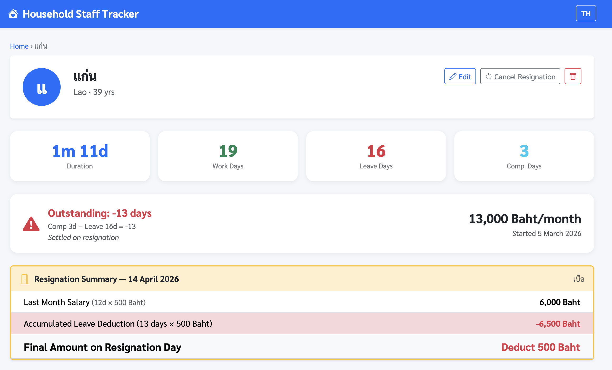

# Maid Tracker

Household staff attendance & salary tracking system — Single-Page Application running on Docker.



## Stack

| Component | Technology |
|-----------|-----------|
| Backend | FastAPI (Python 3.12) |
| Database | SQLite (persisted in named volume) |
| Frontend | Vanilla JS + Bootstrap 5 (SPA, hash-based routing) |
| Port | 5055 → container 8000 |

## Features

### 👤 Staff Management
- Add / edit / delete staff records (name, age, nationality, phone, LINE, Facebook)
- Monthly salary + start date + employment duration display

### 📅 Work Calendar
- Click a day to change status — **full-day / half-day dialog** before saving leave/comp
- Statuses: **Work**, **Leave** (full/half), **Day Off** (Sunday), **Compensatory** (full/half)
- Half-day counts as 0.5 in all calculations — shown as "Leave ½" / "Comp ½" on calendar
- Record a leave reason per day
- Navigate forward/backward by month

### 📋 Leave Log
- Leave entries for the month listed below the calendar, with "½" badge for half-day leave
- Click a leave day on the calendar → instantly revert to Work/Day Off
- Edit leave reason for each day

### 📊 Monthly Summary
- Count Work / Leave / Day Off / Compensatory days
- Calculate daily rate (salary ÷ Mon–Sat working days in the month)
- Base salary (pro-rated for the first partial month)
- Show cumulative leave/comp balance — **no monthly deduction** (see policy below)
- Carry-over from previous month + running cumulative total

### 💰 Salary Payment
- Split into **2 periods/month**: Period 1 (15th) and Period 2 (last day of month)
- Each period = salary ÷ 2 (no leave/comp deduction per period)
- Mark paid / unmark with timestamp
- Alert showing pending unpaid periods

### 🚪 Resignation
- Record resignation date + reason
- Resignation summary: last month salary (pro-rated) ± total accumulated leave/comp balance
- Shows net amount to pay or deduct on resignation day
- Cancel resignation supported
- **Balance preview before resignation** — staff detail page shows days + approximate amount (at current daily rate) without needing to file resignation first

### 🌐 Language Toggle
- Switch **Thai ↔ English** at any time (TH/EN button top-right)
- Language preference saved in `localStorage`

### 🔔 LINE Notifications
Sends a LINE message via LINE Messaging API on the following events:

| Event | Message includes |
|-------|-----------------|
| Leave recorded | Staff name · date · full/half day · current cumulative balance (days + ฿) |
| Compensatory recorded | Staff name · date · full/half day · current cumulative balance |
| Leave cancelled | Staff name · date · "cancelled" label · updated balance |
| Compensatory cancelled | Staff name · date · "cancelled" label · updated balance |
| Salary paid (period 1 or 2) | Staff name · month/period · amount · current balance |
| Resignation recorded | Staff name · resign date · reason (if any) · resignation summary (last-month pay ± balance settlement = final amount) |
| Resignation cancelled | Staff name · cancellation confirmation |

Notifications are **opt-in** — if `LINE_CHANNEL_ACCESS_TOKEN` or `LINE_GROUP_ID` are not set in the environment, all notifications are silently skipped and the app functions normally. Messages are pushed to a LINE **group** so every member sees them with a single API call. See [LINE Group Setup](#line-group-setup) below.

---

## Salary Calculation Policy

| Event | Monthly salary effect | Resignation effect |
|-------|----------------------|-------------------|
| Leave (full day) | **No deduction** | Deducted on resignation (−1 day) |
| Leave (half day) | **No deduction** | Deducted on resignation (−0.5 day) |
| Compensatory (full day) | **No addition** | Paid out on resignation (+1 day) |
| Compensatory (half day) | **No addition** | Paid out on resignation (+0.5 day) |
| Cumulative balance | Carried forward indefinitely | Settled in full |

**Monthly salary formula:** `Full monthly salary` (regardless of leave taken)

**Resignation formula:** `Last month salary (pro-rated) + (accumulated comp − accumulated leave) × daily rate`

---

## Deployment

Use `deploy.sh` from the repo root, or restart manually in Container Manager.

```bash
# From repo root
./deploy.sh
# Choose to restart maid-tracker when prompted
```

## Configuration

No `.env` needed for basic use. Create one to enable LINE notifications.

| Variable | Default | Notes |
|----------|---------|-------|
| `TZ` | `Asia/Bangkok` | Set in docker-compose.yml |
| `DATA_DIR` | `/data` | SQLite DB storage path |
| `LINE_CHANNEL_ACCESS_TOKEN` | _(empty)_ | LINE Messaging API channel token — leave blank to disable |
| `LINE_GROUP_ID` | _(empty)_ | LINE group ID (starts with `C`) — see [LINE Group Setup](#line-group-setup) |

## LINE Group Setup

One-time steps to get the group ID and wire up notifications.

### 1 — Allow bot to join group chats (LINE Developers Console)

1. Open [LINE Developers Console](https://developers.line.biz/) → your **Messaging API Channel**
2. Tab **Messaging API settings** → find **"Allow bot to join group chats"** → **Edit** → **Enabled**
3. _(Recommended)_ Set **Auto-reply messages** → **Disabled** to prevent the bot from auto-replying in the group

### 2 — Create group and invite the bot

1. Open the LINE app → create a new group with all family members
2. Add your LINE OA (bot) to the group as you would add a friend

### 3 — Get the Group ID via webhook

The Group ID (starts with `C`) is only available through a Webhook event.

**Option A — use a temporary webhook inspector** (easiest):

1. Go to [webhook.site](https://webhook.site/) and copy your unique URL
2. In LINE Developers Console → **Messaging API settings** → set **Webhook URL** to that URL → **Verify**
3. Send **any message** in the group
4. In webhook.site, look for the `groupId` field inside `events[0].source`:
   ```json
   "source": {
     "type": "group",
     "groupId": "C1a2b3c4d5..."
   }
   ```
5. Copy the `groupId` value

**Option B — check container logs** (if your stack already has a webhook endpoint):

Send a message in the group, then run:
```bash
docker logs maid-tracker 2>&1 | grep groupId
```

### 4 — Set the env var

Add to your `.env` file (next to `docker-compose.yml`):
```env
LINE_CHANNEL_ACCESS_TOKEN=<your token>
LINE_GROUP_ID=C1a2b3c4d5...
```

Then redeploy (`./deploy.sh` from repo root).

## Data Persistence

SQLite database is stored in named volume `maid_tracker_data` at `/data/maid_tracker.db`.

The volume is not removed on stack restart — data is safe.

## DB Schema

```sql
employees (
  id, name, age, nationality, phone, line_id, facebook,
  start_date, monthly_salary, end_date, resign_note, created_at
)

attendance (
  id, employee_id, work_date,
  status CHECK(IN 'work','leave','holiday','compensatory'),
  note,
  half_day INTEGER DEFAULT 0  -- 1 = half day (counts as 0.5 in all calculations)
)

salary_payments (
  id, employee_id, year, month,
  period CHECK(IN 1, 2),
  paid_at  -- NULL = not yet paid
)
```

## Routes (Hash-based SPA)

| Hash | View |
|------|------|
| `#/` | Staff list |
| `#/employee/new` | Add new staff |
| `#/employee/:id` | Staff profile & overview |
| `#/employee/:id/edit` | Edit staff info |
| `#/employee/:id/leaves?y=&m=` | Calendar + leave log |
| `#/employee/:id/summary?y=&m=` | Monthly summary |
| `#/employee/:id/payments?y=&m=` | Salary payments |
| `#/employee/:id/attendance?y=&m=` | Work calendar (standalone) |

---

---

# ระบบบันทึกการทำงานแม่บ้าน

ระบบบันทึกการทำงานและเงินเดือนแม่บ้าน — Single-Page Application ที่รันบน Docker

## Stack

| Component | Technology |
|-----------|-----------|
| Backend | FastAPI (Python 3.12) |
| Database | SQLite (persisted ใน named volume) |
| Frontend | Vanilla JS + Bootstrap 5 (SPA, hash-based routing) |
| Port | 5055 → container 8000 |

## Features

### 👤 จัดการข้อมูลแม่บ้าน
- เพิ่ม / แก้ไข / ลบข้อมูล (ชื่อ, อายุ, สัญชาติ, เบอร์โทร, LINE, Facebook)
- เงินเดือน + วันเริ่มงาน + แสดงระยะเวลาทำงาน

### 📅 ปฏิทินการทำงาน
- คลิกวันเพื่อเปลี่ยนสถานะ — มี **dialog เลือกเต็มวัน / ครึ่งวัน** ก่อนบันทึกลา/ชดเชย
- สถานะ: **ทำงาน**, **ลา** (เต็ม/ครึ่ง), **หยุด** (อาทิตย์), **ชดเชย** (เต็ม/ครึ่ง)
- ครึ่งวันนับเป็น 0.5 ในทุกการคำนวณ — แสดง "ลา ½" / "ชดเชย ½" ในปฏิทิน
- บันทึกเหตุผลการลาในแต่ละวัน
- เดินหน้า-หลังเดือนได้

### 📋 บันทึกวันลา
- รายการวันลาในเดือนแสดงใต้ปฏิทิน พร้อม badge "½" สำหรับลาครึ่งวัน
- คลิกปฏิทินวันลา → กลับเป็นทำงาน/หยุดได้ทันที
- แก้ไขเหตุผลการลาแต่ละวัน

### 📊 สรุปรายเดือน
- นับวันทำงาน / ลา / หยุด / ชดเชย
- คำนวณอัตราค่าจ้างรายวัน (เงินเดือน ÷ วันทำงาน Mon–Sat ในเดือน)
- ฐานเงินเดือน (pro-rate เดือนแรกถ้าเริ่มงานกลางเดือน)
- แสดงยอดลา/ชดเชยสะสม — **ไม่หักเงินเดือนรายเดือน** (ดูนโยบายด้านล่าง)
- ยอดยกมาจากเดือนก่อน + ยอดสะสมรวม

### 💰 ระบบจ่ายเงินเดือน
- แบ่งจ่าย **2 รอบ/เดือน**: รอบแรก (วันที่ 15) และรอบสอง (วันสุดท้ายเดือน)
- แต่ละรอบ = เงินเดือน ÷ 2 (ไม่มีการหักลา/ชดเชยรายเดือน)
- กดบันทึกว่าจ่ายแล้ว / ยกเลิก พร้อมแสดงเวลาที่จ่าย
- แสดง alert แจ้งรอบที่ยังค้างจ่าย

### 🚪 ระบบลาออก
- บันทึกวันที่ลาออก + เหตุผล
- สรุปการลาออก: เงินเดือนเดือนสุดท้าย (pro-rate) ± ยอดสะสมลา/ชดเชยทั้งหมด
- แสดงยอดสุทธิที่ต้องจ่าย หรือต้องหักในวันลาออก
- ยกเลิกการลาออกได้
- **แสดงยอดค้างก่อนลาออก** — หน้าข้อมูลแม่บ้านแสดงจำนวนวัน + เงินโดยประมาณ (อัตราเดือนปัจจุบัน) ทันทีโดยไม่ต้องกดแจ้งลาออกก่อน

### 🌐 เปลี่ยนภาษา
- สลับ **ไทย ↔ English** ได้ตลอดเวลา (ปุ่ม TH/EN มุมขวาบน)
- จำการตั้งค่าภาษาใน `localStorage`

### 🔔 การแจ้งเตือน LINE
ส่งข้อความผ่าน LINE Messaging API ในกรณีดังนี้:

| กรณี | ข้อมูลที่แจ้งเตือน |
|------|-------------------|
| บันทึกลา | ชื่อ · วันที่ · เต็ม/ครึ่งวัน · ยอดสะสมปัจจุบัน (วัน + ฿) |
| บันทึกชดเชย | ชื่อ · วันที่ · เต็ม/ครึ่งวัน · ยอดสะสมปัจจุบัน |
| ยกเลิกลา | ชื่อ · วันที่ · label "ยกเลิก" · ยอดสะสมที่อัปเดต |
| ยกเลิกชดเชย | ชื่อ · วันที่ · label "ยกเลิก" · ยอดสะสมที่อัปเดต |
| จ่ายเงินเดือน (รอบ 1 หรือ 2) | ชื่อ · เดือน/รอบ · จำนวนเงิน · ยอดสะสมปัจจุบัน |
| บันทึกลาออก | ชื่อ · วันที่ลาออก · เหตุผล (ถ้ามี) · สรุปการลาออก (เงินเดือนเดือนสุดท้าย ± ยอดสะสม = ยอดสุทธิ) |
| ยกเลิกลาออก | ชื่อ · ยืนยันยกเลิก |

การแจ้งเตือนเป็น **opt-in** — ถ้าไม่ได้ตั้งค่า `LINE_CHANNEL_ACCESS_TOKEN` หรือ `LINE_GROUP_ID` ใน environment จะข้ามการแจ้งเตือนทั้งหมด โดยไม่กระทบการทำงานของแอป ข้อความถูกส่งเข้า **กลุ่ม LINE** ทำให้ทุกคนในกลุ่มเห็นพร้อมกันโดยใช้ API call เดียว ดูรายละเอียดที่ [ตั้งค่ากลุ่ม LINE](#ตั้งค่ากลุ่ม-line) ด้านล่าง

---

## นโยบายการคำนวณเงินเดือน

| สิ่งที่ทำ | ผลต่อเงินเดือนรายเดือน | ผลต่อการลาออก |
|----------|----------------------|--------------|
| วันลา (เต็ม) | **ไม่หักเงิน** | หักในวันลาออก (−1 วัน) |
| วันลา (ครึ่ง) | **ไม่หักเงิน** | หักในวันลาออก (−0.5 วัน) |
| วันชดเชย (เต็ม) | **ไม่บวกเงิน** | ได้รับในวันลาออก (+1 วัน) |
| วันชดเชย (ครึ่ง) | **ไม่บวกเงิน** | ได้รับในวันลาออก (+0.5 วัน) |
| ยอดสะสม | ยกไปเดือนถัดไปเสมอ ไม่มีวันหมดอายุ | ชำระยอดรวมทั้งหมด |

**สูตรเงินเดือนรายเดือน:** `เงินเดือนเต็ม` (ไม่ว่าจะลากี่วัน)

**สูตรวันลาออก:** `เงินเดือนเดือนสุดท้าย (pro-rate) + (ยอดชดเชยสะสม − ยอดลาสะสม) × อัตรารายวัน`

---

## การ Deploy

ใช้ `deploy.sh` จาก root ของ repo หรือ restart ใน Container Manager ด้วยตนเอง

```bash
# จาก root ของ repo
./deploy.sh
# เลือก restart maid-tracker เมื่อถามทีหลัง
```

## Configuration

ไม่ต้องมี `.env` สำหรับการใช้งานทั่วไป สร้างไฟล์นี้เพื่อเปิดใช้การแจ้งเตือน LINE

| Variable | Default | Notes |
|----------|---------|-------|
| `TZ` | `Asia/Bangkok` | ตั้งใน docker-compose.yml |
| `DATA_DIR` | `/data` | ที่เก็บ SQLite DB |
| `LINE_CHANNEL_ACCESS_TOKEN` | _(ว่าง)_ | LINE Messaging API channel token — เว้นว่างเพื่อปิดการแจ้งเตือน |
| `LINE_GROUP_ID` | _(ว่าง)_ | Group ID กลุ่ม LINE (ขึ้นต้นด้วย `C`) — ดู [ตั้งค่ากลุ่ม LINE](#ตั้งค่ากลุ่ม-line) |

## ตั้งค่ากลุ่ม LINE

ทำครั้งเดียวเพื่อได้ Group ID และเปิดการแจ้งเตือน

### ขั้นที่ 1 — เปิดสิทธิ์บอทเข้ากลุ่ม (LINE Developers Console)

1. เปิด [LINE Developers Console](https://developers.line.biz/) → เลือก **Messaging API Channel** ที่ใช้งาน
2. Tab **Messaging API settings** → หัวข้อ **"Allow bot to join group chats"** → **Edit** → **Enabled**
3. _(แนะนำ)_ ตั้งค่า **Auto-reply messages** → **Disabled** เพื่อไม่ให้บอทตอบข้อความอัตโนมัติในกลุ่ม

### ขั้นที่ 2 — สร้างกลุ่มและดึงบอทเข้า

1. เปิดแอป LINE → สร้างกลุ่มใหม่ โดยเพิ่มสมาชิกในบ้านทุกคน
2. เพิ่ม LINE OA (บอท) เข้ากลุ่มเหมือนเพิ่มเพื่อน

### ขั้นที่ 3 — หา Group ID ผ่าน Webhook

Group ID (ขึ้นต้นด้วย `C`) ดึงได้จาก Webhook event เท่านั้น

**วิธี A — ใช้ Webhook inspector ชั่วคราว** (ง่ายที่สุด):

1. เปิด [webhook.site](https://webhook.site/) แล้ว copy URL ที่ได้
2. ใน LINE Developers Console → **Messaging API settings** → ตั้ง **Webhook URL** เป็น URL นั้น → **Verify**
3. พิมพ์ข้อความอะไรก็ได้ในกลุ่ม
4. ใน webhook.site ให้ดูที่ `events[0].source.groupId`:
   ```json
   "source": {
     "type": "group",
     "groupId": "C1a2b3c4d5..."
   }
   ```
5. Copy ค่า `groupId` มาใช้

**วิธี B — ตรวจสอบ container log** (ถ้ามี webhook endpoint อยู่แล้ว):

พิมพ์ข้อความในกลุ่ม แล้วรัน:
```bash
docker logs maid-tracker 2>&1 | grep groupId
```

### ขั้นที่ 4 — ตั้งค่า env var

เพิ่มใน `.env` (ไฟล์เดียวกับ `docker-compose.yml`):
```env
LINE_CHANNEL_ACCESS_TOKEN=<token ของคุณ>
LINE_GROUP_ID=C1a2b3c4d5...
```

จากนั้น redeploy (`./deploy.sh` จาก root ของ repo)

## Data Persistence

Database SQLite อยู่ใน named volume `maid_tracker_data` ที่ `/data/maid_tracker.db`

Volume นี้ไม่ถูกลบเมื่อ restart stack — ข้อมูลปลอดภัย

## DB Schema

```sql
employees (
  id, name, age, nationality, phone, line_id, facebook,
  start_date, monthly_salary, end_date, resign_note, created_at
)

attendance (
  id, employee_id, work_date,
  status CHECK(IN 'work','leave','holiday','compensatory'),
  note,
  half_day INTEGER DEFAULT 0  -- 1 = ครึ่งวัน (นับเป็น 0.5 ในทุกการคำนวณ)
)

salary_payments (
  id, employee_id, year, month,
  period CHECK(IN 1, 2),
  paid_at  -- NULL = ยังไม่จ่าย
)
```

## Routes (Hash-based SPA)

| Hash | View |
|------|------|
| `#/` | รายชื่อแม่บ้าน |
| `#/employee/new` | เพิ่มแม่บ้านใหม่ |
| `#/employee/:id` | ข้อมูลและสรุปภาพรวม |
| `#/employee/:id/edit` | แก้ไขข้อมูล |
| `#/employee/:id/leaves?y=&m=` | ปฏิทิน + รายการวันลา |
| `#/employee/:id/summary?y=&m=` | สรุปรายเดือน |
| `#/employee/:id/payments?y=&m=` | จ่ายเงินเดือน |
| `#/employee/:id/attendance?y=&m=` | ปฏิทินการทำงาน (standalone) |
