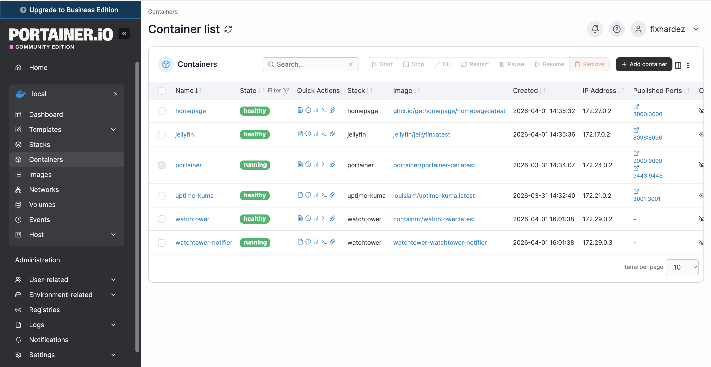

# Portainer

Docker management UI (Community Edition).

**URL:** `http://<NAS_IP>:9000` | `https://<NAS_IP>:9443`

## Setup

Upload via `deploy.sh` from your local machine and register the stack in Container Manager (see root README).

## Data

Container data is persisted in a named Docker volume `portainer_data`.

## Homepage Integration

The Homepage dashboard connects to Portainer via the `portainer` widget. Set `PORTAINER_KEY` in `homepage/.env` to an API key generated from **Account Settings → Access Tokens** in the Portainer UI.
