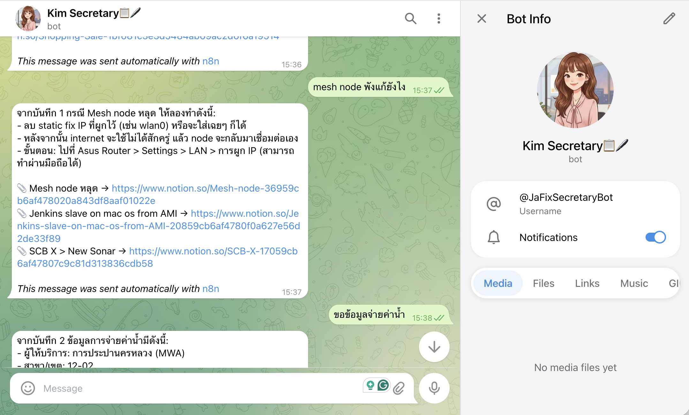

# secretary



Personal knowledge base stack. Ingests Notion pages into Qdrant and serves RAG queries via FastAPI, orchestrated with n8n Telegram bot workflows.

## Architecture

```
Notion API
    ↓ (secretary-ingest, one-shot)
Qdrant (secretary_notes collection, hybrid BGE-M3)
    ↑
secretary-query (FastAPI :5065)
    ↑
n8n (:5678) → Telegram bot
```

## Services

| Service | Container | Port (host→container) | Notes |
|---|---|---|---|
| qdrant | secretary-qdrant | 6333→6333 | Collection: `secretary_notes`, named vectors `dense`+`sparse` |
| ollama | secretary-ollama | 11434→11434 | Present but not used by default |
| n8n | secretary-n8n | 5678→5678 | Telegram webhook at `/webhook/telegram`. External via Synology RP :15678 |
| secretary-query | secretary-query | 5065→5065 | FastAPI RAG. LLM provider switchable via `LLM_PROVIDER` env. External via Synology RP :15065 |
| secretary-ingest | secretary-ingest | — | `restart: "no"`. Run once manually (see below) |

## Quickstart

```bash
# 1. Copy env templates
cp secretary/.env.example secretary/.env
cp secretary/ingest/.env.example secretary/ingest/.env
cp secretary/query/.env.example secretary/query/.env
# Fill in real values in each .env

# 2. Start persistent services
docker compose up -d qdrant ollama n8n secretary-query

# 3. First ingest (downloads BGE-M3 ~2GB on first run)
docker compose run --rm secretary-ingest

# 4. Test query
curl -X POST http://localhost:5065/query \
  -H 'Content-Type: application/json' \
  -d '{"question": "what is X?"}'
```

## Volumes (NAS paths)

| Volume | NAS path |
|---|---|
| qdrant_storage | `/volume2/docker/secretary/qdrant_storage` |
| ollama_data | `/volume2/docker/secretary/ollama_data` |
| n8n_data | `/volume2/docker/secretary/n8n_data` |
| ingest_state | `/volume2/docker/secretary/ingest_state` |
| hf_cache | `/volume2/docker/secretary/hf_cache` |
| query-data | `/volume2/docker/secretary/query-data` (bind, not named volume) |

## Env Files

| File | Used by | Key variables |
|---|---|---|
| `secretary/.env` | n8n | `N8N_BASIC_AUTH_USER/PASSWORD`, `N8N_WEBHOOK_URL` |
| `secretary/ingest/.env` | secretary-ingest, /ingest-trigger | `NOTION_TOKEN`, `QDRANT_URL`, `NOTION_SOURCE_TYPE` |
| `secretary/query/.env` | secretary-query | `LLM_PROVIDER`, `ANTHROPIC_API_KEY`, `COHERE_API_KEY` |

## LLM Providers

Set `LLM_PROVIDER` in `query/.env`:

| Value | Auth | Notes |
|---|---|---|
| `anthropic` | `ANTHROPIC_API_KEY` | Default. Model: `claude-sonnet-4-20250514` |
| `openrouter` | `OPENROUTER_API_KEY` + `OPENROUTER_MODEL` | OpenAI-compat API |
| `nous` | OAuth 2.0 Device Code | Run `GET /nous/auth` once after deploy to authenticate |

## Reranking

Set `COHERE_API_KEY` in `query/.env` to enable Cohere reranking (`rerank-multilingual-v3.0`). Strongly recommended for Thai queries against English content — improves cross-lingual retrieval accuracy.

## API Endpoints

| Method | Path | Description |
|---|---|---|
| `POST` | `/query` | RAG query. Body: `{"question": str, "top_k_retrieve": int=20, "top_k_final": int=6}` |
| `GET` | `/health` | Liveness + Qdrant collection stats |
| `POST` | `/ingest-trigger` | Trigger incremental ingest as subprocess inside query container |
| `GET` | `/nous/auth` | Start Nous OAuth Device Code flow |
| `GET` | `/nous/auth/status` | Check Nous auth status |

## Ingest

```bash
docker compose run --rm secretary-ingest python ingest.py          # incremental
docker compose run --rm secretary-ingest python ingest.py --full   # re-ingest all
docker compose run --rm secretary-ingest python ingest.py --page <NOTION_PAGE_ID>
docker compose run --rm secretary-ingest python ingest.py --dry-run
```

State DB for standalone ingest: `ingest_state` volume (`/volume2/docker/secretary/ingest_state`).  
State DB for `/ingest-trigger`: `query-data` volume (`/volume2/docker/secretary/query-data`).

## Embedding Model

**BGE-M3** (`BAAI/bge-m3`) via FlagEmbedding — CPU-only torch (~200MB, not CUDA ~2.5GB). Hybrid search: 1024d dense (Cosine) + sparse lexical weights, fused with RRF.

First run downloads ~2GB to `hf_cache` volume shared between ingest and query containers.

## n8n Workflow Backup

Export and import n8n workflows via REST API (requires `N8N_API_KEY` in `secretary/.env`).

```bash
# Export all workflows to JSON files in secretary/n8n-workflows/
./scripts/n8n_export.sh

# Import all workflows back into n8n (upsert by name)
./scripts/n8n_import.sh

# Import a specific workflow file
./scripts/n8n_import.sh secretary/n8n-workflows/Secretary_Bot__syPPm4qxmVNENC9U.json
```

Workflow JSON files are git-tracked for version control.
