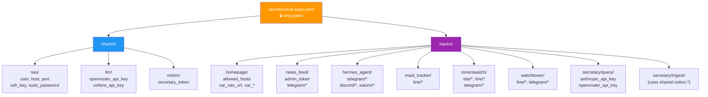
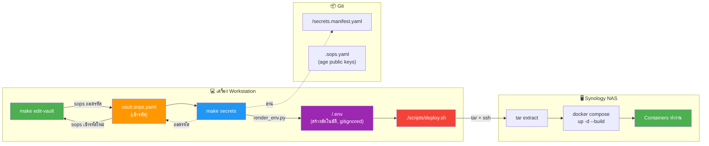

<p align="center">
  <a href="#english">English</a> · <a href="#ภาษาไทย">ภาษาไทย</a>
</p>

---

# Secrets Management

<a id="english"></a>

Single source of truth for all secrets across every stack, encrypted at rest with [sops](https://github.com/getsops/sops) + [age](https://github.com/FiloSottile/age).

## Architecture

```
secrets/vault.sops.yaml          ← encrypted YAML, committed to git
    ├── shared/                  ← cross-stack secrets (NAS creds, LLM keys)
    ├── stacks/                  ← per-stack private secrets
    └── deploy/                  ← deploy-only secrets (NAS_SUDO_PASSWORD etc.)

<stack>/secrets.manifest.yaml    ← declares which vault paths this stack needs
scripts/render_env.py            ← decrypts vault + reads manifests → writes .env
```

**Flow:** `make edit-vault` (edit encrypted YAML) → `make secrets` (generate .env files) → `./scripts/deploy.sh` (upload + restart)


### Vault Structure



## Adding a New Secret

### Step 1: Add the value to the vault

```bash
make edit-vault
```

This opens `secrets/vault.sops.yaml` in your `$EDITOR`. sops transparently decrypts on read and re-encrypts on save.

**Where to put it:**

| Scope | Vault path | When to use |
|---|---|---|
| Shared across stacks | `shared.<category>.<key>` | API keys used by 2+ stacks (e.g. `shared.llm.openrouter_api_key`) |
| Stack-private | `stacks.<stack_name>.<key>` | Secrets only one stack needs (e.g. `stacks.maid_tracker.line.channel_access_token`) |

**Naming conventions:**
- Vault keys: `snake_case` (e.g. `channel_access_token`, not `CHANNEL_ACCESS_TOKEN`)
- Stack name in path: match directory name but replace `-` with `_` (e.g. `maid-tracker/` → `stacks.maid_tracker`)
- Nesting is fine: `stacks.watchtower.line.user_id`

**Example — adding a new shared API key:**

```yaml
shared:
  llm:
    openrouter_api_key: sk-or-v1-...    # existing
    new_service_api_key: abc123         # ← add this

stacks:
  news_feed:
    telegram:
      bot_token: 8774745907:AAFz...
    new_service_api_key: xyz789         # ← or per-stack version
```

Save and close the editor. sops re-encrypts automatically.

### Step 2: Map it in the stack's manifest

Edit `<stack>/secrets.manifest.yaml`:

```yaml
env:
  # Existing mappings...
  OPENROUTER_API_KEY: shared.llm.openrouter_api_key

  # New mapping: ENV_NAME_IN_DOTENV → vault.dotted.path
  NEW_SERVICE_API_KEY: shared.llm.new_service_api_key

literals:
  # Public config values (not secrets) — written as-is
  SOME_PUBLIC_URL: https://api.example.com
```

**Rules:**
- `env:` values must start with `shared.`, `stacks.`, or `deploy.`
- `env:` keys must be `UPPER_SNAKE_CASE` (validated by `secrets/manifest.schema.json`)
- `literals:` are for non-secret config (URLs, feature flags, defaults)
- No duplicate ENV names between `env:` and `literals:`

### Step 3: Regenerate .env files

```bash
make secrets
```

Output:
```
  wrote hermes-agent/.env
  wrote homepage/.env
  ...
  wrote <stack>/.env
```

Verify the new key appears:
```bash
grep NEW_SERVICE_API_KEY <stack>/.env
```

### Step 4: Use it in the application

**Docker Compose** (`docker-compose.yml`):

```yaml
services:
  my-service:
    env_file: .env                    # loads all vars from .env
    environment:
      - NEW_SERVICE_API_KEY=${NEW_SERVICE_API_KEY}   # explicit pass-through (optional)
```

**Python** (FastAPI, scripts, etc.):

```python
import os

api_key = os.getenv("NEW_SERVICE_API_KEY", "")        # with default
api_key = os.environ["NEW_SERVICE_API_KEY"]            # required (crashes if missing)
```

**JavaScript/Node.js:**

```javascript
const apiKey = process.env.NEW_SERVICE_API_KEY;
```

**Shell script:**

```bash
echo "$NEW_SERVICE_API_KEY"
# or with default:
echo "${NEW_SERVICE_API_KEY:-fallback}"
```

### Step 5: Test

```bash
make check                    # validate manifests against vault
make test                     # run pytest (43 tests)
python scripts/render_env.py --dry-run   # preview rendered output
```

### Step 6: Commit + Deploy

```bash
git add <stack>/secrets.manifest.yaml
git commit -m "feat(<stack>): add NEW_SERVICE_API_KEY"
make secrets && ./scripts/deploy.sh -s <stack> -y
```

> `vault.sops.yaml` is already tracked — just commit the manifest change. The generated `.env` files are gitignored.

## Removing a Secret

1. **Remove from manifest** — delete the line from `<stack>/secrets.manifest.yaml`
2. **Remove from vault** — `make edit-vault`, delete the key
3. **Remove from code** — remove `os.getenv()` / `os.environ[]` references
4. **Regenerate** — `make secrets`
5. **Commit** — `git add -A && git commit`

## Rotating a Secret

1. `make edit-vault` — update the value
2. `make secrets` — regenerate .env files
3. `./scripts/deploy.sh -s <stack> -y` — restart the stack
4. (If the old value was leaked) revoke it at the provider

## Setting Up on a New Machine

### Prerequisites

```bash
# 1. Install tooling
brew install sops age        # macOS
# or: apt install sops age   # Linux

# 2. Get the age private key (from Bitwarden / 1Password / vault maintainer)
mkdir -p ~/.config/sops/age
cat > ~/.config/sops/age/keys.txt << 'EOF'
# created: 2026-05-30T...
# public key: age19dju...
AGE-SECRET-KEY-xxxxxxxxxxxxxxxxxxxxxxxxxxxxxxxxxxxxxxxxxxxxxxxxxxxxxxxx
EOF
chmod 600 ~/.config/sops/age/keys.txt
```

### Clone + Generate

```bash
git clone https://github.com/FixHarDeZ/centralized-nas-container-management.git
cd centralized-nas-container-management

# Create venv + install deps (for render_env.py)
python3 -m venv .venv
.venv/bin/pip install pyyaml

# Generate all .env files
make secrets

# Verify
make check
```

### Deploy

```bash
# Fill in deploy credentials (NAS host, user, sudo password)
make edit-vault
# Edit shared.nas.* section

# Generate + deploy
make secrets
./scripts/deploy.sh
```

### Adding a New Age Recipient (Multi-Machine)

If a new machine needs to decrypt the vault:

```bash
# On the new machine: generate a key pair
age-keygen -o ~/.config/sops/age/keys.txt
# Note the public key: age1...

# On a machine that already has access: add the new public key to .sops.yaml
# Then re-encrypt:
sops updatekeys secrets/vault.sops.yaml

# Commit the updated .sops.yaml and vault.sops.yaml
git add .sops.yaml secrets/vault.sops.yaml
git commit -m "chore(secrets): add new age recipient"
```

## CI / GitHub Actions

The workflow `.github/workflows/secrets.yml` validates on every PR:

1. Installs sops + age on `ubuntu-latest`
2. Loads `SOPS_AGE_KEY` from GitHub Actions secret (CI-only age key)
3. Runs `pytest tests/ -v` (43 tests)
4. Runs `python scripts/render_env.py --check --vault secrets/test-vault.sops.yaml`

**`secrets/test-vault.sops.yaml`** is a separate vault encrypted with the CI age key, containing dummy values. It validates that manifests are structurally correct without exposing real secrets.

To add the CI secret (one-time):
1. Go to GitHub repo → Settings → Secrets and variables → Actions
2. Add `SOPS_AGE_KEY` with the CI private key value

## File Reference

| File | Tracked | Purpose |
|---|---|---|
| `.sops.yaml` | yes | age public keys for encryption (prod + CI) |
| `vault.sops.yaml` | yes | All secrets, encrypted |
| `test-vault.sops.yaml` | yes | CI dummy vault, encrypted with CI key |
| `manifest.schema.json` | yes | JSON Schema validating manifests |
| `<stack>/secrets.manifest.yaml` | yes | Per-stack vault → ENV mapping |
| `deploy.manifest.yaml` | yes | Root deploy vault → ENV mapping |
| `<stack>/.env` | **no** (gitignored) | Generated, uploaded to NAS |
| `.env.deploy` | **no** (gitignored) | Generated, used by deploy.sh locally |

## Troubleshooting

**`sops decrypt failed: no secret keys found`**
- Check `~/.config/sops/age/keys.txt` exists and has the private key
- Or set `SOPS_AGE_KEY_FILE` env var to the key file path

**`manifest references missing vault path`**
- The vault path in `secrets.manifest.yaml` doesn't exist in `vault.sops.yaml`
- `make edit-vault` to add the missing key, or fix the manifest path

**`render_env.py` produces empty value**
- The vault key exists but its value is empty string `""`
- This is valid — the .env will have `KEY=`

**CI fails with `sops decrypt failed`**
- The `SOPS_AGE_KEY` GitHub Actions secret is missing or contains the wrong key
- CI uses `secrets/test-vault.sops.yaml` (different age key from prod)

**Want to preview without writing:**
```bash
python scripts/render_env.py --dry-run
```

---

# การจัดการ Secrets

<a id="ภาษาไทย"></a>

แหล่งข้อมูลเดียว (Single Source of Truth) สำหรับ secrets ทั้งหมดในทุก stack เข้ารหัสไว้ด้วย [sops](https://github.com/getsops/sops) + [age](https://github.com/FiloSottile/age)

## สถาปัตยกรรม

```
secrets/vault.sops.yaml          ← YAML เข้ารหัส committed ลง git
    ├── shared/                  ← secrets ใช้ร่วมกันหลาย stack (NAS creds, LLM keys)
    ├── stacks/                  ← secrets เฉพาะแต่ละ stack
    └── deploy/                  ← secrets สำหรับ deploy เท่านั้น

<stack>/secrets.manifest.yaml    ← ประกาศว่า stack นี้ใช้ vault path อะไรบ้าง
scripts/render_env.py            ← ถอดรหัส vault + อ่าน manifest → เขียน .env
```

**Flow:** `make edit-vault` (แก้ไข YAML เข้ารหัส) → `make secrets` (สร้าง .env files) → `./scripts/deploy.sh` (upload + restart)



### โครงสร้าง Vault


## เพิ่ม Secret ใหม่

### Step 1: เพิ่มค่าลงใน vault

```bash
make edit-vault
```

คำสั่งนี้จะเปิด `secrets/vault.sops.yaml` ใน `$EDITOR` ของคุณ sops จะถอดรหัสอัตโนมัติเวลาอ่าน และเข้ารหัสใหม่เวลา save

**ใส่ตรงไหน:**

| Scope | Path ใน vault | ใช้เมื่อ |
|---|---|---|
| ใช้ร่วมหลาย stack | `shared.<category>.<key>` | API keys ที่ใช้ 2+ stacks (เช่น `shared.llm.openrouter_api_key`) |
| เฉพาะ stack เดียว | `stacks.<stack_name>.<key>` | Secrets ที่ stack เดียวใช้ (เช่น `stacks.maid_tracker.line.channel_access_token`) |

**Naming conventions:**
- Vault keys: `snake_case` (เช่น `channel_access_token`, ไม่ใช่ `CHANNEL_ACCESS_TOKEN`)
- Stack name ใน path: ตรงกับชื่อ directory แต่แทน `-` ด้วย `_` (เช่น `maid-tracker/` → `stacks.maid_tracker`)
- Nesting ได้: `stacks.watchtower.line.user_id`

**ตัวอย่าง — เพิ่ม shared API key ใหม่:**

```yaml
shared:
  llm:
    openrouter_api_key: sk-or-v1-...    # ที่มีอยู่
    new_service_api_key: abc123         # ← เพิ่มตรงนี้

stacks:
  news_feed:
    telegram:
      bot_token: 8774745907:AAFz...
    new_service_api_key: xyz789         # ← หรือแบบ per-stack
```

Save แล้วปิด editor sops จะเข้ารหัสใหม่อัตโนมัติ

### Step 2: Map ใน manifest ของ stack

แก้ไข `<stack>/secrets.manifest.yaml`:

```yaml
env:
  # mappings ที่มีอยู่...
  OPENROUTER_API_KEY: shared.llm.openrouter_api_key

  # mapping ใหม่: ENV_NAME_IN_DOTENV → vault.dotted.path
  NEW_SERVICE_API_KEY: shared.llm.new_service_api_key

literals:
  # ค่า config ที่ไม่ใช่ secret — เขียนลง .env ตรงๆ
  SOME_PUBLIC_URL: https://api.example.com
```

**กฎ:**
- `env:` values ต้องขึ้นต้นด้วย `shared.`, `stacks.` หรือ `deploy.`
- `env:` keys ต้องเป็น `UPPER_SNAKE_CASE` (validate ด้วย `secrets/manifest.schema.json`)
- `literals:` สำหรับ config ที่ไม่ใช่ secret (URLs, feature flags, defaults)
- ห้ามมี ENV name ซ้ำระหว่าง `env:` กับ `literals:`

### Step 3: สร้าง .env files ใหม่

```bash
make secrets
```

Output:
```
  wrote hermes-agent/.env
  wrote homepage/.env
  ...
  wrote <stack>/.env
```

ตรวจสอบว่า key ใหม่ปรากฏ:
```bash
grep NEW_SERVICE_API_KEY <stack>/.env
```

### Step 4: ใช้ใน application

**Docker Compose** (`docker-compose.yml`):

```yaml
services:
  my-service:
    env_file: .env                    # โหลดทุก var จาก .env
    environment:
      - NEW_SERVICE_API_KEY=${NEW_SERVICE_API_KEY}   # pass-through ชัดเจน (ไม่จำเป็น)
```

**Python** (FastAPI, scripts, etc.):

```python
import os

api_key = os.getenv("NEW_SERVICE_API_KEY", "")        # มี default
api_key = os.environ["NEW_SERVICE_API_KEY"]            # required (crash ถ้าไม่มี)
```

**JavaScript/Node.js:**

```javascript
const apiKey = process.env.NEW_SERVICE_API_KEY;
```

**Shell script:**

```bash
echo "$NEW_SERVICE_API_KEY"
# หรือมี default:
echo "${NEW_SERVICE_API_KEY:-fallback}"
```

### Step 5: ทดสอบ

```bash
make check                    # validate manifests กับ vault
make test                     # รัน pytest (43 tests)
python scripts/render_env.py --dry-run   # preview output โดยไม่เขียนไฟล์
```

### Step 6: Commit + Deploy

```bash
git add <stack>/secrets.manifest.yaml
git commit -m "feat(<stack>): add NEW_SERVICE_API_KEY"
make secrets && ./scripts/deploy.sh -s <stack> -y
```

> `vault.sops.yaml` ถูก track อยู่แล้ว — commit แค่ manifest .env files ที่สร้างเป็น gitignored

## ลบ Secret

1. **ลบจาก manifest** — ลบบรรทัดจาก `<stack>/secrets.manifest.yaml`
2. **ลบจาก vault** — `make edit-vault`, ลบ key
3. **ลบจากโค้ด** — ลบ `os.getenv()` / `os.environ[]` ที่เกี่ยวข้อง
4. **สร้าง .env ใหม่** — `make secrets`
5. **Commit** — `git add -A && git commit`

## Rotate Secret

1. `make edit-vault` — อัปเดตค่า
2. `make secrets` — สร้าง .env files ใหม่
3. `./scripts/deploy.sh -s <stack> -y` — restart stack
4. (ถ้าค่าเก่าถูกเปิดเผย) revoke ที่ provider

## Setup บนเครื่องใหม่

### Prerequisites

```bash
# 1. ลง tooling
brew install sops age        # macOS
# หรือ: apt install sops age   # Linux

# 2. ขอ age private key (จาก Bitwarden / 1Password / vault maintainer)
mkdir -p ~/.config/sops/age
cat > ~/.config/sops/age/keys.txt << 'EOF'
# created: 2026-05-30T...
# public key: age19dju...
AGE-SECRET-KEY-xxxxxxxxxxxxxxxxxxxxxxxxxxxxxxxxxxxxxxxxxxxxxxxxxxxxxxxx
EOF
chmod 600 ~/.config/sops/age/keys.txt
```

### Clone + สร้าง .env

```bash
git clone https://github.com/FixHarDeZ/centralized-nas-container-management.git
cd centralized-nas-container-management

# สร้าง venv + ลง deps (สำหรับ render_env.py)
python3 -m venv .venv
.venv/bin/pip install pyyaml

# สร้าง .env files ทั้งหมด
make secrets

# ตรวจสอบ
make check
```

### Deploy

```bash
# กรอก deploy credentials (NAS host, user, sudo password)
make edit-vault
# แก้ section shared.nas.*

# สร้าง + deploy
make secrets
./scripts/deploy.sh
```

### เพิ่ม Age Recipient ใหม่ (Multi-Machine)

ถ้าเครื่องใหม่ต้องถอดรหัส vault:

```bash
# บนเครื่องใหม่: สร้าง key pair
age-keygen -o ~/.config/sops/age/keys.txt
# จด public key: age1...

# บนเครื่องที่มีสิทธิ์อยู่แล้ว: เพิ่ม public key ใหม่ใน .sops.yaml
# แล้วเข้ารหัสใหม่:
sops updatekeys secrets/vault.sops.yaml

# Commit .sops.yaml และ vault.sops.yaml ที่อัปเดต
git add .sops.yaml secrets/vault.sops.yaml
git commit -m "chore(secrets): add new age recipient"
```

## CI / GitHub Actions

Workflow `.github/workflows/secrets.yml` validate ทุก PR:

1. ลง sops + age บน `ubuntu-latest`
2. โหลด `SOPS_AGE_KEY` จาก GitHub Actions secret (CI-only age key)
3. รัน `pytest tests/ -v` (43 tests)
4. รัน `python scripts/render_env.py --check --vault secrets/test-vault.sops.yaml`

**`secrets/test-vault.sops.yaml`** เป็น vault แยกเข้ารหัสด้วย CI age key มีค่า dummy ใช้ validate ว่า manifests ถูกต้องเชิงโครงสร้างโดยไม่เปิดเผย secrets จริง

เพิ่ม CI secret (ครั้งเดียว):
1. ไปที่ GitHub repo → Settings → Secrets and variables → Actions
2. เพิ่ม `SOPS_AGE_KEY` ด้วยค่า CI private key

## File Reference

| File | Tracked | หน้าที่ |
|---|---|---|
| `.sops.yaml` | yes | age public keys สำหรับเข้ารหัส (prod + CI) |
| `vault.sops.yaml` | yes | Secrets ทั้งหมด, เข้ารหัส |
| `test-vault.sops.yaml` | yes | CI dummy vault, เข้ารหัสด้วย CI key |
| `manifest.schema.json` | yes | JSON Schema สำหรับ validate manifests |
| `<stack>/secrets.manifest.yaml` | yes | Per-stack vault → ENV mapping |
| `deploy.manifest.yaml` | yes | Root deploy vault → ENV mapping |
| `<stack>/.env` | **no** (gitignored) | สร้างจาก generator, upload ขึ้น NAS |
| `.env.deploy` | **no** (gitignored) | สร้างจาก generator, deploy.sh ใช้ locally |

## Troubleshooting

**`sops decrypt failed: no secret keys found`**
- ตรวจว่า `~/.config/sops/age/keys.txt` มีอยู่และมี private key
- หรือตั้ง `SOPS_AGE_KEY_FILE` env var ชี้ไปที่ key file

**`manifest references missing vault path`**
- vault path ใน `secrets.manifest.yaml` ไม่มีใน `vault.sops.yaml`
- `make edit-vault` เพื่อเพิ่ม key ที่ขาด หรือแก้ path ใน manifest

**`render_env.py` produces empty value**
- vault key มีอยู่แต่ค่าเป็น empty string `""`
- ถูกต้อง — .env จะมี `KEY=`

**CI fails with `sops decrypt failed`**
- `SOPS_AGE_KEY` GitHub Actions secret หายไปหรือใส่ key ผิด
- CI ใช้ `secrets/test-vault.sops.yaml` (age key คนละตัวกับ prod)

**อยาก preview โดยไม่เขียนไฟล์:**
```bash
python scripts/render_env.py --dry-run
```
