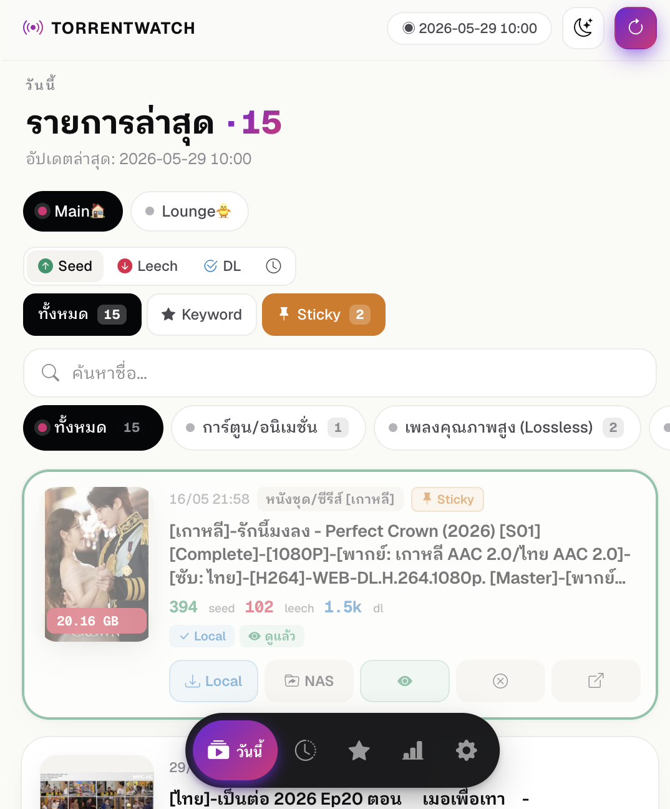

# TorrentWatch

**EN** | [ไทย](#ภาษาไทย)

A daily torrent monitor that scrapes [bearbit.org](https://bearbit.org) on a schedule, paginates through all of today's uploads, filters by seed/leech thresholds and keywords, and surfaces them via a mobile-friendly dark-themed web UI. Runs as a Docker container on Synology NAS.



---

## Features

- **Multi-source** — add multiple listing URLs (e.g. `viewbrsb.php`, `viewno18sbx.php`); each has its own keyword list and custom display label
- **Multi-page scraping** — paginates `?page=0,1,2,...` until it hits an item from a previous day, so all of today's uploads are captured
- **Sticky/pinned support** — optional toggle to include bearbit pinned entries; sticky state syncs with bearbit each scrape (unpinned entries auto-removed from Today view)
- **Seed/leech threshold** with **AND/OR** mode toggle (configurable; seed ≠ 0 always enforced)
- **Per-source keywords** — keyword-matched torrents bypass the threshold
- **Cover image, file size, file count, upload time** displayed per card; sticky entries show a 📌 badge
- **Sort by** seed count, leech count, or upload time
- **Filter buttons with live counts** — ทั้งหมด / Keyword / Sticky with per-bucket counts
- **Clickable title** — opens the bearbit detail page through a backend proxy that bypasses bearbit's anti-hotlink Referer check
- **Two download modes**:
  - **Browser** — proxies the `.torrent` to your browser (preserves Thai filename via RFC 5987)
  - **NAS** — saves directly to `/downloads` (Synology watch folder mount)
- **History tab** — browse any past date (read-only, frozen data)
- **Fixed auto-scrape schedule** (Asia/Bangkok): 19:00–01:00 every 30 min · 01:00–06:00 paused · 06:00–19:00 every 60 min
- **Live progress** — header badge shows source/page/count in real-time during scrape; auto-refreshes the list when done
- **LINE notification** — push to LINE when new keyword-matched torrents are found (configure via Settings UI)
- **Telegram notification** — push to Telegram Bot when new keyword-matched torrents are found; built-in Chat ID discovery helper in Settings UI
- **Sticky notification** — push to LINE + Telegram when a new sticky/pinned torrent is first discovered; toggle in Settings UI
- **HTTP Basic Auth** — web UI protected via `NGINX_BASIC_AUTH_USER` / `NGINX_BASIC_AUTH_PASS`
- **Weekly cleanup** — deletes records older than 7 days every Sunday at 03:00

## Stack

| Component | Detail |
|---|---|
| Runtime | Python 3.12 · FastAPI · Uvicorn |
| Database | SQLite (WAL mode) — persisted in named volume `torrentwatch_data` |
| Scraper | httpx async session + BeautifulSoup4 · login + Referer handling |
| Scheduler | APScheduler `BackgroundScheduler` |
| Host port | `5059` → container `8000` |
| Reverse proxy | Synology RP `https://…:15059` → `http://localhost:5059` |

## Setup

### 1. bearbit.org Account

You need an active account on bearbit.org. Credentials are stored only in the root `.env` — never committed.

### 2. Environment Variables

Add to the root `.env`:

```env
TORRENTWATCH_SITE_USERNAME=your_bearbit_username
TORRENTWATCH_SITE_PASSWORD=your_bearbit_password

# Comma-separated initial listing URLs (seeds the DB on first start; edit via Settings UI after)
TORRENTWATCH_DEFAULT_URLS=https://bearbit.org/viewbrsb.php

# Host path to Synology watch folder (mounted to /downloads inside container)
NAS_TORRENT_PATH=/var/services/homes/<NAS_USER>/Torrents_Watch

# HTTP Basic Auth — shared with homepage (leave empty to disable auth)
NGINX_BASIC_AUTH_USER=your_username
NGINX_BASIC_AUTH_PASS=your_password

# LINE notification (optional) — get token from LINE Developers Console
TORRENTWATCH_LINE_ACCESS_TOKEN=your_line_channel_access_token
TORRENTWATCH_LINE_USER_ID=your_line_user_id

# Telegram notification (optional) — get token from @BotFather
TORRENTWATCH_TELEGRAM_BOT_TOKEN=your_bot_token
TORRENTWATCH_TELEGRAM_CHAT_ID=your_chat_id   # use "ค้นหา Chat ID" button in Settings UI
```

### 3. NAS Watch Folder

The "→ NAS" download button writes `.torrent` files directly to the root of the mounted watch folder (`/downloads`). The mount is configured in `docker-compose.yml`:

```yaml
volumes:
  - torrentwatch_data:/data
  - ${NAS_TORRENT_PATH}:/downloads
```

The host path `NAS_TORRENT_PATH` must already exist on the NAS before starting the container.

### 4. Deploy

```bash
scripts/deploy.sh   # upload files and restart torrentwatch
```

Register in Synology Container Manager → Project → Create → path `/volume1/docker/torrentwatch`.

### 5. Synology Reverse Proxy

DSM → Control Panel → Login Portal → Advanced → Reverse Proxy → Create:

| Field | Value |
|---|---|
| Source Protocol | HTTPS |
| Source Port | `15059` |
| Destination Protocol | HTTP |
| Destination Hostname | `localhost` |
| Destination Port | `5059` |

Router must forward external port `15059 → NAS`.

> Ports 5060 and 5061 are blocked by browsers (SIP protocol) — use 15059 or higher.

## Settings (Web UI)

| Setting | Default | Description |
|---|---|---|
| Seed min | `10` | Minimum seeds for a torrent to pass |
| Leech min | `10` | Minimum leeches for a torrent to pass |
| Completed min | `20` | Minimum completed/snatches (`0` = disabled in AND mode) |
| Filter mode | `OR` | `AND` = all thresholds must meet · `OR` = any one is enough |
| รวม sticky/pinned | on | Include bearbit pinned entries; syncs removals automatically |
| Auto-download to NAS | off | Auto-save keyword-matched `.torrent` to `/downloads` |
| เก็บประวัติ | `7` days | Retention period; older records deleted on Sunday 03:00 |
| LINE notification | off | Push to LINE when new keyword-matched torrents are found |
| Telegram notification | off | Push to Telegram Bot when new keyword-matched torrents are found |

**Auto-scrape schedule** is fixed (not configurable):

| Time window | Interval |
|---|---|
| 19:00 – 01:00 | Every 30 minutes |
| 01:00 – 06:00 | Paused |
| 06:00 – 19:00 | Every 60 minutes |

## API Reference

| Method · Path | Purpose |
|---|---|
| `GET /api/torrents?source_id=…&sort=seeds\|leeches\|date&filter=all\|keyword` | Today's torrents for a source |
| `GET /api/history/dates?source_id=…` | Available history dates |
| `GET /api/history?source_id=…&date=YYYY-MM-DD` | Read-only past day |
| `GET /api/detail/{torrent_id}` | **Proxied** detail page (bypasses bearbit anti-hotlink) |
| `GET /api/download/local/{id}` | Stream `.torrent` to browser (RFC 5987 Thai filename) |
| `POST /api/download/nas/{id}` | Save `.torrent` into the NAS watch folder |
| `GET /api/sources` · `POST` · `DELETE` · `PATCH` | Source CRUD |
| `GET /api/keywords?source_id=…` · `POST` · `DELETE` | Per-source keyword CRUD |
| `GET /api/settings` · `PUT` | Read/update settings (rebuilds scrape job on interval/time change) |
| `POST /api/scrape` | Manual scrape trigger |
| `GET /api/status` | Scraper + scheduler state, including live `scrape_progress` |
| `POST /api/line/test` | Send a test LINE message to verify configuration |
| `POST /api/telegram/test` | Send a test Telegram message to verify configuration |
| `GET /api/telegram/get-chat-id` | Call `getUpdates` to discover your Telegram chat ID |
| `GET /api/debug/html?source_id=…` | Raw scraped HTML — for selector tuning |
| `GET /api/debug/login-page` | Raw bearbit login page |
| `POST /api/debug/relogin` | Force re-login |
| `GET /api/debug/download-test/{id}` | Probe download URL without saving |
| `DELETE /api/debug/clear-all/{source_id}` | Wipe all torrent data for a source |
| `DELETE /api/debug/clear-today/{source_id}` | Wipe today's data only |

## Anti-hotlink Bypass

Bearbit blocks any request whose `Referer` header isn't a bearbit URL — both for `.torrent` downloads and detail pages. TorrentWatch handles this transparently:

- **Scraper** sends `Referer: https://bearbit.org/...` on every backend request
- **Title click** opens `/api/detail/{id}` — the backend fetches the bearbit detail page with a proper Referer, then serves the HTML through our domain (with `<base href="https://bearbit.org/">` injected so images/CSS still resolve)

## Scraper Selectors

If bearbit changes its HTML layout, update the `SELECTOR_*` and `COL_*` constants at the top of `scraper.py` — no other code changes needed. The `/api/debug/html` endpoint dumps the raw HTML for inspection.

---

## ภาษาไทย

[EN](#torrentwatch)

TorrentWatch เป็น app สำหรับ monitor torrent ใหม่จาก bearbit.org อัตโนมัติ ไล่ scrape ทีละหน้าจน list ของวันนี้หมด filter ตาม seed/leech และ keyword แล้วแสดงผ่าน web UI บนมือถือ — รันเป็น Docker container บน Synology NAS


---

## คุณสมบัติ

- รองรับหลาย source URL (`viewbrsb.php`, `viewno18sbx.php`, ฯลฯ) แต่ละ source มี keyword list และชื่อที่กำหนดเองได้
- **Multi-page scraping** — ไล่ `?page=0,1,2,...` จนกว่าจะเจอ torrent ที่ไม่ใช่วันนี้แล้วหยุด
- **Sticky/pinned** — เปิด toggle เพื่อรวมรายการ pinned ของ bearbit; sync อัตโนมัติ (ถ้า bearbit เอาออก ก็หายจาก Today view ด้วย)
- เงื่อนไข seed/leech แบบ **AND** (ทั้งคู่) หรือ **OR** (อย่างใดอย่างหนึ่ง)
- Keyword ต่อ source — ถ้า title match จะข้าม threshold ได้
- การ์ดแสดง: รูปปก, ขนาด, จำนวนไฟล์, เวลา upload, badge 📌 สำหรับ sticky
- ปุ่ม filter แสดงจำนวน torrent แต่ละ bucket (ทั้งหมด / Keyword / Sticky)
- เรียงตาม seed / leech / เวลา upload
- กดชื่อ → เปิดหน้า detail ผ่าน backend proxy (bypass anti-hotlink ของ bearbit)
- ดาวน์โหลด: **Browser** (proxy ผ่าน backend, ชื่อไทยใช้ RFC 5987) หรือ **NAS** (เขียนตรงเข้า `/downloads`)
- History tab — ดูย้อนหลังได้
- Auto scrape ตารางเวลาคงที่: 19:00–01:00 ทุก 30 นาที · 01:00–06:00 หยุด · 06:00–19:00 ทุก 1 ชม.
- Header badge แสดง progress live: source / page / จำนวน items ระหว่าง scrape
- HTTP Basic Auth — ป้องกัน UI ด้วย `NGINX_BASIC_AUTH_USER` / `NGINX_BASIC_AUTH_PASS`
- **LINE notification** — push แจ้งเตือนเมื่อพบ keyword match ใหม่ (ตั้งค่าผ่าน Settings UI)
- **Telegram notification** — push แจ้งเตือนเมื่อพบ keyword match ใหม่ มี helper ค้นหา Chat ID ใน Settings UI
- ลบข้อมูลเก่าอัตโนมัติทุก Sunday 03:00 (เกิน 7 วัน)

## การตั้งค่า

### 1. Account bearbit.org

ต้องมี account บน bearbit.org credential เก็บใน `.env` ที่ root — ไม่ commit

### 2. Environment Variables

เพิ่มใน `.env`:

```env
TORRENTWATCH_SITE_USERNAME=your_bearbit_username
TORRENTWATCH_SITE_PASSWORD=your_bearbit_password
TORRENTWATCH_DEFAULT_URLS=https://bearbit.org/viewbrsb.php
NAS_TORRENT_PATH=/var/services/homes/<NAS_USER>/Torrents_Watch

# HTTP Basic Auth — ใช้ร่วมกับ homepage (ว่างเปล่า = ไม่มี auth)
NGINX_BASIC_AUTH_USER=your_username
NGINX_BASIC_AUTH_PASS=your_password

# LINE notification (optional)
TORRENTWATCH_LINE_ACCESS_TOKEN=your_line_channel_access_token
TORRENTWATCH_LINE_USER_ID=your_line_user_id

# Telegram notification (optional)
TORRENTWATCH_TELEGRAM_BOT_TOKEN=your_bot_token
TORRENTWATCH_TELEGRAM_CHAT_ID=your_chat_id   # หาได้จากปุ่ม "ค้นหา Chat ID" ใน Settings
```

### 3. Deploy

```bash
scripts/deploy.sh   # อัปโหลดไฟล์และ restart torrentwatch
```

Register ใน Synology Container Manager → Project → Create → path `/volume1/docker/torrentwatch`

### 4. เข้าใช้งาน

- LAN: `http://192.168.x.x:5059`
- External: `https://<NAS_HOST>:15059` (ผ่าน Synology Reverse Proxy)
