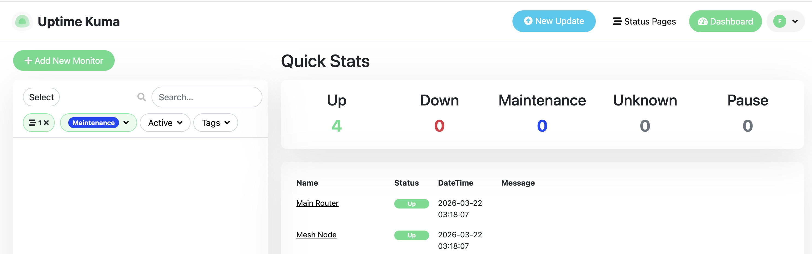

# Uptime Kuma

Service health monitor with a clean web UI.

**URL:** `http://<NAS_IP>:3001`

## Setup

Upload via `deploy.sh` from your local machine and register the stack in Container Manager (see root README).

## Data

All monitor configs, history, and settings are persisted at `/volume1/docker/uptime-kuma` on the host.

## Homepage Integration

The Homepage dashboard connects to Uptime Kuma via the `uptimekuma` widget using a status page slug. Set `UPTIME_KUMA_SLUG` in `homepage/.env` to match the slug of your public status page.
