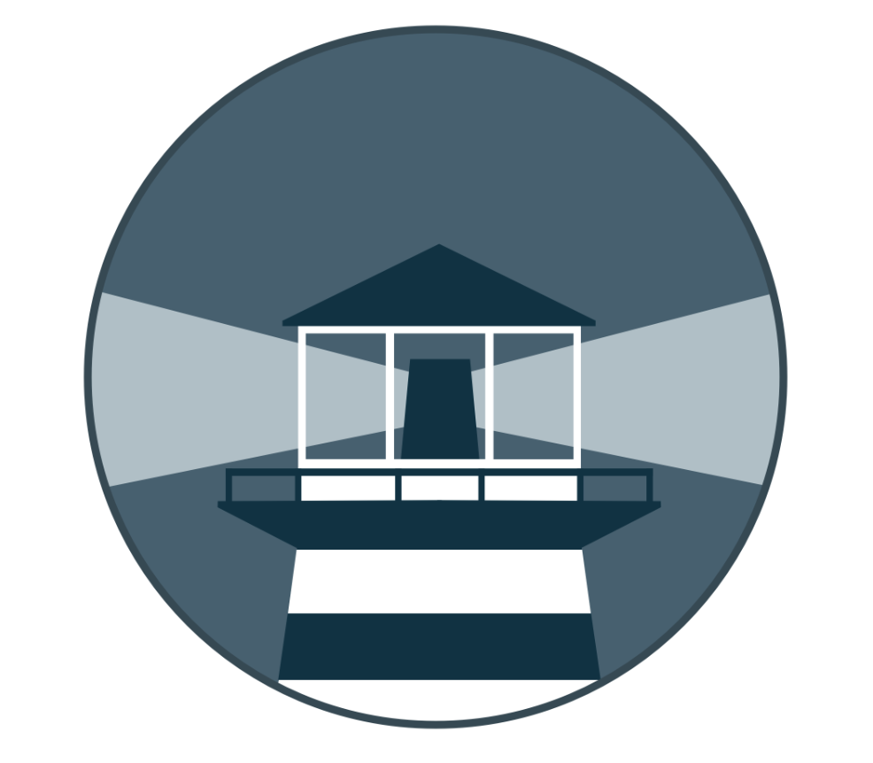

# Watchtower + LINE Notifier



Automatically updates Docker containers and sends LINE push notifications for each event.

## File Structure

```
watchtower/
├── .env                  ← LINE credentials (gitignored, copy from .env.example)
├── .env.example          ← template
├── docker-compose.yml
└── notifier/
    ├── Dockerfile
    ├── notifier.py
    └── requirements.txt
```

## Setup

```bash
cp .env.example .env
# Fill in LINE_CHANNEL_ACCESS_TOKEN and LINE_USER_ID
```

Then upload via `deploy.sh` from your local machine and register the stack in Container Manager (see root README).

## Services

| Service | Description |
|---|---|
| `watchtower` | Polls registries every 24h and updates containers |
| `watchtower-notifier` | Python sidecar that tails Watchtower logs and sends LINE notifications |

## How the Notifier Works

```
watchtower (logs)
      ↓  raw Docker socket HTTP
watchtower-notifier (Python)
      ↓  parse Watchtower 1.7.x log format
LINE Messaging API
      ↓
your phone
```

The sidecar connects to `/var/run/docker.sock` directly (no `docker` CLI needed), streams Watchtower's logs, and parses structured log lines to detect events.

## Notification Events

| Event | Trigger |
|---|---|
| Notifier started | Sidecar process start |
| Watchtower started | `msg="Watchtower x.x.x"` log line |
| Container updated | `msg="Creating /container"` log line |
| Session summary | `msg="Session done"` log line |
| Error | `level=error` or `level=fatal` log line |

## Configuration

| Variable | Description |
|---|---|
| `LINE_CHANNEL_ACCESS_TOKEN` | LINE Messaging API channel token |
| `LINE_USER_ID` | LINE user ID to push notifications to |
| `WATCHTOWER_POLL_INTERVAL` | Check interval in seconds (default: `86400` = 24h) |

The notifier auto-reconnects within 10 seconds if Watchtower restarts. It is excluded from Watchtower's own update cycle via `com.centurylinklabs.watchtower.enable=false`.
