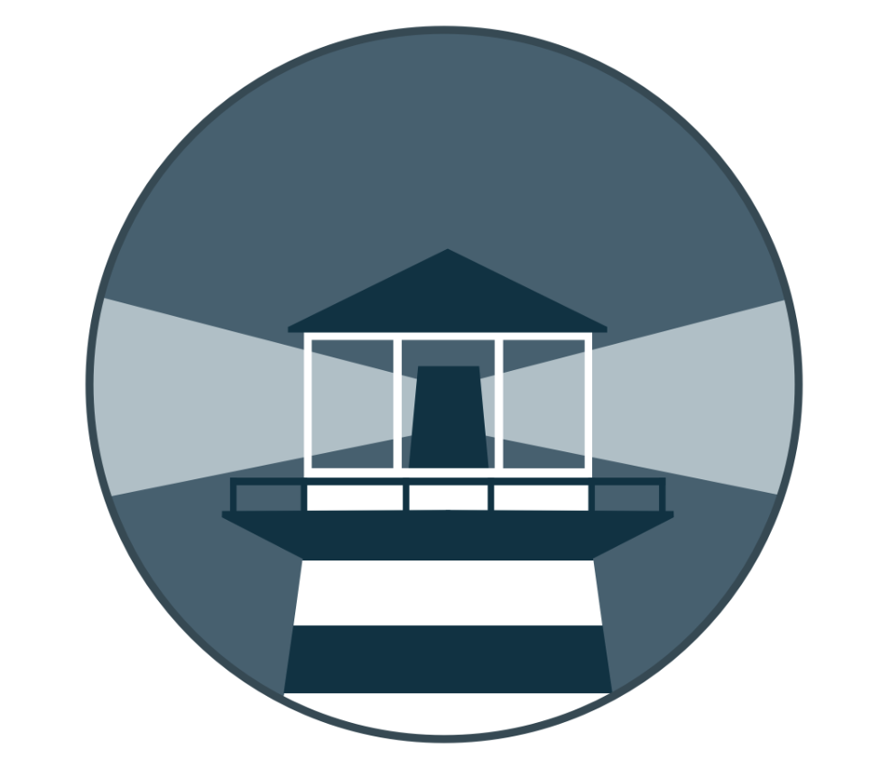

# Watchtower + LINE Notifier



Automatically updates Docker containers and sends LINE push notifications for each event.

## File Structure

```
watchtower/
├── docker-compose.yml
└── notifier/
    ├── Dockerfile
    ├── notifier.py
    └── requirements.txt
```

## Ports

Watchtower has no web UI and exposes no ports. It runs entirely in the background.

## Setup

Set `WATCHTOWER_LINE_CHANNEL_ACCESS_TOKEN` and `WATCHTOWER_LINE_USER_ID` in the **root `.env`** (shared by all stacks):

```bash
# From the project root
cp .env.example .env
# Fill in the LINE section in .env
```

Then upload to the NAS with `deploy.sh` from the project root.

## Services

| Service | Description |
|---|---|
| `watchtower` | Polls registries every 24h and updates containers |
| `watchtower-notifier` | Python sidecar that tails Watchtower logs and sends LINE notifications |

## How the Notifier Works

```
watchtower (logs)
      ↓  raw Docker socket HTTP
watchtower-notifier (Python)
      ↓  parse Watchtower 1.7.x log format
LINE Messaging API
      ↓
your phone
```

The sidecar connects to `/var/run/docker.sock` directly (no `docker` CLI needed), streams Watchtower's logs, and parses structured log lines to detect events.

## Notification Events

| Event | Trigger |
|---|---|
| Notifier started | Sidecar process start |
| Watchtower started | `msg="Watchtower x.x.x"` log line |
| Container updated | `msg="Creating /container"` log line |
| Session summary | `msg="Session done"` log line |
| Error | `level=error` or `level=fatal` log line |
| **Major-version bump** | Daily GitHub poll finds a pinned repo's latest stable release with `major > pinned` |

### Major-version watch

Watchtower follows a moving tag (`:2`, `:latest`) but **never crosses a major** — tag `N` freezes once `vN+1` ships (this is exactly what left `louislam/uptime-kuma:latest` stuck on v1 while v2 shipped under tag `2`). A daemon thread polls each pinned upstream's GitHub `releases/latest` once a day and alerts (LINE + Telegram) when a new major appears, so you can bump the tag + back up the DB deliberately. Alerts fire once per new major (in-memory dedupe; re-nags after a container restart until you act).

Add a repo to watch by appending one line to `MAJOR_WATCH` in `notifier/notifier.py`. Poll cadence via `MAJOR_CHECK_INTERVAL_HOURS` (default 24).

## Configuration (in root `.env`)

| Variable | Description |
|---|---|
| `WATCHTOWER_LINE_CHANNEL_ACCESS_TOKEN` | LINE Messaging API channel token |
| `WATCHTOWER_LINE_USER_ID` | LINE user ID to push notifications to |
| `WATCHTOWER_POLL_INTERVAL` | Check interval in seconds (default: `86400` = 24h, set in docker-compose.yml) |

The notifier auto-reconnects within 10 seconds if Watchtower restarts. It is excluded from Watchtower's own update cycle via `com.centurylinklabs.watchtower.enable=false`.
